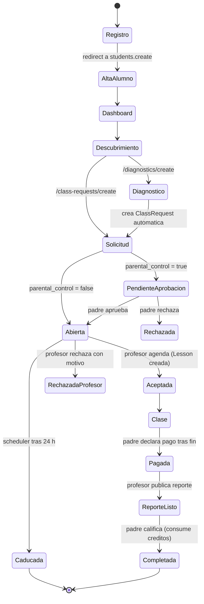
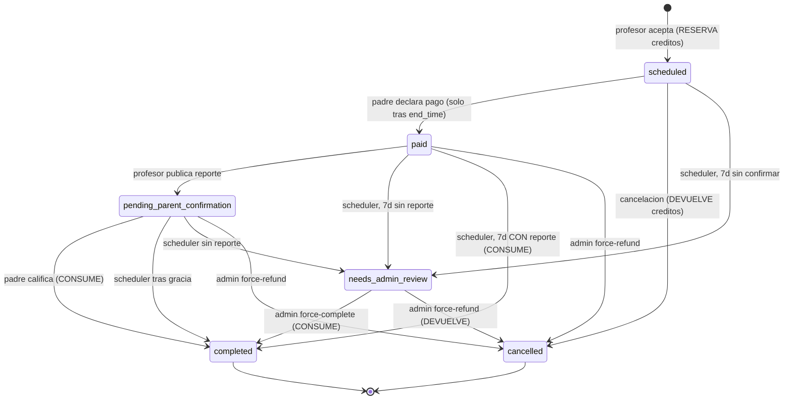
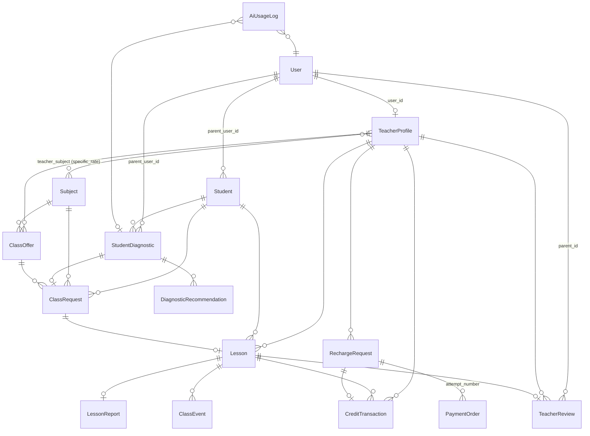

# MOVA — Mapa del Sistema

> **Propósito.** Reconstrucción funcional completa de MOVA a partir del **código actual**, no de la
> documentación previa. Un ingeniero que nunca haya visto el proyecto debería poder leer este
> documento y entender qué hace el sistema, quién puede hacer qué, y dónde están los bordes.
>
> **Contrato de snapshot** (exigido por `.claude/skills/mova-audit/SKILL.md`):
> - `HEAD`: `0b94f1d030fe3104d46b9f2d56fec811178261d9` — *docs(deploy): document Railway IaC migration blocker*
> - Rama: `master`. `origin/master` = `692b365` → local **106 commits adelante, 0 atrás, sin push**.
> - Working tree: **sucio**: Fase 2A heredada y Fase 2B sin commit, por instrucción explícita.
>   El inventario contado vive en este mismo documento (banner de abajo) y en §30.
> - Auditado sobre el **directorio de trabajo real**, no un checkout aislado.
> - Fecha: 2026-09-04.
> - Snapshot de implementación y validación local de Fase 2B; producción no fue consultada ni modificada.
>
> **Convención de estado por funcionalidad:**
> `IMPLEMENTADO` · `PARCIAL` · `LEGACY` · `CÓDIGO MUERTO` · `PLANIFICADO (no implementado)` · `INCIERTO`
>
> **Secretos:** no se imprimen valores. Ver §37.
>
> ---
>
> ## Baseline reconciliado — Fase 2B
>
> Este mapa describe el working tree actual. Los hallazgos históricos corregidos se indican como
> **RESUELTO EN FASE 2A** en sus secciones; no deben interpretarse como carencias actuales.
> Las limitaciones de entrega externa, producción y reversión financiera permanecen explícitas.
>
> Inventario calculado al cierre de la revisión (contado, no estimado): **128 rutas registradas**
> = 9 de debug (`_debugbar`, `_ignition`) + `sanctum/csrf-cookie` + **118 rutas de aplicación**,
> **20 modelos**, **40 controllers**, **7 policies**, **16 comandos** (**6 agendados**),
> **24 notificaciones** (+1 concern), **90 migraciones**, **55 páginas Vue**, **29 componentes**,
> **82 archivos PHPUnit / 881 métodos / 1003 casos con datasets**.
>
> ### Resultado de la revisión final (Fase 2B)
>
> | Punto | Estado |
> |---|---|
> | **Paridad SQLite ↔ MySQL** | **CONSEGUIDA.** Los 7 errores que el perfil MySQL arrastraba desde antes de la Fase 2A están corregidos sin perder cobertura: `PRAGMA` de SQLite en `ReminderDeliverySemanticsTest` (sustituido por una prueba real de la constraint UNIQUE en ambos motores) y `Schema::drop` en `SchedulerConfigurationTest` (el DDL hacía commit implícito y rompía la transacción de `RefreshDatabase`). **1003 tests verdes en los dos perfiles.** |
> | **Carrera en alertas operativas** | **CORREGIDA.** `raise()` leía `notified_at` dentro de la transacción y lo escribía fuera: un TOCTOU por el que dos workers podían avisar de la misma incidencia. Ahora `notifyAdmins()` reclama con un UPDATE condicional y comprueba las filas afectadas. |
> | **`health-check --json --alert`** | **CORREGIDO.** `publishFindings()` se ejecutaba después del early-return de `--json`, así que esa combinación no publicaba ninguna incidencia. |
> | **Modal compartido** | **BUG DE PRODUCTO REAL, CORREGIDO EN LA FUENTE.** En escritorio el panel volvía a `sm:static` (no posicionado) mientras el backdrop seguía `fixed`: el orden de pintado de CSS ponía el backdrop encima y un clic sobre un botón **cerraba el modal**. Ahora `sm:relative`. Verificado con clic real en navegador — `elementFromPoint()` devolvía el botón y aun así el evento llegaba al backdrop. Beneficia a los 8 consumidores del componente. |
> | **Saldo negativo (§7)** | **CONTRADICCIÓN RESUELTA.** `AGENTS.md` prohíbe saldos negativos; el servicio los permitía y lo documentaba como "pendiente". Se separan los dos caminos: la reversión **manual de un admin** es fail-closed (rechaza sin tocar nada + incidencia crítica), y la **confirmada por el proveedor** sí puede dejar negativo, porque el dinero ya volvió al pagador y negarse dejaría créditos vivos sin respaldo. |
> | **Gate E2E** | **DETERMINISTA Y COMPLETO.** **37/37** verdes en **dos ejecuciones consecutivas sin volver a preparar la base**, partiendo de estado sucio. Antes dependía de residuos (la cuenta de Google y la recarga fixture sobrevivían entre ejecuciones) y, además, **3 casos heredados nunca llegaban a ejecutarse** por un fail-fast que los ocultaba: los tres fallaban por defectos del harness (presupuesto de 120 s, una tilde y una ventana horaria caducada), no del producto. Detalle en §30.2. |
> | **Modo oscuro** | **CARENCIA PREEXISTENTE, CONFIRMADA Y NO RESUELTA.** Los tokens funcionan (`data-theme="dark"`, canvas `rgb(11,18,32)`), pero casi todas las páginas usan `bg-white` fijo en lugar de `bg-surface`: el fondo se oscurece y las tarjetas siguen blancas. No es una regresión de 2B. Sigue pendiente (ver §27.6). |


---

## 1. Executive Summary

MOVA es una plataforma peruana de tutorías privadas que conecta **padres/tutores** con
**profesores particulares** para clases 1-a-1 en línea, dictadas dentro de la propia plataforma
mediante videollamada (JaaS / 8x8). Los alumnos son **menores de edad** y **no tienen cuenta**:
existen como registros dependientes del padre.

El hecho arquitectónico más importante y menos evidente es el **modelo de dinero**:

- **MOVA no intermedia el pago del padre al profesor.** El padre paga directamente al profesor por
  Yape/Plin fuera de la plataforma. MOVA solo registra una **declaración unilateral** del padre.
- **MOVA sí cobra al profesor**, en forma de **créditos** prepagados que el profesor consume al
  aceptar clases. Ese flujo (profesor → MOVA) sí está verificado, conciliado y protegido con un
  ledger append-only e idempotencia.

Es decir: el crédito **no representa el pago de la clase**, representa **el coste de usar la
plataforma**. Confundir ambos es el error conceptual más caro posible en este código y está
explícitamente advertido en `app/Models/Lesson.php:18-46`.

**Madurez desigual.** El subsistema financiero profesor→MOVA (Mercado Pago Payments API, ledger,
conciliación, compensación de Challenges 3DS perdidos) está desarrollado a un nivel muy por encima
del resto del producto: ~2.600 líneas entre proveedor y servicio de conciliación, con recuperación
de pagos inciertos y fail-closed sistemático. En contraste, el descubrimiento de profesores
(§39) es un listado paginado sin filtros, la agenda (§15) no tiene selección de slots reales, y
la observabilidad integra Sentry y alertas persistentes; todavía falta el Centro de Operaciones (§29).

**Estado operativo por defecto: apagado.** Casi todas las integraciones arrancan deshabilitadas
(`PAYMENTS_ENABLED=false`, `WHATSAPP_ENABLED=false`, `RECHARGES_ENABLED=false`,
`DIAGNOSTIC_AI_ENABLED=false`, `LESSON_SETTLEMENT_MODE=dry_run`, `GOOGLE_LOGIN_ENABLED=false`).
Sin activarlas explícitamente, MOVA funciona pero **no cobra, no liquida créditos y no envía
WhatsApp**.

### Cobertura del mapeo

| Elemento | Cantidad |
|---|---|
| Rutas HTTP (sin debugbar/ignition) | **119** |
| Páginas Inertia (`.vue` en `Pages/`) | **55** (50 páginas + 5 parciales de perfil) |
| Modelos Eloquent | **20** |
| Controllers | **40** |
| Policies | **7** |
| Middleware propios | **11** |
| Notifications | **24** (+1 concern `BuildsAppUrls`) |
| Jobs | **1** |
| Events / Listeners | **2 / 3** |
| Comandos artisan propios | **16** (**6** agendados) |
| Migraciones | **90** |
| Tests PHPUnit | **82 archivos / 881 métodos / 1003 casos** |
| Specs E2E Playwright | **3 archivos / 28 casos antes del nuevo gate de estabilización** |
| Integraciones externas | **8** (Mercado Pago, Meta WhatsApp, JaaS/8x8, Gmail API, Google OAuth, Cloudinary, Pusher, OpenAI/Gemini) |

### Hallazgos más importantes (detalle en §34 y §35)

| ID | Severidad | Hallazgo |
|---|---|---|
| **H-01** | **RESUELTO EN FASE 2A** | Handler::register() integra Sentry mediante Integration::captureUnhandledException; SentryReportingTest verifica captura y exclusión de errores esperados. La entrega en producción depende del DSN efectivo, no consultado. |
| **H-02** | **RESUELTO EN FASE 2A** | Ruta admin.recharges.reverse, policy de administrador y modal con motivo; servicio transaccional e idempotente. La política de saldo negativo heredada sigue pendiente de decisión (§34). |
| **H-03** | **RESUELTO EN FASE 2A** | mova:health-check --alert corre cada hora y mova:reconcile-ledger --alert diariamente a las 03:10. Publican incidencias deduplicadas. |
| **H-04** | **RESUELTO EN FASE 2A** | resend/resend-laravel fue eliminado; route:list no contiene POST /resend/webhook. |
| **H-05** | **RESUELTO EN FASE 2A** | gmail_api es un transporte Symfony registrado por AppServiceProvider y config/mail.php; el failover se declara mediante Laravel. El proveedor efectivo depende del entorno. |
| **H-06** | **RESUELTO EN FASE 2A** | lesson-reports.show vive en el grupo compartido auth/verified/not_suspended; LessonPolicy::view conserva ownership de padre/profesor y acceso admin. |
| **H-07** | Media | Un padre puede declarar `paid` sin haber pagado, y eso **consume el crédito del profesor**. Asimetría documentada y aceptada, pero sin ninguna compensación al profesor. |
| **H-08** | **RESUELTO EN FASE 2A** | DiagnosticsController::results presenta recomendaciones persistidas, revalida elegibilidad y omite el score interno; Results.vue las renderiza. |
| **H-09** | Baja | Estados muertos: `class_requests.status='completed'` y `payment_orders.status='expired'` existen en los enums y **nadie los escribe**. |
| **H-10** | Baja | Divergencia de entorno: PHP local 8.1.25, `composer.json` `^8.1`, `railpack.json` fija **8.3**. |
| **H-11** | **RESUELTO EN FASE 2A** | RechargeApprovalService::credit emite RechargeApprovedNotification cuando changed=true, tanto para abono manual como automático. Los reintentos secuenciales no duplican el aviso; no garantiza entrega externa exactamente una vez. |
| **H-12** | **RESUELTO EN FASE 2A** | ProfileUpdateRequest y el formulario aceptan phone; cambiar el número normalizado revoca verificación, OTP y opt-in, conservando el historial del bono. |

---

## 2. Qué es MOVA

### 2.1 El problema

En Perú, conseguir un profesor particular de confianza para un menor implica tres fricciones:
verificar que el profesor es real y competente, coordinar horario, y pagarle. MOVA resuelve la
primera (verificación manual por admin) y la segunda (solicitud → aceptación → sala de clase),
y **deliberadamente no resuelve la tercera** entre padre y profesor.

### 2.2 El modelo operativo real

```
Padre                       MOVA                        Profesor
  |                          |                             |
  |-- registra alumno(s) --->|                             |
  |-- crea solicitud ------->|-- notifica a elegibles ---->|
  |                          |                             |-- acepta (RESERVA créditos)
  |                          |<-- crea Lesson + sala ------|
  |<---- confirmacion -------|---- confirmacion ---------->|
  |========== clase por videollamada (JaaS) ===============|
  |--- paga por Yape/Plin DIRECTAMENTE al profesor ------->|   (MOVA NO participa)
  |-- declara "pague" ------>| status: paid                |
  |                          |                             |-- publica reporte pedagogico
  |<-- reporte --------------| status: pending_parent_conf |
  |-- califica (resena) ---->| CONSUME creditos, completed |
```

### 2.3 Monetización

**Una sola fuente de ingreso: la venta de créditos al profesor.**

- 1 crédito = 1 hora de clase (o fracción; mínimo 1). `config/credits.php:5,11`
- Precio de referencia: **S/ 2.00 por crédito** (`credit_price_pen`).
- Paquetes (`config/credits.php:14-31`): `inicio` 5 cr / S/10 · `impulso` 15 cr / S/30 ·
  `pro` 30 cr / S/60. Precio unitario idéntico en los tres — **no hay descuento por volumen**.
- **Bono de bienvenida**: 5 créditos gratis al profesor cuando verifica su teléfono por WhatsApp.
  `Auth\PhoneVerificationController.php` (`WELCOME_BONUS_CREDITS = 5`, idempotente con clave
  `teacher:{id}:welcome`).

El profesor cobra su tarifa (S/20–30/h según nivel) **completa y por fuera**. MOVA se queda solo
con el crédito. Con la tarifa base de S/20/h, MOVA captura ~10% del valor de la clase.

### 2.4 El alumno NO es un rol

**Confirmado:** solo existen tres roles Spatie — `parent`, `teacher`, `admin`
(`database/seeders/RoleSeeder.php`, `2026_06_29_500000_seed_spatie_roles_and_admin_user.php`).
No hay rol `student` ni `superadmin`.

El alumno es el modelo **`Student`** (`app/Models/Student.php`), un registro **sin cuenta ni login**,
propiedad del padre vía `parent_user_id`. Consecuencias verificadas:

- Toda autorización sobre un alumno se resuelve por *ownership* del padre
  (`StudentPolicy`, y el patrón `auth()->user()->students()->pluck('id')` repetido en casi todos
  los controllers de padre).
- El alumno usa `SoftDeletes` y `Student::anonymize()` sustituye sus datos personales conservando
  la fila, porque las clases históricas y el ledger la referencian
  (`2026_08_24_000003_add_soft_deletes_to_students_table.php`).
- Por eso `ClassRequest::student()` y `Lesson::student()` **deben** usar `withTrashed()`: sin eso,
  dar de baja al alumno hacía que el padre dejara de recibir avisos de cancelación **en silencio**
  (regresión F-18 documentada en `app/Models/Lesson.php:147-159`).
- La página pública `/invitacion/alumno` (`Landing/StudentInvitation.vue`) es **marketing dirigido
  al padre**, no un flujo de registro de alumno.

---

## 3. Arquitectura

**Monolito Laravel con frontend SPA acoplado vía Inertia.** No hay API pública ni cliente móvil.

```
Navegador (Vue 3 SPA)
   |  Inertia (props server-side, sin API REST intermedia)
   |  Pusher/Echo (notificaciones en vivo, canal privado por usuario)
   |  axios (3 endpoints JSON: /notifications, lessons.join, checkout status)
   v
+------------------------------------------------------------------+
|  mova-web (FrankenPHP/Caddy via Railpack)                        |
|    routes/web.php - 111 rutas . routes/api.php - 3 . auth.php    |
|    Middleware: auth > verified > role:* > not.suspended > throttle|
|    Controllers > Services > Models (Eloquent) > MySQL            |
+------------------------------------------------------------------+
   |                        |                        |
   v                        v                        v
mova-queue              mova-scheduler            MySQL
queue:work              schedule:work             (Railway)
(database driver)       (1 replica obligatoria)
   |                        |
   |  Notifications         |  classmate:send-reminders (cada minuto)
   |  ProcessMercadoPago    |  mova:settle-lessons      (cada hora)
   v                        v  mercadopago:reconcile    (cada 5 min)
Integraciones externas:
  Mercado Pago Payments API . Meta WhatsApp Cloud API . JaaS/8x8
  Gmail API (OAuth) . Google OAuth . Cloudinary . Pusher . OpenAI/Gemini
```

### Principios de diseño observados en el código

1. **Fail-closed en dinero.** Ante ambigüedad financiera se lanza excepción o se marca para revisión
   humana; nunca se estima. Ejemplo canónico: `Lesson::reservedCreditAmount()` exige *exactamente*
   un asiento `reservation` en el ledger y lanza `RuntimeException` si hay 0 o 2
   (`app/Models/Lesson.php:124-139`).
2. **Un solo choke point de crédito.** `RechargeApprovalService::credit()` es el único lugar que
   abona créditos, sin importar el camino (admin manual, webhook, conciliación, recuperación).
3. **La verdad viene del servidor del proveedor, no del cliente ni del webhook.**
   `MercadoPagoPaymentReconciliationService::reconcile()` siempre relee con
   `GET /v1/payments/{id}` antes de decidir nada.
4. **Idempotencia por clave natural.** `credit_transactions.idempotency_key` es `UNIQUE`; las claves
   son deterministas (`lesson:{id}:reservation`, `lesson:{id}:consumption`, `lesson:{id}:release`,
   `recharge:{id}:deposit`, `recharge:{id}:reversal`, `teacher:{id}:welcome`).
5. **Lógica compartida extraída a un único lugar** cuando se detecta triplicada
   (`Lesson::scopeEndedBefore`, `lessonJoin.js`, `statusColors.js`, `ClassRequest::eligibleTeacherUsers`).
6. **Comentarios como registro de decisión.** El código lleva miles de líneas de comentario
   explicando *por qué*, incluyendo bugs históricos. Es la fuente secundaria más fiable del repo.

---

## 4. Stack

| Capa | Tecnología | Versión | Evidencia |
|---|---|---|---|
| Runtime | PHP | `^8.1` (local **8.1.25**, prod **8.3**) | `composer.json`, `railpack.json` |
| Framework | Laravel | `^10.10` | `composer.json` |
| Frontend | Vue 3 + Inertia | `^3.4` / `inertia-laravel ^0.6.8` + `@inertiajs/vue3 ^1.0` | `package.json` |
| Build | Vite | `^5.0` | `vite.config.js` |
| CSS | Tailwind + `@tailwindcss/forms` | `^3.2` | `tailwind.config.js` (9 KB de tema propio) |
| DB | MySQL (prod) / SQLite (tests) | — | `phpunit.xml`, `phpunit.mysql.xml` |
| Roles | `spatie/laravel-permission` | `^6.25` | solo **roles**, cero permissions |
| Rutas en JS | `tightenco/ziggy` | `^2.6` | `HandleInertiaRequests::share()` |
| Auth API | `laravel/sanctum` | `^3.2` | solo `GET /api/user`, sin uso real |
| OAuth | `laravel/socialite` | `^5.29` | solo Google |
| Realtime | `pusher/pusher-php-server` + `laravel-echo` + `pusher-js` | `^7.2` / `^2.4` / `^8.5` | `resources/js/echo.js` |
| Uploads | `cloudinary-labs/cloudinary-laravel` | `^2.3` | `CloudinaryService` |
| JWT | `firebase/php-jwt` | `^7.1` | `JaasService` (RS256) |
| Errores | `sentry/sentry-laravel` | `^4.26` | Integrado en Handler; H-01 RESUELTO EN FASE 2A |
| Email | Transporte Symfony Gmail API + mailers Laravel | Ver composer.lock | Resend eliminado; H-04/H-05 RESUELTOS EN FASE 2A |
| Animación/UI | `gsap`, `swiper`, `lucide-vue-next` | — | `package.json` |
| Tests | PHPUnit 10 + Playwright | — | `phpunit.xml`, `qa/playwright.config.js` |

**Sin SDK de Mercado Pago ni de Meta**: ambas integraciones son HTTP directo con el facade `Http`,
decisión explícita de *dependency budget* (`app/Payment/MercadoPagoPaymentProvider.php:33-35`).

---

## 5. Actores y roles reales

Tres roles, obtenidos del código, no asumidos.

### 5.1 `guest` (no autenticado) — no es un rol Spatie

| Puede | Evidencia |
|---|---|
| Ver landing, marketplace, perfil público de profesor **verificado**, "quiénes somos", términos, privacidad, invitaciones | `routes/web.php:50-55`, sin middleware |
| Ver `sitemap.xml`, `robots.txt`, `/healthz` | `routes/web.php:32-43` |
| Registrarse como `parent` o `teacher`; iniciar sesión; Google OAuth; recuperar contraseña | `routes/auth.php:16-48` |
| **No puede** ver el `referral_code` de un profesor | `TeacherPublicController::referralCodeVisibleTo()` devuelve `false` sin sesión |
| **No puede** ver un perfil de profesor no verificado | `abort_unless($teacherProfile->is_verified, 404)` |

### 5.2 `parent` (padre / tutor)

| Capacidad | Detalle | Condición |
|---|---|---|
| **Ver** | dashboard, sus alumnos, sus solicitudes, sus clases, sus reportes, notificaciones | ownership por `parent_user_id` |
| **Crear** | alumnos, diagnósticos, solicitudes de clase, reseñas | `role:parent` + `not.suspended` |
| **Modificar** | alumnos, su propio perfil/avatar, control parental, preferencias WhatsApp, reprogramar clase | `StudentPolicy::update`, `LessonPolicy::reschedule` |
| **Cancelar** | clases en estado `scheduled` | `LessonPolicy::cancel` |
| **Eliminar** | alumnos (soft delete + anonimización si hay historial), su propia cuenta | `StudentController::destroy`, `ProfileController::destroy` |
| **Aprobar / rechazar** | solicitudes propias en `pending_parent_approval` (control parental activo) | `ClassRequestController::approve/reject` |
| **Pagar** | **fuera de la plataforma**. Solo *declara* el pago | `LessonController::confirmPayment` |
| **Recibir dinero** | nunca | — |
| **Entrar a reuniones** | sí, como participante (no moderador) | `LessonController::join`, `$isModerator = false` |
| **Comunicarse** | **no hay mensajería** profesor↔padre en el producto | verificado: sin modelo/ruta/página de chat |

**Restricción no obvia:** solo puede confirmar el pago **después** de que la clase haya terminado
(`now() >= end_time`) y solo si está en `scheduled` (`LessonController::confirmPayment`).

### 5.3 `teacher` (profesor)

| Capacidad | Detalle | Condición |
|---|---|---|
| **Ver** | dashboard, solicitudes visibles para él, sus clases, sus reportes, sus créditos y ledger | `ClassRequest::scopeVisibleToTeacher` |
| **Crear** | perfil (setup), clase al aceptar solicitud, reporte pedagógico, recarga (manual o checkout MP) | `role:teacher` + `not.suspended` |
| **Modificar** | bio, materias, Yape/Plin, cupos de acompañamiento, ofertas ya existentes | `TeacherProfileController`, `ClassOfferPolicy::update` |
| **NO puede modificar** | `hourly_rate` (derivado), `is_verified`, `credits_*`, `referral_code`, `completed_classes_count` | ausentes de los formularios; `hourly_rate` lo fija `maxAllowedRate()` |
| **Cancelar / reprogramar** | clases propias en `scheduled` | `LessonPolicy` |
| **Rechazar** | solicitudes `open` visibles, con motivo ≥10 caracteres | `ClassRequestController::teacherReject` |
| **Aceptar** | solicitudes `open` — **consume créditos disponibles** | `LessonController::store` |
| **Pagar** | sí, a MOVA (créditos) | `CreditController` / `CreditCheckoutController` |
| **Recibir dinero** | sí, **del padre y fuera de MOVA** (Yape/Plin propios) | `teacher_profiles.yape_number/plin_number` |
| **Entrar a reuniones** | sí, como **moderador** | `$isModerator = $lesson->teacherProfile?->user_id === $user->id` |
| **Crear ofertas nuevas** | **deshabilitado** (`create`/`store` excluidos de la ruta) | `routes/web.php:145` |

**Puerta de verificación:** `ClassRequestPolicy::accept()` exige `$profile->is_verified`. Un profesor
sin verificar puede registrarse, configurar perfil y comprar créditos, **pero no puede aceptar
ninguna solicitud**. Cubierto por `tests/Feature/TeacherVerificationGateTest.php`.

### 5.4 `admin`

| Capacidad | Detalle |
|---|---|
| **Ver** | usuarios, profesores pendientes/rechazados, todas las solicitudes, todas las clases, recargas, reseñas, uso de IA |
| **Verificar / rechazar** | perfiles de profesor (rechazo exige motivo ≥10 y desactiva sus ofertas) |
| **Suspender / reactivar** | cualquier usuario **excepto** otro admin |
| **Cancelar** | clases `scheduled` (con motivo, devuelve créditos) |
| **Forzar cierre** | `paid` / `pending_parent_confirmation` / `needs_admin_review` → `completed` (consume crédito) |
| **Forzar devolución** | `scheduled`/`paid`/`pending…`/`needs_admin_review` → `cancelled` (libera crédito) |
| **Aprobar / rechazar recargas** | **solo las NO Mercado Pago** (`RechargeRequestPolicy` lo bloquea explícitamente) |
| **Moderar reseñas** | ocultar/mostrar |
| **Bypass de policies** | `before()` devuelve `true` en 6 de 7 policies |

**Excepciones deliberadas del admin:**
- El grupo `admin` **no lleva** `not.suspended` (`routes/web.php:167-171`): un admin suspendido por
  error conservaría acceso para revertirlo. Sin esto, la plataforma podría quedarse sin
  administrador operativo.
- `RechargeRequestPolicy` es la **única policy sin `before()` admin-bypass**, precisamente para que
  el admin no pueda aprobar a mano una recarga que Mercado Pago gestiona.

### 5.5 Ausencias confirmadas

`student`, `superadmin`, `support`, `moderator` — **no existen**. Spatie está instalado con la
tabla de permissions creada pero **cero permissions definidos o usados**: toda la autorización es
por rol + ownership.

---

## 6. Matriz completa de permisos

Autorización **verificada en servidor**, no por presencia de botón.
Leyenda: SI permitido · NO denegado · COND permitido con condición.

| Función | Guest | Parent | Teacher | Admin | Autorización backend | Evidencia |
|---|:---:|:---:|:---:|:---:|---|---|
| Ver landing / marketplace / perfil público | SI | SI | SI | SI | ninguna (`abort_unless(is_verified,404)` en perfil) | `TeacherPublicController:14` |
| Ver `referral_code` de un profesor | NO | COND | COND | COND | solo dueño, o padre con clase `completed` con él | `TeacherPublicController::referralCodeVisibleTo()` |
| Registrarse | SI | NO | NO | NO | `guest` | `routes/auth.php:16` |
| Ver dashboard | NO | SI | SI | SI | `auth`+`verified`; ramifica por rol | `DashboardController::__invoke` |
| Crear alumno | NO | SI | NO | NO | `role:parent` + `not.suspended` | `routes/web.php:88` |
| Editar / borrar alumno | NO | COND | NO | SI | `StudentPolicy::update/delete` (ownership) | `StudentPolicy` |
| Crear diagnóstico | NO | SI | NO | NO | `role:parent`, `throttle:5,1` | `routes/web.php:84` |
| Ver resultados de diagnóstico | NO | COND | NO | SI | `StudentDiagnosticPolicy::view` (`parent_user_id`) | `StudentDiagnosticPolicy` |
| Crear solicitud de clase | NO | SI | NO | NO | `role:parent`; `students()->findOrFail()` valida ownership | `ClassRequestController::store:64` |
| Aprobar/rechazar solicitud propia | NO | COND | NO | SI | `ClassRequestPolicy::view` + estado `pending_parent_approval` | `ClassRequestController::approve` |
| Ver bandeja de solicitudes del profesor | NO | NO | SI | SI | `role:teacher` + `scopeVisibleToTeacher` | `ClassRequestController::teacherIndex` |
| Aceptar solicitud (crear clase) | NO | NO | COND | COND | `ClassRequestPolicy::accept`: verificado + (referido / oferta / materia) | `ClassRequestPolicy:20-40` |
| Rechazar solicitud como profesor | NO | NO | COND | SI | `ClassRequestPolicy::reject` (= `accept`) + estado `open` | `ClassRequestController::teacherReject` |
| Confirmar pago de clase | NO | COND | NO | SI | `LessonPolicy::confirmPayment` + `scheduled` + `now()>=end_time` | `LessonController::confirmPayment` |
| Cancelar clase | NO | COND | COND | SI | `LessonPolicy::cancel` + `scheduled` | `LessonController::cancel` |
| Reprogramar clase | NO | COND | COND | SI | `LessonPolicy::reschedule` + `scheduled`; duración **prohibida** | `LessonController::reschedule:300` |
| Entrar a la sala | NO | COND | COND | COND | `LessonPolicy::view` + estado en {scheduled,paid,pending…} + ventana temporal | `LessonController::join:141-169` |
| Crear reporte pedagógico | NO | NO | COND | SI | `LessonPolicy::createReport` + estado `paid` | `LessonReportController::store` |
| **Ver** reporte en `/lessons/{id}/report` | NO | COND | COND | SI | auth, verified, not_suspended + LessonPolicy::view | `routes/web.php` |
| Ver reportes propios (padre) | NO | SI | NO | SI | `/my-reports`, filtrado por `student_id` | `LessonReportController::parentIndex` |
| Crear reseña | NO | COND | NO | SI | `LessonPolicy::createReview` + estado en {pending…,completed} + reporte existe + sin reseña previa | `TeacherReviewController::assertReviewable` |
| Moderar reseña | NO | NO | NO | SI | `TeacherReviewPolicy::moderate` devuelve `false`; solo pasa por `before()` admin | `TeacherReviewPolicy:23` |
| Crear oferta de clase | NO | NO | **NO** | NO | rutas `create`/`store` **excluidas** — código muerto | `routes/web.php:145` |
| Editar/borrar/togglear oferta | NO | NO | COND | SI | `ClassOfferPolicy::update/delete` (ownership) | `ClassOfferPolicy` |
| Solicitar recarga manual | NO | NO | COND | NO | `role:teacher` + `RECHARGES_ENABLED` + destino configurado (si no, **503**) | `CreditController::storeRecharge:57` |
| Checkout Mercado Pago | NO | NO | COND | NO | `PAYMENTS_ENABLED` + provider `mercadopago` + public key (si no, **503**) | `CreditCheckoutController::store:25` |
| Pagar un checkout | NO | NO | COND | NO | `RechargeRequestPolicy::pay` (ownership del perfil) | `RechargeRequestPolicy:15` |
| Aprobar recarga | NO | NO | NO | COND | `RechargeRequestPolicy::approve`: admin **Y** `payment_method != 'mercadopago'` | `RechargeRequestPolicy:22` |
| **Revertir recarga** | NO | NO | NO | SI | admin + policy; solo recarga manual aprobada, motivo obligatorio | `RechargeRequestPolicy::reverse` |
| Verificar / rechazar profesor | NO | NO | NO | SI | `role:admin` | `AdminController::verifyTeacher` |
| Suspender usuario | NO | NO | NO | COND | `role:admin`; **no** sobre otro admin | `AdminController::suspendUser:210` |
| Forzar cierre / devolución de clase | NO | NO | NO | COND | `role:admin` + estados permitidos + motivo ≥5 | `AdminController:169-207` |
| Ver panel de uso de IA | NO | NO | NO | SI | `role:admin` | `AiUsageController` |
| Webhook Mercado Pago | publico | — | — | — | HMAC-SHA256 + `data.id` query=body + flag habilitado | `MercadoPagoWebhookController` |
| Webhook WhatsApp | publico | — | — | — | HMAC-SHA256 `X-Hub-Signature-256` | `WhatsAppWebhookController` |
| `POST /resend/webhook` (histórico) | NO | NO | NO | NO | Ruta eliminada: H-04 RESUELTO EN FASE 2A | `route:list` |

Los dos webhooks son públicos por necesidad, pero **fail-closed**: sin secreto configurado, ambos
rechazan todo (401/403).

### 6.1 Divergencias frontend ↔ backend

| Caso | Frontend | Backend | Veredicto |
|---|---|---|---|
| Ventana de acceso a la sala | `lessonJoin.js` (15 min antes, 120 min de gracia) | `LessonController::join()` aplica lo mismo desde `config/jaas.php` | **alineado** (era un hueco real: F-06) |
| Estados que permiten entrar | `['scheduled','pending_parent_confirmation']` + `paid` | idénticos | alineado |
| Ver reporte de clase | `/my-reports` y detalle | Ruta compartida y ownership | H-06 RESUELTO EN FASE 2A |
| Tope de tarifa en ofertas | UI muestra `maxRate` | `max:{$maxAllowedRate}` validado server-side | alineado |
| Tipos de transacción de crédito | `reversal` etiquetado en Credits/Index.vue | Conciliación MP y reversión administrativa | H-02 RESUELTO EN FASE 2A |
| Datos de tarjeta | Brick tokeniza en el navegador | `prohibited` explícito para 12 campos PAN/CVV | **defensa activa** (`CreditCheckoutController::pay:89-100`) |

---

## 7. Inventario completo de páginas

55 archivos `.vue` bajo `resources/js/Pages/` (50 páginas + 5 parciales de perfil). Layouts: `PublicPageLayout` (público),
`GuestLayout` (auth), `AppLayout` (autenticado, con sidebar por rol).

### 7.1 Públicas (sin autenticación)

| Página | Ruta | Objetivo | Acciones | Datos | Backend | Estado |
|---|---|---|---|---|---|---|
| `Welcome.vue` | `GET /` | Landing comercial | Ir a registro/marketplace, buscar materia | materias, 6 profesores destacados, stats (profesores/padres/clases), 3 testimonios 5★ | `WelcomeController::index` | IMPLEMENTADO |
| `Marketplace/Index.vue` | `GET /marketplace` | Catálogo de profesores verificados | Ver perfil; si es padre, solicitar clase | 24 por página, orden por nº de reseñas | `MarketplaceController::index` | **PARCIAL** — sin filtros ni búsqueda (§39) |
| `Teachers/Show.vue` | `GET /teachers/{teacherProfile}` | Perfil público del profesor | Solicitar clase | nombre, avatar, bio, tarifa, materias, clases completadas, rating, 5 reseñas, `referral_code` condicional | `TeacherPublicController::show` | IMPLEMENTADO |
| `About.vue` | `GET /quienes-somos` | Página institucional | — | stats | `AboutController::index` | IMPLEMENTADO |
| `Landing/TeacherInvitation.vue` | `GET /invitacion/profesor` | Captación de profesores | Registro con `?role=teacher` | estático | `TeacherInvitationController` | IMPLEMENTADO |
| `Landing/StudentInvitation.vue` | `GET /invitacion/alumno` | Captación de familias | Registro | estático | `StudentInvitationController` | IMPLEMENTADO |
| `Legal/Terms.vue` | `GET /terminos` | Términos y condiciones | — | estático | `LegalController::terms` | IMPLEMENTADO |
| `Legal/Privacy.vue` | `GET /privacidad` | Política de privacidad | — | estático | `LegalController::privacy` | IMPLEMENTADO |

También públicas pero sin página Vue: `GET /sitemap.xml` (blade `sitemap.blade.php`),
`GET /robots.txt` (closure), `GET /healthz` (closure → `"OK"`).

### 7.2 Autenticación

| Página | Ruta | Objetivo | Estado |
|---|---|---|---|
| `Auth/Register.vue` | `GET /register` | Alta de padre o profesor; `?role=` bloquea la elección; el profesor declara materias en el propio registro | IMPLEMENTADO |
| `Auth/GoogleRole.vue` | `GET /auth/google/role` | Selección parent/teacher tras identidad Google en sesión | IMPLEMENTADO |
| `Auth/Login.vue` | `GET /login` | Sesión + enlace a Google | IMPLEMENTADO |
| `Auth/ForgotPassword.vue` | `GET /forgot-password` | Solicitar enlace de reset | IMPLEMENTADO |
| `Auth/ResetPassword.vue` | `GET /reset-password/{token}` | Nueva contraseña | IMPLEMENTADO |
| `Auth/VerifyEmail.vue` | `GET /verify-email` | Aviso de verificación pendiente + reenvío | IMPLEMENTADO |
| `Auth/ConfirmPassword.vue` | `GET /confirm-password` | Reconfirmar contraseña | **CÓDIGO MUERTO en la práctica** — ninguna ruta usa `password.confirm` |
| `Auth/PhoneVerification.vue` | `GET /verify-phone` | OTP de 6 dígitos por WhatsApp + opt-in de notificaciones | IMPLEMENTADO (depende de `WHATSAPP_ENABLED`) |
| `Suspended.vue` | `GET /suspended` | Pantalla de cuenta suspendida | IMPLEMENTADO |

### 7.3 Padre

| Página | Ruta | Objetivo | Acciones | Backend | Estado |
|---|---|---|---|---|---|
| `Dashboard/Parent.vue` | `GET /dashboard` | Panel principal | Ir a clases, calificar, aprobar solicitudes | `DashboardController` | IMPLEMENTADO |
| `Students/Index.vue` | `GET /students` | Lista de hijos | Crear/editar/eliminar | `StudentController::index` | IMPLEMENTADO |
| `Students/Create.vue` | `GET /students/create` | Alta de alumno (destino del onboarding) | Guardar | `StudentController::create` | IMPLEMENTADO |
| `Students/Edit.vue` | `GET /students/{student}/edit` | Editar alumno | Guardar | `StudentController::edit` | IMPLEMENTADO |
| `Diagnostics/Create.vue` | `GET /diagnostics/create` | Cuestionario de dificultad (materia, texto, objetivo, urgencia) | Enviar → crea solicitud automática | `DiagnosticsController::create` | IMPLEMENTADO |
| `Diagnostics/Results.vue` | `GET /diagnostics/{diagnostic}/results` | Resumen del diagnostico + profesores recomendados | Ver perfil de cada profesor | `DiagnosticsController::results` | **[FASE 2A] IMPLEMENTADO** — las recomendaciones guardadas se muestran, revalidando elegibilidad en la lectura (verificado, no suspendido, oferta activa) y sin recalcular. El `score` interno no se expone: se traduce a una banda cualitativa |
| `ClassRequests/Create.vue` | `GET /class-requests/create` | Crear solicitud (alumno, materia, descripción, horarios preferidos, código de profesor) | Enviar; lookup de código en vivo | `ClassRequestController::create` | IMPLEMENTADO |
| `ClassRequests/Index.vue` | `GET /class-requests` | Solicitudes del padre | Aprobar/rechazar las `pending_parent_approval` | `ClassRequestController::index` | IMPLEMENTADO |
| `Lessons/ParentIndex.vue` | `GET /my-classes` | Clases del padre | Entrar a la sala, confirmar pago, cancelar, reprogramar, calificar | `LessonController::parentIndex` | IMPLEMENTADO |
| `Reviews/Create.vue` | `GET /lessons/{lesson}/review/create` | Calificar 1–5 + comentario | Enviar → **liquida créditos** | `TeacherReviewController::create` | IMPLEMENTADO |
| `LessonReports/ParentIndex.vue` | `GET /my-reports` | Reportes pedagógicos recibidos | Leer | `LessonReportController::parentIndex` | IMPLEMENTADO |

### 7.4 Profesor

| Página | Ruta | Objetivo | Acciones | Backend | Estado |
|---|---|---|---|---|---|
| `Dashboard/Teacher.vue` | `GET /dashboard` | Panel con checklist de perfil (0–100%), próximas clases, solicitudes pendientes, reportes pendientes, reseñas | Navegar | `DashboardController` | IMPLEMENTADO |
| `Teacher/Setup.vue` | `GET /teacher/setup` | Onboarding: bio, materias, cupos de acompañamiento | Guardar | `TeacherProfileController::setup` | IMPLEMENTADO |
| `Teacher/Edit.vue` | `GET /teacher/profile` | Editar perfil + Yape/Plin | Guardar | `TeacherProfileController::edit` | IMPLEMENTADO |
| `ClassRequests/TeacherIndex.vue` | `GET /teacher/requests` | Bandeja de solicitudes abiertas + últimas 10 rechazadas | Aceptar / rechazar con motivo | `ClassRequestController::teacherIndex` | IMPLEMENTADO |
| `ClassRequests/Accept.vue` | `GET /teacher/requests/{classRequest}/accept` | Elegir fecha/hora y duración; muestra créditos disponibles | Confirmar → crea la clase | `ClassRequestController::accept` | IMPLEMENTADO |
| `Lessons/TeacherIndex.vue` | `GET /teacher/classes` | Clases del profesor (lista + calendario semanal) | Entrar a la sala, cancelar, reprogramar, crear reporte | `LessonController::teacherIndex` | IMPLEMENTADO |
| `LessonReports/Create.vue` | `GET /lessons/{lesson}/report/create` | Formulario de reporte pedagógico (6 campos) | Enviar → `pending_parent_confirmation` | `LessonReportController::create` | IMPLEMENTADO |
| `LessonReports/Show.vue` | `GET /lessons/{lesson}/report` | Ver reporte | — | `LessonReportController::show` | IMPLEMENTADO (padre propietario, profesor asignado y admin; H-06 RESUELTO EN FASE 2A) |
| `LessonReports/TeacherIndex.vue` | `GET /teacher/reports` | Histórico de reportes | Leer | `LessonReportController::teacherIndex` | IMPLEMENTADO |
| `ClassOffers/Index.vue` | `GET /class-offers` | Ofertas existentes | Editar / activar / borrar. **No crear** | `ClassOfferController::index` | **LEGACY** (mantenimiento de lo ya creado) |
| `ClassOffers/Edit.vue` | `GET /class-offers/{id}/edit` | Editar oferta y disponibilidad | Guardar | `ClassOfferController::edit` | LEGACY |
| `Teacher/Credits/Index.vue` | `GET /teacher/credits` | Saldo, ledger (20), recargas (20), paquetes | Recarga manual o checkout MP | `Teacher\CreditController::index` | IMPLEMENTADO |
| `Teacher/Credits/Checkout.vue` | `GET /teacher/credits/checkout/{recharge}` | Pago con Yape o tarjeta (Bricks) + polling de estado + Challenge 3DS | Pagar, refrescar | `Teacher\CreditCheckoutController::show` | IMPLEMENTADO |

**Página inexistente pero referenciada:** `ClassOfferController::create()` renderiza
`'ClassOffers/Create'`, **archivo que no existe**. Inalcanzable por ruta, así que no rompe nada hoy.

### 7.5 Administrador

| Página | Ruta | Objetivo | Acciones | Estado |
|---|---|---|---|---|
| `Dashboard/Admin.vue` | `GET /dashboard` | 10 métricas operativas + 5 usuarios recientes | Navegar | IMPLEMENTADO |
| `Admin/Users.vue` | `GET /admin/users` | Usuarios paginados (20) con roles | Suspender / reactivar | IMPLEMENTADO |
| `Admin/PendingTeachers.vue` | `GET /admin/pending-teachers` | Profesores pendientes y rechazados | Verificar / rechazar con motivo | IMPLEMENTADO |
| `Admin/Requests.vue` | `GET /admin/requests` | Todas las solicitudes (30/pág, filtro por estado) | Solo lectura | IMPLEMENTADO |
| `Admin/Lessons.vue` | `GET /admin/lessons` | Todas las clases (30/pág, filtro por estado) | Cancelar / forzar cierre / forzar devolución | IMPLEMENTADO |
| `Admin/Recharges/Index.vue` | `GET /admin/recharges` | Recargas (30/pág) con su último `PaymentOrder` | Aprobar / rechazar (**solo no-MP**) | IMPLEMENTADO |
| `Admin/Reviews.vue` | `GET /admin/reviews` | Reseñas (30/pág, filtro de visibilidad) | Ocultar / mostrar | IMPLEMENTADO |
| `Admin/AiUsage.vue` | `GET /admin/ai-usage` | Consumo de IA hoy/mes + 30 llamadas recientes + límites | Solo lectura | IMPLEMENTADO |

**Herramientas de admin que NO existen:** editar usuario, reasignar clase,
reenviar notificación, ver `class_events` (auditoría), ver `payment_webhooks`/`payment_orders` en
revisión, ver `failed_jobs`, exportar datos. Detalle en §11.3.

### 7.6 Compartidas y transversales

| Página / vista | Ruta | Notas |
|---|---|---|
| `Profile/Edit.vue` + 5 parciales | `GET /profile` | Datos (**[FASE 2A]** incluido el **telefono**, editable con reverificacion), contrasena, avatar (Cloudinary), preferencias WhatsApp, baja de cuenta |
| `errors/{403,404,419,429,500,503,minimal}.blade.php` | — | Páginas de error Blade (no Inertia) |
| `app.blade.php` | — | Raíz Inertia |
| `welcome.blade.php` | — | **LEGACY**: vista Blake de Laravel por defecto, sin ruta que la use |

---

## 8. Inventario completo de rutas

**119 rutas** (excluyendo Debugbar/Ignition). Convenciones:
`A`=`auth`, `V`=`verified`, `NS`=`not.suspended`, `R:x`=`role:x`, `T:n,m`=`throttle`.

### 8.1 Públicas (11)

| Método | URI | Nombre | Acción | Middleware |
|---|---|---|---|---|
| GET | `/` | `welcome` | `WelcomeController@index` | web |
| GET | `/quienes-somos` | `about` | `AboutController@index` | web |
| GET | `/marketplace` | `marketplace` | `MarketplaceController@index` | web |
| GET | `/teachers/{teacherProfile}` | `teachers.show` | `TeacherPublicController@show` | web |
| GET | `/invitacion/profesor` | `landing.teacher` | `TeacherInvitationController@index` | web |
| GET | `/invitacion/alumno` | `landing.student` | `StudentInvitationController@index` | web |
| GET | `/terminos` | `legal.terms` | `LegalController@terms` | web |
| GET | `/privacidad` | `legal.privacy` | `LegalController@privacy` | web |
| GET | `/sitemap.xml` | `sitemap` | `SitemapController@index` | web |
| GET | `/robots.txt` | `robots` | closure | web |
| GET | `/healthz` | — | closure | **ninguno** (sin sesión, por diseño) |

### 8.2 Autenticación (22)

| Método | URI | Nombre | Middleware |
|---|---|---|---|
| GET/POST | `register` | `register` | guest / +`T:5,1` |
| GET/POST | `login` | `login` | guest / +`T:10,1` |
| POST | `logout` | `logout` | A |
| GET | `auth/google` · `auth/google/callback` | `auth.google[.callback]` | guest |
| GET/POST | `auth/google/role` | `auth.google.role[.store]` | guest; POST T:10,1; identidad en sesión, lista blanca y términos |
| GET/POST | `forgot-password` | `password.request` / `password.email` | guest / +`T:5,1` |
| GET/POST | `reset-password[/{token}]` | `password.reset` / `password.store` | guest / +`T:5,1` |
| GET | `verify-email` | `verification.notice` | A |
| GET | `verify-email/{id}/{hash}` | `verification.verify` | A + `signed` + `T:6,1` |
| POST | `email/verification-notification` | `verification.send` | A + `T:6,1` |
| GET/POST | `confirm-password` | `password.confirm` | A / +`T:5,1` |
| PUT | `password` | `password.update` | A + `T:5,1` |
| GET | `verify-phone` | `phone.verification.notice` | A |
| POST | `verify-phone/send` | `phone.verification.send` | A + `T:3,1` |
| POST | `verify-phone` | `phone.verification.verify` | A + `T:10,1` |

### 8.3 Autenticadas sin restricción de rol (11)

`A+V` en todas. `dashboard`, `profile.edit/update/destroy`, `profile.avatar[.remove]`,
`profile.notifications.update`, `notifications.index/read/readAll`.
`GET /suspended` lleva solo `A` (a propósito: es la pantalla que ve un suspendido).

### 8.4 Padre (17) — `A+V+R:parent+NS`

`diagnostics.create/store/results/request`, `students.*` (index/create/store/edit/update/destroy),
`class-requests.index/create/lookup-code/store/approve/reject`, `parent.lessons`,
`lessons.confirm-payment`, `reviews.create/store`, `parent.reports`, `parent.settings.update`.

### 8.5 Profesor (21) — `A+V+R:teacher+NS`

`teacher.setup[.store]`, `teacher.profile[.update]`, `teacher.credits.index`,
`teacher.credits.recharge`, `teacher.credits.checkout.store/show/pay/status/refresh`,
`class-offers.index/edit/update/destroy/toggle` (**sin create/store**), `teacher.requests`,
`teacher.requests.accept`, `teacher.requests.reject`, `lessons.store`, `teacher.lessons`,
`teacher.reports`, `lesson-reports.create/store/show`.

### 8.6 Compartidas padre/profesor/admin (4) — `A+V+NS`

`lessons.cancel`, `lessons.reschedule`, `lessons.join` y **[FASE 2A]** `lesson-reports.show`
(movida desde el grupo `role:teacher`: la ruta era más restrictiva que su propia policy, H-06).
La autorización fina la hace `LessonPolicy`.

### 8.7 Admin (20) — `A+V+R:admin` (**sin `NS`**, deliberado)

`admin.users[.suspend/.unsuspend]`, `admin.teachers.pending/.verify/.reject`, `admin.requests`,
`admin.lessons[.cancel/.force-complete/.force-refund]`,
`admin.recharges.index/.approve/.reject`, `admin.reviews[.hide/.show]`, `admin.ai-usage`.

### 8.8 API y webhooks (4)

| Método | URI | Nombre | Middleware | Notas |
|---|---|---|---|---|
| GET | `api/user` | — | `api` + `auth:sanctum` | **CÓDIGO MUERTO** — sin consumidor |
| POST | `api/webhooks/mercadopago` | `webhooks.mercadopago.handle` | `api` + `T:120,1`, **sin** `throttle:api` | Quita el throttle global de 60/min que descartaba reintentos legítimos |
| GET | `api/webhooks/whatsapp` | `webhooks.whatsapp.verify` | `api` + `T:120,1` | Handshake `hub.challenge` de Meta |
| POST | `api/webhooks/whatsapp` | `webhooks.whatsapp.handle` | `api` + `T:120,1` | Estados de entrega |

### 8.9 Rutas de vendor / no intencionales (5)

| Ruta | Origen | Veredicto |
|---|---|---|
| ~~`POST /resend/webhook`~~ | `resend/resend-laravel` | **[FASE 2A] ELIMINADA** — la dependencia se retiró por no tener consumidores |
| `GET /sanctum/csrf-cookie` | Sanctum | inofensiva, sin uso (no hay SPA cross-domain) |
| `GET/POST /broadcasting/auth` | Broadcasting | **usada** por Echo/Pusher |
| `_debugbar/*` | Debugbar (dev) | solo si `DEBUGBAR_ENABLED` |
| `_ignition/*` | Ignition (dev) | solo en dev |

### 8.10 Rutas legacy / sin efecto

| Ruta | Problema |
|---|---|
| `POST /diagnostics/{diagnostic}/request/{classOffer}` (`diagnostics.request`) | El controlador es un **stub**: ignora ambos parámetros y solo hace `redirect()` con un mensaje. **LEGACY** de cuando el diagnóstico permitía elegir profesor recomendado. |
| `GET /confirm-password` (`password.confirm`) | Ninguna ruta usa el middleware `password.confirm`. **CÓDIGO MUERTO**. |
| `GET /api/user` | Sin consumidor. **CÓDIGO MUERTO**. |

**No hay rutas duplicadas.** `GET`/`POST /lessons/{lesson}/report` comparten URI con verbos
distintos — correcto.

---

## 9. Flujo completo del padre

Reconstruido del código, no del flujo hipotético.

### 9.1 Camino principal



### 9.1.1 Alta con Google — R-19 RESUELTO EN FASE 2A

Una identidad existente inicia sesión conservando sus roles. Una nueva queda en sesión sin
crear usuario y va a GoogleRole: parent/teacher, términos obligatorios y email tomado de sesión.
POST crea usuario y perfil teacher cuando corresponde, notifica bienvenida y deriva al onboarding.
La familia va a students.create; el profesor a teacher.setup. La identidad externa se simuló en QA.

### 9.2 Transiciones, con validación y efectos

| # | Estado previo | Acción | Validación server-side | Estado nuevo | Efectos secundarios |
|---|---|---|---|---|---|
| 1 | — | `POST /register` | email único, contraseña por defecto de Laravel, `accepted_terms`, `role in [parent,teacher]` | usuario `parent` | Rol asignado; `event(Registered)` → email de verificación; login automático; `WelcomeParentNotification`; `welcome_notification_sent_at`; **redirect a `students.create`** |
| 2 | email sin verificar | clic en enlace firmado | `signed` + `T:6,1` | `email_verified_at` | `event(Verified)` → `SendWelcomeAfterVerification` → `WelcomeEmailNotification` **solo si `welcome_notification_sent_at` no es null** |
| 3 | — | `POST /students` | nombre, `grade_level in [primaria,secundaria,universidad]` | `Student` creado | redirect a dashboard |
| 4 | — | `POST /diagnostics` | texto 10–500, `goal`, `urgency` | `StudentDiagnostic` | **Idempotente** por SHA-256 de (padre,alumno,materia,texto,goal,urgency); enriquecimiento IA opcional; `DiagnosticRecommendationService::compute()`; crea `ClassRequest` genérica; diagnóstico → `converted`; `event(ClassRequestCreated)` |
| 5 | — | `POST /class-requests` | ownership del alumno; oferta activa y profesor verificado; código de referido válido; cupos de acompañamiento | `open` o `pending_parent_approval` | Bloqueo `lockForUpdate` sobre el alumno + **ventana anti-duplicado de 30 s**; `event(ClassRequestCreated)` |
| 6 | `pending_parent_approval` | `POST /class-requests/{id}/approve` | `ClassRequestPolicy::view` + estado exacto (revalidado **bajo lock**) | `open` | — (⚠️ **no** vuelve a notificar a los profesores; ver §34) |
| 7 | `pending_parent_approval` | `.../reject` | idem | `rejected` | terminal |
| 8 | `open` | (profesor acepta) | §10 | `accepted` + `Lesson` en `scheduled` | `ClassConfirmed` → notifica a ambos |
| 9 | `scheduled` | `GET /lessons/{id}/join` | policy + estado + ventana temporal | sin cambio | Devuelve `jitsi_room` + JWT JaaS acotado |
| 10 | `scheduled` | `POST /lessons/{id}/confirm-payment` | `LessonPolicy::confirmPayment` + `status==scheduled` + `now()>=end_time` (revalidado bajo lock) | `paid` | `ClassEvent('payment_confirmed')`; `PaymentConfirmedNotification` al profesor. **Ningún movimiento de crédito** |
| 11 | `paid` | (profesor publica reporte) | §10 | `pending_parent_confirmation` | `LessonReportPublishedNotification` al padre |
| 12 | `pending_parent_confirmation` | `POST /lessons/{id}/review` | policy + reporte existe + sin reseña previa | `completed` | Crea `TeacherReview`; **`LessonSettlementService::consume()`** → asiento `consumption`, `credits_reserved--`, `completed_classes_count++`, recalcula `hourly_rate`; `TeacherReviewReceivedNotification` |

### 9.3 Caminos alternativos verificados

| Escenario | Comportamiento real | Evidencia |
|---|---|---|
| **Cancelación** | Solo desde `scheduled`. Devuelve créditos (asiento `refund`), libera cupo de acompañamiento, registra `ClassEvent`, notifica a la contraparte | `LessonController::cancel` |
| **Reprogramación** | Solo desde `scheduled`. **Cambiar `duration_minutes` está explícitamente prohibido** (evita alterar el coste en créditos ya reservado). Revalida solapamiento bajo lock. Guarda `original_start_time` la primera vez | `LessonController::reschedule:300-304` |
| **Rechazo del profesor** | `open → teacher_rejected` con motivo ≥10. `ClassRequestRejectedNotification` al padre. La solicitud **no vuelve a `open`**: el padre debe crear otra | `ClassRequestController::teacherReject` |
| **Expiración de solicitud** | R-12 RESUELTO EN FASE 2A: open → expired tras 24 h desde created_at; auditoría y aviso al padre | §14.1 |
| **Pago fallido** | No aplica al padre (paga fuera de MOVA) | — |
| **Profesor no disponible** | El padre no lo ve: no hay agenda pública. Se entera si el profesor rechaza o nunca responde | §15 |
| **Conflicto de horario** | El profesor no puede agendar solapado (chequeo bajo lock, `hasScheduleOverlap`). **El alumno sí puede tener dos clases simultáneas con profesores distintos** — no se valida | `LessonController::hasScheduleOverlap` (filtra por `teacher_profile_id`) |
| **Clase no realizada** | Si el padre nunca declara el pago, a los 7 días el scheduler la pasa a `needs_admin_review` **sin efecto financiero**. Los créditos siguen reservados hasta que un admin decida | `SettleLessons::escalateUnconfirmed` |
| **Disputa** | **No existe módulo de disputas.** La única vía es que un admin use force-complete / force-refund | §8.7 |
| **Doble envío de formulario** | Solicitudes: ventana anti-duplicado de 30 s. Diagnósticos: clave de idempotencia. Confirmación de pago / cancelación / reseña: revalidación de estado bajo `lockForUpdate` | §42 |
| **Página abierta con estado cambiado** | Aceptar una solicitud ya tomada devuelve *"probablemente otro profesor la aceptó primero"*; el resto devuelve 422 con mensaje explícito | `ClassRequestController::accept:204` |
| **Baja de cuenta con historial** | **No borra**: anonimiza (`Cuenta eliminada`, `deleted-{id}@mova.invalid`), invalida sesiones y tokens, quita roles, suspende, desactiva ofertas y anonimiza a los alumnos. Solo borra de verdad si no hay historial | `ProfileController::destroy` |

---

## 10. Flujo completo del profesor

### 10.1 Onboarding

| Paso | Comportamiento | Estado |
|---|---|---|
| Registro | Declara materias **en el propio formulario** (`teacher_subject_names` obligatorio). Se crea `TeacherProfile` con `hourly_rate = 20`, `referral_code` de 6 caracteres autogenerado (alfabeto sin vocales ni `0/O/1/I/L`) | IMPLEMENTADO |
| Redirect | A `teacher.setup` | IMPLEMENTADO |
| Setup | bio, materias, `mentorship_slots_total` (0–50). Exige ≥1 materia | IMPLEMENTADO |
| Verificación de teléfono | OTP 6 dígitos por WhatsApp, TTL 10 min, 5 intentos, `phone_verified_normalized` **UNIQUE** (un número = una cuenta) | IMPLEMENTADO |
| Bono | +5 créditos idempotentes al verificar | IMPLEMENTADO |
| Verificación de perfil | **Manual por admin.** Sin ella no puede aceptar solicitudes | IMPLEMENTADO |

### 10.2 Perfil profesional

Ver §38. Puede editar: bio, materias, Yape/Plin, cupos. **No** puede editar tarifa ni verificación.

### 10.3 Disponibilidad

`ClassOffer.availability_schedule` es un JSON `{timezone, days:{monday:[{start,end}],…}}`, normalizado
server-side (`ClassOfferController::normalizeAvailability`) descartando slots inválidos.
**Pero:** ya no se pueden crear ofertas nuevas, y la disponibilidad **no restringe** qué hora puede
elegir el profesor al aceptar. Solo la consume `DiagnosticRecommendationService::scoreAvailability()`,
cuyo resultado no se muestra. → **PARCIAL / vía muerta**. Ver §15.

### 10.4 Solicitudes

`ClassRequest::scopeVisibleToTeacher` define tres caminos excluyentes:

1. `teacher_profile_id` fijado → **exclusiva** de ese profesor (llegó por código de referido).
2. `class_offer_id` → el dueño de la oferta.
3. Ninguno → **todos los profesores verificados de la materia** (competencia abierta).

`ClassRequest::eligibleTeacherUsers()` centraliza esa resolución; antes estaba duplicada y
`SendClassReminders` solo implementaba el caso 2, marcando como avisadas solicitudes que no
notificaban a nadie (bug F-10 corregido, documentado en `app/Models/ClassRequest.php:98-113`).

### 10.5 Aceptar una solicitud — la transacción financiera más importante del producto

`LessonController::store()`, todo dentro de una única `DB::transaction`:

1. Relee `ClassRequest` con `lockForUpdate`; si ya no está `open`, aborta.
2. Revalida solapamiento **con lock**.
3. Relee `TeacherProfile` con `lockForUpdate`.
4. Calcula `creditsNeeded = ceil(duration/60)`, mínimo 1.
5. Si `credits_available < creditsNeeded` → error de validación.
6. Si es acompañamiento y no hay cupo → error.
7. Crea la `Lesson` (`scheduled`) con `price_frozen_pen = rate * creditsNeeded` — **la tarifa se
   congela**, cambios posteriores no la afectan.
8. Genera `jitsi_room = "mova-lesson-{id}-" + Str::random(32)`.
9. `credits_available -= n`, `credits_reserved += n`; `mentorship_slots_taken++` si aplica.
10. Asiento `reservation` con clave `lesson:{id}:reservation`.
11. `ClassRequest → accepted`.
12. Fuera de la transacción: `event(ClassConfirmed)` → notifica a padre y profesor.

### 10.6 Resto de capacidades

| Capacidad | Estado | Notas |
|---|---|---|
| Rechazar solicitud | IMPLEMENTADO | Solo `open`, motivo 10–500 |
| Reprogramar / cancelar | IMPLEMENTADO | Solo `scheduled` |
| Entrar a la sala como moderador | IMPLEMENTADO | JWT con `moderator: true` |
| Reporte pedagógico | IMPLEMENTADO | Solo desde `paid`; 6 campos; uno por clase |
| Créditos y ledger | IMPLEMENTADO | Últimos 20 movimientos y 20 recargas |
| Recarga manual (Yape/transferencia) | IMPLEMENTADO, **apagado por defecto** | Requiere `RECHARGES_ENABLED=true` **y** `RECHARGE_PAYMENT_DESTINATION`; si no, 503 |
| Checkout Mercado Pago | IMPLEMENTADO, apagado por defecto | Yape + tarjeta con 3DS |
| Ver reseñas recibidas | IMPLEMENTADO | Dashboard, últimas 5 |
| Ver sus alumnos | **NO EXISTE** | No hay vista de alumnos del profesor; solo aparecen dentro de cada clase |
| Configuración de notificaciones | IMPLEMENTADO | Opt-in/out de WhatsApp en el perfil |
| Ver su código de referido | IMPLEMENTADO | En su propio perfil público |

---

## 11. Flujo completo del administrador

### 11.1 Lo que puede hacer (verificado)

| Área | Acción | Ruta | Efectos |
|---|---|---|---|
| Profesores | Verificar | `admin.teachers.verify` | `is_verified=true`, limpia rechazo, `reviewed_by/at`, `TeacherVerifiedNotification`, `Log::info('ADMIN_TEACHER_VERIFIED')` |
| Profesores | Rechazar | `admin.teachers.reject` | Motivo ≥10; **desactiva todas sus ofertas**; `TeacherRejectedNotification`; log |
| Usuarios | Suspender / reactivar | `admin.users.*` | `suspended_at` + motivo. **No** sobre otro admin. Efecto: `EnsureNotSuspended` redirige a `/suspended` y `WhatsAppChannel` registra un skip `suspended` |
| Clases | Cancelar | `admin.lessons.cancel` | Solo `scheduled`; motivo ≥5; devuelve créditos; notifica a ambos; log |
| Clases | Forzar cierre | `admin.lessons.force-complete` | `paid`/`pending…`/`needs_admin_review` → `completed`; **consume** créditos |
| Clases | Forzar devolución | `admin.lessons.force-refund` | +`scheduled` → `cancelled`; **libera** créditos; notifica |
| Recargas | Aprobar | `admin.recharges.approve` | Solo **no-MP**; abona créditos vía el choke point; idempotente |
| Recargas | Rechazar | `admin.recharges.reject` | Motivo obligatorio; una aprobada **no** puede rechazarse (422) |
| Reseñas | Ocultar / mostrar | `admin.reviews.*` | `is_visible`, `moderated_by/at/reason`. Afecta al rating público |
| Observación | Listados y panel de IA | varias | Solo lectura |

### 11.2 Lo que el admin cree poder hacer pero no puede

- **Aprobar una recarga de Mercado Pago**: bloqueado en dos capas
  (`RechargeRequestPolicy::approve` y un `abort(422)` dentro de `RechargeApprovalService::credit()`).
  Intencional: la única verdad es el proveedor.

### 11.3 Herramientas administrativas que NO existen

| Falta | Impacto | Severidad |
|---|---|---|
| ~~Revertir una recarga aprobada por error~~ | **[FASE 2A] IMPLEMENTADO** — `POST /admin/recharges/{recharge}/reverse` con policy, motivo obligatorio (>=10), idempotencia y aviso al profesor. Excluye deliberadamente las recargas de Mercado Pago: esas las revierte la conciliacion con evidencia del proveedor | Resuelto |
| Ver `payment_orders` / `payment_webhooks` en `review` | **[FASE 3A] PARCIAL** — el Centro de Operaciones (`/admin/operations`) ya las lista, filtra y permite cerrarlas con motivo. Sigue **sin pantalla propia de `payment_orders`**: el deep link lleva al listado de recargas, no al pago concreto | Media |
| Ver `class_events` | Existe una auditoría completa que ninguna UI muestra | Media |
| Ver `failed_jobs` | El dashboard muestra el **contador**, pero no permite inspeccionar ni reintentar | Media |
| Editar datos de un usuario | Corregir un email o teléfono mal escrito exige acceso a la base de datos | Media |
| Reasignar / recrear una clase | Sin herramienta de recuperación operativa | Media |
| Reenviar una notificación fallida | — | Baja |
| Gestionar materias (`subjects`) | Se crean solas desde texto libre del profesor, con solo un filtro de palabras prohibidas. No hay fusión ni limpieza | Media |
| Exportar datos / informes | Sin exportación | Baja |
| Ajuste manual de créditos | Solo indirecto vía force-complete/refund | Media |

---

## 12. Solicitudes (`ClassRequest`)

Es la pieza que conecta la demanda del padre con la oferta del profesor.

### 12.1 Cómo nace

Dos caminos, ambos terminan en el mismo modelo:

| Origen | Ruta | Diferencias |
|---|---|---|
| **Directo** | `POST /class-requests` | El padre elige materia, escribe `help_needed` (≤2000), marca horarios preferidos y opcionalmente introduce un **código de referido** de 6 caracteres |
| **Vía diagnóstico** | `POST /diagnostics` | `help_needed` se **genera** con una plantilla (objetivo + urgencia + aviso de que el detalle se revela al aceptar); `class_offer_id` siempre `null`; `is_mentorship = (goal === 'continuous_support')` |

`DiagnosticsController::buildHelpNeeded()` es deliberadamente parco: el texto libre del padre sobre
el menor **no viaja** a la bandeja del profesor hasta que acepta.

### 12.2 Direccionamiento — a quién le llega

`ClassRequest::eligibleTeacherUsers()` (`app/Models/ClassRequest.php:115-136`), tres caminos
**excluyentes** en orden de especificidad:

| Prioridad | Condición | Destinatarios |
|---|---|---|
| 1 | `teacher_profile_id != null` (código de referido) | **Solo ese profesor**. Nunca se difunde |
| 2 | `class_offer_id != null` | El dueño de la oferta |
| 3 | ninguno (abierta) | **Todos los profesores verificados de la materia** — compite el primero que acepte |

El código de referido se valida contra la base de datos exigiendo `is_verified = true`
(`ClassRequestController::store:71-80`); `teacher_profile_id` y `teacher_referral_code` están
**fuera de `$fillable`** para que un request manipulado no pueda autoasignarse un profesor.

### 12.3 Control parental

`users.parental_control` (booleano, editable en `PATCH /settings/parental-control`) decide el estado
inicial: `true` → `pending_parent_approval`, `false` → `open`
(`ClassRequestController::store:65`). Con control parental, la solicitud espera a que el propio padre
la apruebe — pensado para escenarios donde el menor u otro adulto usa la cuenta.

### 12.4 Protección anti-duplicado

`ClassRequestController::store()` abre transacción, bloquea el `Student` con `lockForUpdate()` y
busca una solicitud idéntica (mismo alumno, materia, texto, tipo, oferta y profesor) creada en los
últimos **30 segundos** (`DUPLICATE_SUBMISSION_WINDOW_SECONDS`). Si existe, **devuelve la existente**
en vez de crear otra. No es idempotencia real (una repetición al minuto sí duplica), es protección
contra doble clic y reenvío de formulario.

Los diagnósticos sí usan idempotencia real: `idempotency_key` = SHA-256 de
(padre, alumno, materia, texto, goal, urgency), con índice `UNIQUE`
(`2026_08_27_000001_add_idempotency_key_to_student_diagnostics.php`).

### 12.5 Estado

Ver la máquina completa en §14.1. Resumen: `pending_parent_approval | open → accepted | rejected |
teacher_rejected`. **`completed` está en el enum y nadie lo escribe** (H-09).

### 12.6 Recordatorio de solicitud sin respuesta

`SendClassReminders::sendUnansweredRequestAlerts()`: solicitudes `open` con más de 12 h y
`request_reminder_sent_at` nulo → `UnansweredRequestNotification` a todos los elegibles.
Se envía **una sola vez** (el claim es un `UPDATE ... WHERE request_reminder_sent_at IS NULL`
dentro de transacción). Si no hay destinatarios, **no se marca** — así una materia sin profesores
verificados no consume el recordatorio para siempre.

---

## 13. Clases (`Lesson` → tabla `classes`)

**Divergencia de nombres deliberada:** el modelo se llama `Lesson`, la tabla `classes`
(`protected $table = 'classes'`). `class` es palabra reservada de PHP; la tabla es la original del
esquema. Consecuencia práctica: hay que leer `classes` en SQL/migraciones y `Lesson` en PHP, y
`AdminController::lessons()` alimenta `Admin/Lessons.vue`. Cualquier búsqueda hay que hacerla con
ambos términos.

### 13.1 Campos que gobiernan el comportamiento

| Campo | Significado | Quién escribe |
|---|---|---|
| `status` | Máquina de estados (§14.2) | controllers + `LessonSettlementService` + `SettleLessons` |
| `start_time` / `duration_minutes` | Horario; `end_time` es **accesor calculado**, no columna | `LessonController::store/reschedule` |
| `price_frozen_pen` | Precio **congelado** al aceptar (`rate × créditos`). Cambios de tarifa posteriores no lo alteran | `store()` |
| `credits_settled_at` | Marcador de "el ledger ya cerró esta clase". **Fuera de `$fillable`** a propósito | solo `LessonSettlementService` |
| `jitsi_room` | Token de acceso a la sala. **En `$hidden`** | `store()` |
| `reminder_sent`, `reminder_24h_sent_at`, `reminder_2h_sent_at`, `report_reminder_sent_at` | Claims de recordatorio (idempotencia) | `SendClassReminders` |
| `cancelled_at/by`, `cancel_reason` | Auditoría de cancelación | `cancel`, `AdminController` |
| `original_start_time`, `rescheduled_at/by`, `reschedule_reason` | Auditoría de reprogramación | `reschedule` |

### 13.2 Scopes que centralizan lógica temporal

`end_time` no es columna, así que no se puede usar en `where()`. La aritmética vive en tres scopes,
**ramificados por driver** porque MySQL y SQLite no comparten sintaxis de fechas
(`app/Models/Lesson.php:203-273`):

- `scopeEndedBefore($moment)` — clases ya terminadas antes de un instante.
- `scopeEndedAfter($moment)` — complemento, para expresar "todavía dentro de la gracia".
- `scopeAwaitingReportWithinGrace()` — `paid` + sin reporte + terminada hace ≥2 h + dentro de los
  7 días de gracia. La usan `DashboardController` (×2) y `SendClassReminders`.

Ese último scope corrige un bug real: antes se consultaba `completed` sin reporte, condición
**imposible por construcción** (a `completed` solo se llegaba tras el reporte), así que tres
contadores mostraban siempre cero.

### 13.3 Solapamiento de agenda

`LessonController::hasScheduleOverlap()` filtra por `teacher_profile_id` + `status='scheduled'` +
`start_time < requestedEnd`, y luego compara `end_time` en PHP. Se ejecuta **dos veces**: una
optimista fuera de la transacción (feedback rápido) y otra **con `lockForUpdate`** dentro.

Índice de apoyo: `classes_teacher_status_start_index (teacher_profile_id, status, start_time)`
(`2026_08_22_000001`).

**[FASE 2A] CORREGIDO (R-14).** `scheduleConflict()` sustituye a `hasScheduleOverlap()` y comprueba
en una sola consulta la agenda del **profesor Y la del alumno**. La concurrencia entre dos profesores
distintos aceptando al mismo menor se serializa bloqueando la fila del `Student` dentro de la
transacción, porque ni la `ClassRequest` ni el `TeacherProfile` son un recurso compartido en ese caso.
Cubierto por `StudentScheduleOverlapTest`.

---

## 14. Máquinas de estado

### 14.1 `class_requests.status`

```mermaid
stateDiagram-v2
    [*] --> pending_parent_approval: store() con parental_control
    [*] --> open: store() sin parental_control
    pending_parent_approval --> open: padre aprueba
    pending_parent_approval --> rejected: padre rechaza
    open --> expired: plazo vencido
    expired --> [*]
    open --> accepted: profesor agenda (LessonController::store)
    open --> teacher_rejected: profesor rechaza con motivo
    accepted --> [*]
    rejected --> [*]
    teacher_rejected --> [*]
```

| Estado | Viene de | Va a | Acción | Actor | Validación | Side effects |
|---|---|---|---|---|---|---|
| `pending_parent_approval` | creación | `open`, `rejected` | approve / reject | padre | `ClassRequestPolicy::view` + estado revalidado bajo lock | `ParentApprovalRequestNotification` al crearse |
| `open` | creación o aprobación | `accepted`, `teacher_rejected` | agendar / rechazar | profesor | `ClassRequestPolicy::accept` (verificado + elegible) | Al crearse: `NewClassRequestNotification` a elegibles. A las 12 h: `UnansweredRequestNotification` |
| `accepted` | `open` | — **terminal** | — | — | — | Crea `Lesson`, reserva créditos |
| `rejected` | `pending_parent_approval` | — terminal | — | — | — | ninguno |
| `teacher_rejected` | `open` | — terminal | — | — | motivo 10–500 | `ClassEvent('request_rejected')`, `ClassRequestRejectedNotification` |
| `expired` | `open` | terminal | scheduler | lock + plazo | — | ClassEvent request_expired; notifica al padre |
| `completed` | **nunca** | — | — | — | — | **ESTADO MUERTO (H-09)** |

**[FASE 2A] YA HAY EXPIRACION (R-12).** `mova:expire-class-requests` corre cada hora al minuto :30 y
cierra las solicitudes `open` con mas de `CLASS_REQUEST_EXPIRY_HOURS` (24 por defecto), pasandolas a
`expired`. Solo expira `open`: nunca `accepted` (tiene clase y creditos reservados), ni los terminales,
ni `pending_parent_approval` (esa espera al padre, no a un profesor). La carrera aceptacion-expiracion
se resuelve con `lockForUpdate` en ambos sentidos, y avisa **solo al padre**, que es quien pierde algo.
Cero efecto financiero: una solicitud `open` nunca tuvo creditos reservados. Cubierto por
`ClassRequestExpiryTest`.

**Asimetría no obvia:** `teacher_rejected` es terminal a nivel de datos, pero
`ClassRequest::scopeVisibleToTeacher` **sigue mostrándola** en la bandeja del profesor (las últimas
10). Sirve de historial, no de estado accionable.

### 14.2 `classes.status` (Lesson)



| Estado | Viene de | Va a | Actor | Validación | Efecto financiero |
|---|---|---|---|---|---|
| `scheduled` | creación | `paid`, `cancelled`, `needs_admin_review` | profesor | créditos suficientes, sin solapamiento, cupo | **`reservation`**: `available −n`, `reserved +n` |
| `paid` | `scheduled` | `pending_parent_confirmation`, `completed`, `cancelled`, `needs_admin_review` | padre | `now() >= end_time`, estado exacto bajo lock | **ninguno** |
| `pending_parent_confirmation` | `paid` | `completed`, `cancelled`, `needs_admin_review` | profesor (reporte) | estado `paid` bajo lock | **ninguno** |
| `needs_admin_review` | `scheduled`/`paid`/`pending…` | `completed`, `cancelled` | scheduler | — | **ninguno** al entrar |
| `completed` | `paid`/`pending…`/`needs_admin_review` | — terminal | padre, admin o scheduler | `credits_settled_at` nulo; reserva única en el ledger; automático **exige reporte** | **`consumption`**: `reserved −n`, `completed_classes_count++`, recalcula `hourly_rate` |
| `cancelled` | `scheduled`/`paid`/`pending…`/`needs_admin_review` | — terminal | padre, profesor, admin | idem | **`refund`**: `available +n`, `reserved −n`, libera cupo |

**Estados eliminados:** `in_progress` existía y fue **borrado** del enum
(`2026_08_24_000002_remove_in_progress_from_classes_status_enum.php`). No queda ningún escritor.

**Protección a nivel de motor:** en MySQL el enum limita los valores; en SQLite (tests) hay un
`CHECK constraint` equivalente (`2026_08_27_000003`), y dos tests *drift guard*
(`ClassesStatusEnumMigrationDriftGuardTest`, `ClassesStatusCheckConstraintTest`) fallan si el enum
del esquema real se desincroniza de la lista esperada.

**Transiciones no protegidas encontradas:** ninguna en los caminos HTTP — todos revalidan el estado
**dentro** de la transacción tras `lockForUpdate`. La revalidación previa (fuera del lock) existe
solo para dar un mensaje rápido.

### 14.3 `recharge_requests.status`

```
pending → approved → reversed
   |
   +--→ rejected
```

| Estado | Va a | Actor | Regla |
|---|---|---|---|
| `pending` | `approved`, `rejected` | admin (manual) o conciliación MP | Un MP **no** puede aprobarse a mano (422 en policy y en el servicio) |
| `approved` | `reversed` | Conciliación MP o admin para recargas manuales | Motivo, locks, ledger append-only e idempotencia; H-02 RESUELTO EN FASE 2A |
| `rejected` | — terminal | — | Idempotente: rechazar dos veces no cambia nada |
| `reversed` | — terminal | — | Asiento `reversal` con importe **negativo** |

### 14.4 `payment_orders.status` y `submission_status`

Dos dimensiones ortogonales — es la parte más sutil del sistema.

**`status`** (resultado del pago): `created` → `pending` → `paid` | `failed` | `cancelled`.
`expired` **está en el enum y nadie lo escribe** (H-09).

**`submission_status`** (qué pasó con el `POST /v1/payments`, no con el pago):

| Valor | Significado | Escrito en |
|---|---|---|
| `prepared` | Fila creada, aún no se envió nada | `MercadoPagoPaymentProvider:625` |
| `submitting` | Petición en vuelo | `:199` |
| `uncertain` | Timeout / 5xx / 429 / 2xx sin id / conflicto de idempotencia — **no se sabe si el pago existe** | `:236,322,346` |
| `submitted` | Respuesta recibida y `provider_order_id` conocido | `:435`, y la recuperación en `Reconciliation:640` |

`uncertain` es la razón de existir de `reconcileUncertainSubmission()`: busca por
`external_reference` (`recharge:{id}:attempt:{n}`) con `GET /v1/payments/search`, para no cobrar dos
veces ni perder un pago real. Máximo de intentos configurable
(`MERCADOPAGO_RECOVERY_UNCERTAIN_MAX_ATTEMPTS`, por defecto 5).

**Tercera dimensión: `review_reason`.** Cualquier anomalía (contexto que no cuadra, estado ambiguo,
reembolso parcial, contracargo) lo fija junto con `review_detected_at`, y se limpia con
`review_resolved_at` cuando una reconciliación posterior resuelve. Refleja el estado **actual**, no
un histórico.

### 14.5 `payment_webhooks.status`

`received` → `processed` | `failed` | `review`.
`MercadoPagoWebhookRecoveryService` puede devolver un `failed` a `received` para reintentarlo, hasta
`MERCADOPAGO_RECOVERY_MAX_ATTEMPTS` (3), y luego lo pasa a `review`.

### 14.6 `whatsapp_messages.status`

`sent` → `delivered` → `read`, más `failed`, `unknown`, `skipped`.
`WhatsAppMessageStatus::deliveryRank()` (1/2/3) impide que un evento fuera de orden **retroceda** el
estado; `failed` y `skipped` son terminales y no se sobrescriben
(`WhatsAppWebhookController::shouldApply`).

### 14.7 `teacher_profiles` (verificación)

No hay columna `status`; el estado es derivado:

| Estado | Expresión | Método |
|---|---|---|
| Pendiente | `!is_verified && rejected_at === null` | `isPending()` |
| Verificado | `is_verified === true` | — |
| Rechazado | `!is_verified && rejected_at !== null` | `isRejected()` |

### 14.8 `student_diagnostics.status`

`draft` → `completed` → `converted`. **En la práctica solo se usan `draft` (default) y `converted`**:
`DiagnosticsController::store()` salta directamente a `converted` al crear la solicitud.
`completed` es un **estado muerto**.

---

## 15. Agenda, disponibilidad y zona horaria

### 15.1 Zona horaria canónica

**UTC en la base de datos, `America/Lima` en la interpretación de negocio.**

- `config/app.php` mantiene `timezone` por defecto (UTC); no se sobreescribe globalmente.
- `LessonController::store/reschedule` normaliza toda entrada con
  `Carbon::parse($t)->utc()->toIso8601String()` antes de persistir.
- `App\Support\LimaClock::TIMEZONE = 'America/Lima'` y `todayRangeUtc()` traducen "hoy en Lima" a un
  rango UTC. Lo usan `DashboardController` (clases de hoy) y `AiUsageController` (límite diario).
- Perú no tiene horario de verano, lo que elimina la clase de bug más habitual aquí.
- Test dedicado: `tests/Feature/LimaTimezoneTest.php`.

**Riesgo residual:** cualquier consulta "de hoy" que use `now()->startOfDay()` en lugar de
`LimaClock` estaría desfasada 5 h. `SettleLessons` y `SendClassReminders` usan ventanas relativas
(`subDays`, `addHours`), inmunes al problema.

### 15.2 Disponibilidad declarada

`class_offers.availability_schedule`, JSON:
`{timezone: 'America/Lima', days: {monday: [{start:'HH:MM', end:'HH:MM'}], …}}`.
Normalizado server-side descartando slots con `start >= end` (`ClassOfferController::normalizeAvailability`).

**Estado real: PARCIAL / vía muerta.**
- Ya no se pueden crear ofertas (`create`/`store` fuera de la ruta), así que solo existe en ofertas
  antiguas.
- **No restringe** qué `start_time` puede elegir el profesor al aceptar: `LessonController::store`
  valida `after:now`, duración 30–240 min y solapamiento, pero **nunca consulta la disponibilidad**.
- Su único lector es `DiagnosticRecommendationService::scoreAvailability()`, cuyo resultado no se
  presentaba antes de Fase 2A. Actualmente Results.vue lo presenta (H-08 RESUELTO EN FASE 2A).

### 15.3 Horarios preferidos del padre

`class_requests.preferred_times` (array JSON) se captura con `TimeSlotPicker.vue` y **se muestra**
al profesor en `ClassRequests/TeacherIndex.vue:24-26`. Es **informativo**: no se valida contra la
hora que el profesor termina eligiendo.

### 15.4 Cómo se elige la hora realmente

En `ClassRequests/Accept.vue` el profesor introduce fecha, hora y duración libremente. El backend
valida:

| Regla | Dónde |
|---|---|
| `start_time` en el futuro | `'required|date|after:now'` |
| Duración 30–240 min | `'integer|min:30|max:240'` |
| Sin solapamiento con otra clase suya `scheduled` | `hasScheduleOverlap()` bajo lock |
| Créditos suficientes | bajo lock |
| Cupo de acompañamiento | bajo lock |

**No hay** sistema de slots reservables, ni disponibilidad visible para el padre, ni bloqueo de
franjas. Ver §35.

### 15.5 Cálculos de frontend que el backend también valida

| Cálculo | Frontend | ¿Backend? |
|---|---|---|
| Ventana de acceso a la sala | `lessonJoin.js` | **Sí** — `LessonController::join()` (era el hueco F-06) |
| Coste en créditos | `Accept.vue` muestra la estimación | **Sí** — `Lesson::creditCostForMinutes()` recalcula |
| Tope de tarifa | `Edit.vue` muestra `maxRate` | **Sí** — `max:{$maxAllowedRate}` |
| Solapamiento | no se calcula en cliente | **Sí** |
| Slots válidos (`start < end`) | `AvailabilityPicker` | **Sí** — `normalizeAvailability()` |

---

## 16. Sistema de créditos

### 16.1 Qué es un crédito

**Una hora de derecho de uso de la plataforma.** No es dinero del padre ni saldo retirable.
Lo compra **el profesor** a MOVA y lo consume al dictar.

`Lesson::creditCostForMinutes()`:
`max(1, ceil(duration_minutes / 60)) × cost_per_hour(=1)`
→ 30 min = 1 · 60 min = 1 · 90 min = 2 · 240 min = 4.

### 16.2 Dónde vive el saldo

Dos columnas desnormalizadas en `teacher_profiles` (`credits_available`, `credits_reserved`) más el
**ledger append-only** `credit_transactions`. Las columnas son la caché; el ledger es la verdad.

`credit_transactions`: `teacher_profile_id`, `idempotency_key` **UNIQUE**, `lesson_id`,
`recharge_request_id`, `type`, `amount` (entero), `description`.
FKs `RESTRICT` hacia `classes` y `recharge_requests` — no se puede borrar el respaldo de un asiento.

### 16.3 Los cinco tipos de asiento

| Tipo | Signo | Clave de idempotencia | Cuándo | Efecto en columnas |
|---|---|---|---|---|
| `deposit` | + | `recharge:{id}:deposit` / `teacher:{id}:welcome` | Recarga aprobada; bono de bienvenida | `available +n` |
| `reservation` | + | `lesson:{id}:reservation` | Profesor acepta | `available −n`, `reserved +n` |
| `consumption` | + | `lesson:{id}:consumption` | Clase liquidada | `reserved −n` |
| `refund` | + | `lesson:{id}:release` | Clase cancelada/devuelta | `available +n`, `reserved −n` |
| `reversal` | **−** | `recharge:{id}:reversal` | Reembolso total / chargeback confirmado | `available −n` |

`reversal` es el **único con importe negativo**, para que la suma del ledger funcione sin casos
especiales (`LedgerReconciliation:174-181`).

### 16.4 Invariantes financieras

Verificadas en `App\Support\LedgerReconciliation`:

```
saldo_esperado = Σdeposit − Σreservation + Σrefund + Σreversal   ==  credits_available
reservado_esperado = Σreservation − Σconsumption − Σrefund       ==  credits_reserved
```

Y por clase, exactamente una de estas cuatro clasificaciones:

| Clasificación | Patrón | ¿Sano? |
|---|---|---|
| `HEALTHY_CONSUMED` | 1 reservation + 1 consumption + 0 refund | sí |
| `HEALTHY_REFUNDED` | 1 reservation + 0 consumption + 1 refund | sí |
| `OPEN_RESERVATION` | 1 reservation, nada más | sí (clase en curso) |
| `NO_LEDGER` | sin asientos | **anomalía** |
| `INVALID` | cualquier otra combinación | **anomalía** |

`STATES_ALLOWED_WITHOUT_LEDGER` está **vacío**: ningún estado justifica una clase sin ledger.

### 16.5 Ciclo de vida completo

| Momento | Qué ocurre | Garantía |
|---|---|---|
| **Compra** | `deposit` al aprobar la recarga | Idempotencia por `recharge:{id}:deposit`; una `UniqueConstraintViolation` aborta con 409 |
| **Bono** | +5 al verificar teléfono (solo profesores) | Doble comprobación: clave nueva **o** el patrón legacy (`type=deposit` + descripción) |
| **Reserva** | Al aceptar la solicitud, dentro de la transacción | Bajo `lockForUpdate` del perfil |
| **Liberación** | Cancelación/devolución | Importe leído del **ledger**, no recalculado |
| **Consumo** | Reseña del padre, force-complete del admin o liquidación automática | `credits_settled_at` actúa de guarda; una `UniqueConstraintViolation` en el asiento devuelve la lección sin duplicar |
| **Reversión** | Refund/chargeback confirmado por MP | Asiento negativo |

### 16.6 Preguntas difíciles, respondidas por el código

| Pregunta | Respuesta verificada |
|---|---|
| ¿Y si cambia la duración tras aceptar? | **No puede.** `reschedule` prohíbe `duration_minutes` explícitamente (422) |
| ¿Y si la clase no termina? | Tras 7 días: con reporte se liquida sola; sin reporte escala a `needs_admin_review` **sin tocar dinero** |
| ¿Y si el padre nunca confirma el pago? | Tras 7 días pasa a `needs_admin_review`. Los créditos siguen **reservados** indefinidamente hasta decisión del admin |
| ¿Y si el ledger y el saldo no cuadran? | `consume()`/`refund()` lanzan `RuntimeException` con mensaje de investigación manual — **nunca fabrican el faltante** |
| ¿Y si hay 0 o 2 reservas para una clase? | `reservedCreditAmount()` lanza excepción. En la UI: *"Esta clase tiene una anomalía financiera… Contacta a soporte"* |
| ¿Puede alterarse el crédito fuera del flujo estándar? | **No por HTTP.** Los únicos escritores son `LessonController` (store/cancel), `AdminController` (cancelLesson), `LessonSettlementService` y `RechargeApprovalService`. `credits_available/reserved` sí están en `$fillable`, pero ningún controller los expone a entrada de usuario |

### 16.7 Interruptor de liquidación automática

`LESSON_SETTLEMENT_MODE` (`dry_run` por defecto). `App\Support\SettlementMode` valida el valor y
**lanza excepción** si es ambiguo. `Kernel::schedule()` añade `--dry-run` salvo que sea `live`.

**En `dry_run` (el valor por defecto, también en producción): los créditos de clases que nadie
cierra quedan reservados para siempre.** `mova:health-check` emite
`SETTLEMENT_DRY_RUN_IN_PRODUCTION`; se ejecuta cada hora con `--alert` (H-03 RESUELTO EN FASE 2A).

---

## 17. Pagos

### 17.1 Dos flujos de dinero completamente distintos

| | Padre → Profesor | Profesor → MOVA |
|---|---|---|
| **Qué es** | El precio de la clase | Compra de créditos |
| **¿MOVA intermedia?** | **No** | Sí |
| **Canal** | Yape/Plin **fuera de la plataforma** | Yape/transferencia manual, o Mercado Pago |
| **Registro** | `classes.status = 'paid'` (declarativo) | `RechargeRequest` + `PaymentOrder` + `PaymentWebhook` |
| **¿Verificado?** | **No. Cero evidencia** | Sí, server-to-server |
| **¿Reembolsable?** | No aplica | Sí (`reversal`) |
| **Estado** | IMPLEMENTADO (como registro) | IMPLEMENTADO (apagado por defecto) |

El profesor publica sus números Yape/Plin en `teacher_profiles`; `Lessons/ParentIndex.vue` los
muestra al padre para que pague directamente. **MOVA nunca ve ese dinero.**

### 17.2 Proveedores

| Proveedor | Estado | Evidencia |
|---|---|---|
| **Mercado Pago (Payments API)** | **IMPLEMENTADO** — Yape + tarjeta con 3DS | `MercadoPagoPaymentProvider` (1536 líneas) |
| Mercado Pago (Orders API) | **LEGACY / sustituido** | Pivot documentado: Yape no está soportado oficialmente sobre Orders API. El nombre `PaymentOrder` sobrevive por evitar un rename masivo |
| **Culqi** | **PLANIFICADO (stub)** | `CulqiPaymentProvider` lanza `RuntimeException` en ambos métodos. Sin cuenta comercial |
| **Fake** | IMPLEMENTADO (solo dev/test) | `FakePaymentProvider`; `ProviderGuard` **impide** usarlo con pagos habilitados fuera de `local`/`testing` |
| **Yape** (recarga manual) | IMPLEMENTADO | `payment_method='yape'` + número de operación → aprobación de admin |
| **Transferencia bancaria** | IMPLEMENTADO | idem |
| Plin | **Solo padre→profesor**, no como método de recarga | ausente de `config('credits.payment_methods')` |

### 17.3 Camino automático (Mercado Pago)

```
1. POST /teacher/credits/checkout        -> crea RechargeRequest(payment_method='mercadopago')
2. GET  .../checkout/{recharge}          -> Bricks (Yape o tarjeta) con la public key
3. Navegador tokeniza (mp.yape.create() / Card Payment Brick)  -- MOVA nunca ve PAN/CVV
4. POST .../checkout/{recharge}/pay      -> createPaymentAttempt()
       submission_status: prepared -> submitting -> submitted | uncertain
       Solo se refleja localmente el resultado NEGATIVO (rejected/cancelled -> 'failed').
       "approved" NO acredita aqui.
5a. Webhook  POST /api/webhooks/mercadopago
       verifica firma -> persiste PaymentWebhook (unique provider+event_id)
       -> ProcessMercadoPagoWebhook (cola, 5 intentos, backoff 10/30/60/300/900s)
5b. Polling  POST .../checkout/{recharge}/refresh  (min. 3 s entre llamadas)
5c. Barrido  mercadopago:reconcile  (cada 5 min)
6. reconcile(): GET /v1/payments/{id}  <- UNICA fuente de verdad
       valida external_reference + monto + moneda + collector_id
       normaliza estado -> paid | pending | failed | reversed | review
7. 'paid' -> RechargeApprovalService::credit($recharge, null)  <- unico choke point
```

**Nunca se acredita desde la respuesta síncrona**, aunque Payments API resuelva en el momento
(`MercadoPagoPaymentProvider.php:37-46`). Un solo camino de crédito.

### 17.4 Idempotencia, en cuatro capas

| Capa | Mecanismo |
|---|---|
| Webhook | `payment_webhooks UNIQUE(provider, event_id)`; solo se encola si `wasRecentlyCreated` |
| Job | Sale temprano si el webhook ya está `processed`/`review` |
| Intento de pago | `payment_orders UNIQUE(recharge_request_id, attempt_number)` + `UNIQUE(idempotency_key)` + `UNIQUE(provider, provider_order_id)` |
| Ledger | `credit_transactions UNIQUE(idempotency_key)` → `recharge:{id}:deposit` **una vez por recarga**, sin importar cuántos intentos |

Varios intentos por recarga son legítimos (tarjeta rechazada → reintento con Yape), y aun así el
crédito es *exactamente-once*.

### 17.5 Verificación de firma del webhook

`MercadoPagoWebhookSignatureVerifier` (HMAC-SHA256 sobre el manifiesto `id;request-id;ts`) más dos
controles adicionales en `verifyWebhook()`:

1. **`data.id` del query string es obligatorio.** El algoritmo genérico de MP **omite** del
   manifiesto los componentes ausentes, así que una firma válida podría construirse sin ningún
   `id:`. Sin este control, el body no quedaría atado a ningún recurso.
2. **`data.id` del body debe coincidir** (case-insensitive) con el del query ya firmado.

Además: `type` debe ser `payment`; `live_mode` se valida siempre; `application_id` y `user_id` se
validan **solo si vienen y hay valor esperado configurado**. Límite de 1 MB.
**Sin `MERCADOPAGO_WEBHOOK_SECRET` o con `MERCADOPAGO_WEBHOOKS_ENABLED=false`, se rechaza todo**
(401 / 404).

### 17.6 Mapeo de estados del proveedor

`MercadoPagoPaymentStatusMapper::normalize()` — `default => 'review'` (fail-closed):

| Estado MP | `status_detail` | Normalizado |
|---|---|---|
| `approved` | `accredited` | **`paid`** |
| `approved` | `partially_refunded` | `review` |
| `authorized` | `pending_capture` | `pending` |
| `in_process` / `pending` | — | `pending` |
| `rejected` / `cancelled` | — | `failed` |
| `refunded` | `refunded` o `by_admin` | **`reversed`** |
| `in_mediation` | `pending` | `review` |
| `charged_back` | cualquiera | `review` (**contracargo no automatizado**) |
| cualquier otro | — | `review` |

Aunque el mapper diga `reversed`, `reconcile()` **exige además** que
`transaction_amount_refunded` confirme un reembolso total; si no, `review`.

### 17.7 Recuperación de fallos

`MercadoPagoWebhookRecoveryService::recover()` (vía `mercadopago:reconcile`, cada 5 min), seis pasadas:

| Pasada | Qué recupera |
|---|---|
| 1 | `payment_webhooks` en `received` estancados >15 min → reencola |
| 2 | `failed` → reencola hasta 3 veces; agotados → `review` |
| 3 | `payment_orders` `pending` con `provider_order_id` estancados >30 min → reconcilia |
| 4 | Retro-verificación de `paid` (últimos 90 días, ≥60 min de antigüedad) para detectar reembolsos |
| 5 | `submission_status` `uncertain` → búsqueda por `external_reference` |
| 6 | Challenges 3DS perdidos → compensación (cancelar el pago de forma segura) |

### 17.8 Challenge 3DS y compensación

Si el banco exige verificación adicional, MP devuelve `status_detail=pending_challenge` con
`external_resource_url` y `creq`; el frontend abre un iframe (`mercadoPagoChallenge.js`).
Ventana ≈5 minutos (`CHALLENGE_WINDOW_MINUTES`).

Si el navegador se cierra a mitad, queda un pago colgado que podría acreditarse más tarde. Por eso
`compensateLostChallenge()` **cancela** el pago en MP de forma segura, con un claim
(`compensation_claimed_at`) para que dos workers no compitan, y solo si el intento es
`isStructurallyCancellable()`. Mientras tanto la UI dice: *"Estamos cerrando de forma segura el
intento anterior. No vuelvas a pagar todavía."*

### 17.9 Protección de datos de tarjeta

`CreditCheckoutController::pay()` marca como `prohibited` **doce** variantes de campo sensible
(`card_number`, `cardNumber`, `cvv`, `cvc`, `security_code`, `securityCode`, `expiration_month/year/date`
y sus formas camelCase). Un cliente que intente enviar un PAN recibe error de validación.
`payer.email` se toma **siempre** del profesor autenticado, nunca del cliente.

### 17.10 Conciliación y huecos

| Aspecto | Estado |
|---|---|
| Idempotencia | **Sólida**, cuatro capas |
| Firma de webhook | **Sólida**, más estricta que el mínimo de MP |
| Reintentos | 5 en el job + 6 pasadas de barrido |
| Pagos duplicados | Prevenidos por `UNIQUE` y por el choke point único |
| **Contracargos** | **NO automatizados** — `charged_back` → `review`, y no hay pantalla de revisión |
| **Reembolso parcial** | → `review`, sin herramienta de resolución |
| **Notificación de acreditación automática** | H-11 RESUELTO EN FASE 2A: `RechargeApprovalService::credit()` notifica al cambiar el estado. |

---

## 18. Reuniones / videollamadas (JaaS)

### 18.1 Proveedor

**JaaS (Jitsi as a Service) de 8x8**, dominio `8x8.vc`. Reemplazó a `meet.jit.si` público, cuyo
embed se corta a los 5 minutos ("only meant for demo purposes").

Configuración: `JAAS_APP_ID`, `JAAS_KEY_ID`, `JAAS_PRIVATE_KEY` (PEM en base64 de una línea, se
decodifica en `config/jaas.php` — evita el problema de saltos de línea en `.env`).

### 18.2 Sala y token

- **Sala**: `mova-lesson-{id}-{Str::random(32)}`, generada al crear la clase. Está en
  `Lesson::$hidden` — **nunca** viaja en un listado. Solo la expone `join()`.
- **Token**: JWT **RS256** firmado con la clave privada (`JaasService::generateToken`).
  `aud=jitsi`, `iss=chat`, `sub={appId}`, `room={sala}`, `nbf=now−10s`,
  `exp` acotado por la ventana de acceso (mínimo `now+300s`).
  `context.user.moderator = true` solo para el profesor.
  `livestreaming`, `recording` y `transcription` **deshabilitados**.

### 18.3 Quién puede entrar y cuándo

`LessonController::join()` (`GET /lessons/{lesson}/join`, devuelve JSON con `Cache-Control: no-store, private`):

1. `LessonPolicy::view` → profesor dueño, padre del alumno, o admin.
2. Estado ∈ {`scheduled`, `paid`, `pending_parent_confirmation`}.
3. `jitsi_room` existe (si no, 404).
4. **Ventana temporal**, salvo si el estado es `paid`:
   - abre `join_window_before_minutes` (15) antes de `start_time`;
   - cierra `join_grace_after_minutes` (120) después de `end_time`.
5. `exp` del JWT nunca sobrevive a la ventana que lo habría concedido.

**Excepción `paid`:** una clase ya pagada permite entrar sin ventana (repasar, cerrar temas), con
token de 120 min desde ahora. Decisión de producto explícita.

### 18.4 Qué impide el acceso indebido

| Vector | Defensa |
|---|---|
| Adivinar la sala | 32 caracteres aleatorios + nunca serializada |
| Enlace compartido | El JWT es obligatorio y se emite por usuario, con `exp` corto |
| Entrar días antes | Ventana validada **en backend** (era el hueco F-06: la regla vivía solo en JS) |
| Reutilizar el token | `exp` acotado; `nbf` bloquea uso anticipado |
| Clase cancelada | Estado fuera de la lista → 403 |
| Usuario suspendido | `not.suspended` en la ruta |
| Escalada a moderador | `moderator` se calcula server-side comparando `user_id` |

### 18.5 Restos de la implementación anterior

| Resto | Estado |
|---|---|
| `meet.jit.si` | **Solo en comentarios** explicando por qué se abandonó. Cero referencias operativas |
| `jitsi_password` | Columna **eliminada** (`2026_08_24_000001_drop_jitsi_password_from_classes_table.php`) |
| `jitsi_url` en payloads de notificación | Purgable con `mova:purge-jitsi-urls`. **Comando no agendado** — hay que ejecutarlo a mano |
| Columnas Zoom (`zoom_meeting_id`, `zoom_link`, `zoom_password`, `zoom_account_id`) | **Eliminadas** por dos migraciones (`2026_07_18_000001`, `2026_07_26_153152`) |

**No hay reprogramación ni cancelación de sala**: la sala vive con la clase; cambiar la hora no
regenera nada, y cancelar simplemente bloquea el acceso por estado.

---

## 18-bis. Centro de Operaciones del admin (Fase 3A)

`/admin/operations` — `Admin\OperationsController`, dentro del grupo `role:admin`
existente. Responde a una sola pregunta: **¿hay algo que necesite atención ahora?**

**No es una segunda fuente de verdad.** `PaymentOrder` sigue mandando sobre el pago,
`Lesson` sobre la clase y el ledger sobre el dinero. Una `OperationalAlert` solo dice
"esto necesita atención"; para actuar, la pantalla **navega** al recurso canónico en
lugar de reimplementar su lógica.

### Categorías

Derivadas de los productores que existen, no de un catálogo aspiracional:

| Categoría | Tipos |
|---|---|
| `finance` | `payment_review`, `webhook_review`, `ledger_anomaly`, `reconciliation_failure` |
| `lesson` | `lesson_needs_review` |
| `system` | `health_check` |

**No hay categoría de entregas** (correo/WhatsApp): ningún productor levanta todavía
una incidencia de ese tipo, y una categoría siempre vacía enseña al admin a ignorar
el panel.

La severidad sigue siendo `warning | critical`. Se mantuvo el contrato de dos niveles
en lugar de introducir cuatro: los seis productores ya lo usan de forma coherente y
ampliarlo obligaría a revisarlos todos sin ganar capacidad de decisión.

### Incidencias que nadie resuelve automáticamente

Auditado productor por productor. Estas tres se levantan pero **ningún camino del
código las cierra**, así que quedan abiertas indefinidamente hasta que un admin
actúe:

| Clave | Productor |
|---|---|
| `recharge:{id}:manual_reversal_blocked` | `Admin\RechargeController` |
| `payment_webhook:{id}:failed` | `ProcessMercadoPagoWebhook` |
| `payment_webhook:{id}:review` | `MercadoPagoPaymentReconciliationService` (solo se resuelve la variante `payment_order:{id}:review`) |

Es la razón por la que existe el cierre manual. No se "arregló" añadiendo resolución
automática a esos flujos: eso tocaría el camino del dinero y excede el alcance de 3A.

### Cerrar a mano: allowlist, no botón universal

`OperationalAlertService::closeManually()` exige actor y motivo (10–500 caracteres) y los
persiste en `resolved_by` / `resolved_by_name` / `resolution_note`.

**Solo se puede cerrar a mano lo que nadie cierra solo.** El backend rechaza con 422
cualquier otra (`OperationalAlert::isManuallyClosable()`), así que la allowlist son
exactamente las tres claves de la tabla anterior. Si la fuente de verdad puede demostrar
que el problema desapareció, debe cerrarla ella: un botón manual ahí sería una forma de
silenciar algo que sigue roto.

La allowlist es **por clave, no por tipo**, porque `ledger_anomaly` es mixto:
`ledger:anomaly` lo resuelve `mova:reconcile-ledger`, pero
`recharge:{id}:manual_reversal_blocked` no lo resuelve nadie.

Se llama **cerrar**, no *resolver*: la acción no toca el `PaymentOrder`, ni la `Lesson`,
ni la recarga, ni el ledger. Solo declara que el aviso ya no requiere atención.

Al **reabrirse**, `raise()` limpia `resolved_by`, `resolved_by_name` y `resolution_note`:
una incidencia abierta que siguiera diciendo "cerrada por X" sería una contradicción en
pantalla y una pista falsa en una auditoría. Se acepta perder ese histórico — conservarlo
exigiría una tabla aparte — porque el cierre queda registrado en el log con actor y motivo.

`resolved_by_name` es una instantánea deliberadamente duplicada: un usuario **sí** puede
borrarse físicamente (`ProfileController::destroy`, sin `SoftDeletes`), y sin ella el
cierre se quedaría sin autor. La FK con `nullOnDelete` existe en MySQL (verificada en
`information_schema`) pero **no en SQLite**, donde `$table->foreign()` sobre una tabla ya
creada es un no-op silencioso; el snapshot es lo que garantiza la traza en ambos.

### Salud por capacidad — sin verdes falsos

`healthy` exige una **señal positiva**, no la ausencia de malas noticias.

| Capacidad | Señal | Estado posible |
|---|---|---|
| Cola de trabajos | `failed_jobs` se puede contar | `healthy` / `attention` |
| Pagos, ledger, clases, configuración | Solo incidencias abiertas; **no hay sonda** | `attention` / `unknown` |

**No existe heartbeat del scheduler** (verificado: ninguna columna ni cache registra su
última ejecución). Por eso ninguna capacidad salvo la cola puede reportarse como sana:
"no hay alertas de WhatsApp" significa que MOVA no está mirando, no que funcione.

### Presentación (Fase 3B)

`type` **no se envía** al navegador: el controller manda `type_label`
(`OperationalAlert::typeLabel()`), para que una clave interna como
`payment_review` no pueda pintarse por descuido. Un productor sin etiqueta cae
en «Incidencia operativa», que describe lo único que se sabe con certeza sin
afirmar una causa.

El `detail` de cada capacidad se deriva de su propio `status`. Antes se
calculaba aparte y producía líneas contradictorias («Pagos — Requiere atención —
*deshabilitados por configuración*»).

`resolved_by`, `resolved_by_name` y `resolution_note` se añadieron a `$fillable`:
el cierre manual usa el query builder y no los necesitaba, pero su ausencia los
descartaba **en silencio** en cualquier otro camino (un seeder, un fixture), y un
cierre sin autor ni motivo es justo lo que 3A.1 quiso evitar.

**Deuda de shell conocida (no introducida aquí).** `AppLayout` sigue con
superficies fijas en la barra superior y el sidebar (`bg-white`,
`border-gray-100`, `text-slate-*`): son una isla en tema claro dentro de una app
que ya oscurece canvas y tarjetas. El contenedor raíz sí se migró a `bg-canvas`
—idéntico en claro, 248 250 252 en ambos casos—, porque con `bg-slate-50` fijo el
lienzo seguía blanco en modo oscuro y **todo texto `text-ink` quedaba invisible
sobre él**. Se detectó midiendo píxeles de una captura: `getComputedStyle` sobre
`<body>` devolvía el canvas oscuro correcto y ocultaba el problema. Migrar barra
y sidebar exige tocar superficie, bordes, texto y estados de los enlaces a la
vez, y queda fuera del alcance de esta pantalla.

### Seguridad del contexto — allowlist por tipo

`OperationalAlert::safeContext()` usa una **allowlist explícita por tipo de incidencia**
(`CONTEXT_ALLOWLIST`), derivada auditando los seis productores. Lo que no está declarado
no sale, aunque exista en la fila; además se sigue exigiendo que el valor sea escalar.

**Por qué no una blacklist.** La primera versión descartaba claves cuyo nombre sonara
peligroso (`token`, `secret`, `payload`…). Eso falla con lo que no suena peligroso:
`ProcessMercadoPagoWebhook` mete `'Error' => substr($exception->getMessage(), 0, 300)`,
un mensaje de excepción crudo que puede arrastrar la URL del proveedor con su query
string, y "Error" no coincidía con ningún patrón prohibido. Con una blacklist cada
productor nuevo es una fuga potencial hasta que alguien la amplíe; con una allowlist un
campo nuevo es invisible hasta que alguien decide que es seguro. `Error` queda
deliberadamente fuera: el detalle técnico vive en el log y en Sentry.

El filtro vive en el modelo, no en el controller, para que valga para cualquier consumidor.
La página no usa `v-html` en ningún punto: `context` y `resolution_note` se pintan con
interpolación, que Vue escapa.

## 19. Sistema completo de notificaciones

### 19.1 Canales

| Canal | Implementación | Condición |
|---|---|---|
| **In-app** (`database`) | Tabla `notifications` de Laravel; `NotificationBell.vue` la consulta | Siempre que la notificación lo declare |
| **Email** (`mail`) | `MailChannel` **rebindeado** a `App\Channels\SafeMailChannel` | Solo si `email_verified_at` (en la mayoría) |
| **WhatsApp** | `App\Channels\WhatsAppChannel` | Solo si `phone_verified_at` **y** opt-in **y** `WHATSAPP_ENABLED` |
| **Realtime** (`broadcast`) | Pusher, canal privado `App.Models.User.{id}` | Solo 3 notificaciones |

### 19.2 Matriz completa

Las 24 clases de notificación propias implementan `ShouldQueue` (van a la cola `default`).

| Evento | Notificación | Destinatario | Canales | Disparador | Deep link |
|---|---|---|---|---|---|
| Registro de padre | `WelcomeParentNotification` | padre | db, mail, WA | `RegisteredUserController::store` | dashboard |
| Registro de profesor | `WelcomeTeacherNotification` | profesor | db, mail, WA | `RegisteredUserController::store` | `teacher.setup` |
| Email verificado | `WelcomeEmailNotification` | usuario | mail | `SendWelcomeAfterVerification` (**solo si `welcome_notification_sent_at`**) | — |
| Verificación de email | `VerifyEmail` (Laravel) | usuario | mail | `event(Registered)` | URL firmada |
| Reset de contraseña | `ResetPassword` (Laravel) | usuario | mail | `password.email` | token |
| OTP de teléfono | *(no es Notification)* | usuario | **WhatsApp directo** | `PhoneVerificationController::send` | — |
| Nueva solicitud | `NewClassRequestNotification` | profesores elegibles | db, mail | `SendClassRequestNotifications` | `teacher.requests` |
| Solicitud requiere aprobación | `ParentApprovalRequestNotification` | padre | db, mail, WA | `SendClassRequestNotifications` | `class-requests.index` |
| Solicitud sin respuesta (12 h) | `UnansweredRequestNotification` | profesores elegibles | db, mail, WA | `SendClassReminders` | `teacher.requests` |
| Solicitud rechazada por profesor | `ClassRequestRejectedNotification` | padre | db, mail | `ClassRequestController::teacherReject` | `class-requests.index` |
| Clase confirmada | `ClassConfirmedNotification` | **ambos** | db, broadcast, mail, WA | `SendClassConfirmationNotifications` | lista de clases por rol |
| Recordatorio 24 h / 2 h / 10 min | `ClassReminderNotification` | ambos | db, mail, WA | `SendClassReminders` | lista de clases |
| Clase reprogramada | `ClassRescheduledNotification` | ambos | db, mail | `LessonController::reschedule` | lista de clases |
| Clase cancelada | `ClassCancelledNotification` | contraparte (o ambos si admin) | db, mail, WA | `LessonController::cancel`, `AdminController` | lista de clases |
| Pago declarado por el padre | `PaymentConfirmedNotification` | profesor | db, broadcast, mail | `LessonController::confirmPayment` | `teacher.lessons` |
| Reporte publicado | `LessonReportPublishedNotification` | padre | db, broadcast, mail, WA | `LessonReportController::store` | `parent.reports` |
| Falta el reporte | `PendingReportReminderNotification` | profesor | db, mail, WA | `SendClassReminders` | crear reporte |
| Clase liquidada sola | `LessonSettledNotification` | ambos | db, mail | `LessonSettlementService::consume(notify:true)` | lista de clases |
| Reseña recibida | `TeacherReviewReceivedNotification` | profesor | db, mail | `TeacherReviewController::store` | dashboard |
| Profesor verificado | `TeacherVerifiedNotification` | profesor | db, mail | `AdminController::verifyTeacher` | dashboard |
| Profesor rechazado | `TeacherRejectedNotification` | profesor | db, mail | `AdminController::rejectTeacher` | perfil |
| Nueva recarga manual | `NewRechargeRequestNotification` | **todos los admins** | mail | `Teacher\CreditController::storeRecharge` | `admin.recharges.index` |
| Recarga aprobada | `RechargeApprovedNotification` | profesor | mail | `RechargeApprovalService::credit` (manual y automático) | créditos |
| Recarga revertida | RechargeReversedNotification | profesor | mail | RechargeApprovalService::reverse | créditos |
| Solicitud caducada | ClassRequestExpiredNotification | padre | db, mail | ExpireClassRequests | solicitudes |
| Incidencia operativa | OperationalAlertNotification | admins | db, mail | OperationalAlertService | admin dashboard |
| Recarga rechazada | `RechargeRejectedNotification` | profesor | mail | `Admin\RechargeController::reject` | créditos |

### 19.3 Eventos que NO generan ninguna notificación

| Evento | Consecuencia |
|---|---|
| ~~Recarga acreditada por Mercado Pago~~ | **[FASE 2A] CORREGIDO** — `RechargeApprovedNotification` se emite desde `RechargeApprovalService::credit()`, exactamente una vez por la guarda `changed` |
| ~~Recarga revertida~~ | **[FASE 2A] CORREGIDO** — `RechargeReversedNotification` desde el mismo choke point |
| Clase escalada a `needs_admin_review` | **[FASE 2A] PARCIAL** — ahora abre una incidencia y avisa a los **admins**. Padre y profesor siguen sin aviso (decisión: es una incidencia operativa, no de producto) |
| ~~`PaymentOrder`/`PaymentWebhook` marcados `review`~~ | **[FASE 2A] CORREGIDO** — incidencia crítica en `operational_alerts` + correo a los admins, deduplicada por recurso |
| Usuario suspendido / reactivado | Sin notificación; el usuario lo descubre al ser redirigido a `/suspended` |
| Clase cancelada **por quien la cancela** | Correcto (no se autonotifica) |
| Alumno eliminado / cuenta anonimizada | Sin confirmación |

### 19.4 Reintentos y errores

| Capa | Comportamiento |
|---|---|
| Cola | `queue:work --tries=3 --backoff=5 --timeout=60`; los fallos van a `failed_jobs` |
| Email | SafeMailChannel captura, registra y reporta; solo el mailer failover configura respaldo Gmail API → SMTP |
| WhatsApp | `WhatsAppChannel` devuelve `void` y registra `Log::info/debug`; los skips por opt-out o suspensión se persisten en `whatsapp_messages` |
| Broadcast | Si Pusher falla, el job falla y se reintenta; la notificación `database` ya se guardó |

**Consecuencia de diseño:** un fallo de email **no** hace fallar el job, así que la notificación
in-app y el resto de canales sí llegan. El precio es que un email perdido **no aparece en
`failed_jobs`** por diseño: SafeMailChannel registra y reporta el fallo a Sentry sin reintentar los otros canales. R-08 RESUELTO EN FASE 2A; la recepción externa requiere configuración efectiva.

### 19.5 Contenido y seguridad

- Las URLs se construyen con `BuildsAppUrls` a partir de `config('app.url')` — nunca con el host de
  la petición (los jobs de cola no tienen request).
- **La sala nunca viaja en una notificación** (`LessonSettledNotification.php:29`, y
  `mova:purge-jitsi-urls` para limpiar el histórico).
- `ClassConfirmedNotification::classListUrl()` ramifica el destino por rol, porque la misma
  notificación llega a ambas partes.
- Cobertura: `tests/Feature/NotificationSecurityTest.php` (13 tests).

---

## 20. Email

### 20.1 Proveedor por entorno

MAIL_MAILER selecciona el mailer efectivo; el default del código es smtp. Se soporta gmail_api
mediante un transporte Symfony propio y failover nativo gmail_api → smtp cuando se selecciona
ese mailer. No se consultaron valores .env/Railway: no se afirma cuál está activo en producción.

### 20.2 Pipeline actual — H-05 RESUELTO EN FASE 2A

Notification::toMail → SafeMailChannel → MailChannel Laravel → mailer configurado.
GmailApiTransport entrega el MIME a GmailApiMailService por HTTPS/OAuth2. El antiguo
GmailApiMailChannel fue eliminado. Los Mailable pueden usar el mismo transporte registrado.
SafeMailChannel omite array/log; para transportes reales captura, registra y reporta excepciones.
El failover solo avanza tras una excepción; una respuesta ambigua del proveedor puede causar
entrega duplicada. No se garantiza exactly-once externo.

### 20.3 Plantillas y marca

La marca se aplica **únicamente por el tema**: `config/mail.php:185` fija `'theme' => 'mova'`, que
resuelve a `resources/views/vendor/mail/html/themes/mova.css`. La plantilla `email.blade.php` **no**
está publicada en `resources/views/vendor/notifications/`: se usa la del framework
(`Illuminate/Notifications/resources/views/email.blade.php`), que es lo correcto — publicar solo la
hoja de estilo evita heredar una copia de la plantilla que habría que mantener a mano en cada
actualización de Laravel. El MIME lo construye Symfony, sin HTML manual en GmailApiMailService.
MailerArchitectureTest cubre el transporte y su integración.

### 20.4 Errores y configuración

Un fallo de correo no hace fallar la notificación multicanal: queda registrado y reportado,
sin reenvío automático independiente del correo. Sentry requiere configuración efectiva.
MAIL_FROM_ADDRESS/MAIL_FROM_NAME tienen fallback a GMAIL_FROM_ADDRESS/GMAIL_FROM_NAME.

### 20.5 Contenido y URLs

BuildsAppUrls construye enlaces sobre config(app.url). No se incluyen salas Jitsi ni credenciales.
Los correos de acceso contienen los enlaces temporales de verificación/reset necesarios.

### 20.6 Herramientas operativas

mova:gmail-auth-url y mova:gmail-exchange-code son herramientas manuales de configuración.
No se ejecutaron en Fase 2B.

---

## 21. WhatsApp

### 21.1 Proveedor

**Meta WhatsApp Cloud API directa (Graph API), sin BSP intermediario.** Reemplazó a una integración
previa vía **Twilio** (`app/WhatsApp/MetaCloudApiProvider.php:9-11`, y `docs/whatsapp-architecture.md`).
No queda código de Twilio.

`POST https://graph.facebook.com/{v20.0}/{phone_number_id}/messages`

### 21.2 Plantillas

Meta exige plantillas preaprobadas. MOVA define **dos**:

| Clave | Variable de entorno | Uso |
|---|---|---|
| `generic_notification` | `META_WHATSAPP_TEMPLATE_GENERIC` | Todas las notificaciones (el texto completo va como un único parámetro `{{1}}`) |
| `phone_verification_code` | `META_WHATSAPP_TEMPLATE_OTP` | OTP de verificación; incluye botón URL opcional |

`$params` se envía como **lista posicional** que se mapea 1:1 a `{{1}}, {{2}}…`. MOVA no intenta
reconstruir la plantilla; solo necesita saber cuántos parámetros lleva.

Si la plantilla no está configurada o aún no aprobada, se registra un warning y **no se envía**
(devuelve `false`) — no se lanza excepción.

### 21.3 Reglas de envío (`WhatsAppChannel`)

En orden, todas deben pasar:

1. `services.whatsapp.enabled` (global).
2. La notificación implementa `toWhatsApp()`.
3. `phone_verified_at` presente, si `WHATSAPP_REQUIRE_VERIFIED_PHONE` (por defecto `true`).
4. Usuario **no suspendido** → si lo está, se registra `WhatsAppMessage` con
   `status=skipped, skip_reason=suspended`.
5. **Consentimiento**: `User::wantsWhatsAppNotifications()` → `opt_out` gana siempre sobre un
   `opt_in` anterior. Si no hay consentimiento, se registra `skip_reason=opt_out`.
6. Teléfono normalizable a E.164.

**Distinción deliberada** (`app/Models/User.php:115-128`):
`phone_verified_at` responde *"controla este número"*; `whatsapp_opt_in_at` responde
*"aceptó que le escribamos"*. Antes solo se miraba la primera, y MOVA no podía justificar por qué
enviaba un mensaje a alguien concreto.

**El OTP es la excepción**: no pasa por `WhatsAppChannel` (lo envía `PhoneVerificationController`
directamente) porque bloquearlo por falta de opt-in impediría precisamente el paso donde se obtiene
el opt-in.

### 21.4 Normalización de números

`User::normalizePhone()` acepta: `+51987654321`, `987654321` (móvil peruano de 9 dígitos que empieza
por 9) y `51987654321`. Devuelve `null` en cualquier otro caso.
`users.phone_verified_normalized` es **UNIQUE** — un número verificado pertenece a **una sola
cuenta** (`2026_08_22_000002`).

### 21.5 Webhook de estados

`GET /api/webhooks/whatsapp` → handshake `hub.challenge` de Meta, con `hash_equals` sobre
`META_WHATSAPP_WEBHOOK_VERIFY_TOKEN`.

`POST /api/webhooks/whatsapp`:
1. Límite de 1 MB.
2. **Firma** `X-Hub-Signature-256` = `sha256=HMAC(app_secret, rawBody)`, con `hash_equals`.
   **Sin `META_WHATSAPP_APP_SECRET` se rechaza todo (403).**
3. Extrae `entry[].changes[].value.statuses[]`.
4. **Deduplicación**: `whatsapp_webhook_events.event_key` = SHA-256 de `{id}:{status}:{timestamp}`,
   con índice `UNIQUE`. Un reenvío de Meta se ignora.
5. Bajo `lockForUpdate`, aplica el estado **solo si avanza** (`deliveryRank`); `failed`/`skipped`
   son terminales.

### 21.6 Rate limiting y protecciones

| Control | Valor |
|---|---|
| OTP por usuario | `throttle:3,1` en la ruta |
| **OTP por número** | 5 por hora (`RateLimiter` con clave `whatsapp-otp-phone:{E164}`) — impide rotar cuentas para bombardear un número |
| Intentos de verificación | 5, luego exige nuevo código |
| TTL del código | 10 minutos |
| Almacenamiento del código | **Hash**, nunca en claro (`Hash::make` / `Hash::check`) |
| Webhook | `throttle:120,1` (generoso: Meta entrega ráfagas de estados) |

### 21.7 Observabilidad

`whatsapp_messages` registra cada intento: destino, plantilla, `client_reference`, proveedor,
`provider_message_id`, estado, error y marcas temporales.
`mova:reconcile-whatsapp` (solo lectura) busca mensajes estancados en un estado que no debería
durar. **No está agendado.**

### 21.8 Estado global

**IMPLEMENTADO pero apagado por defecto.** `WHATSAPP_ENABLED=false`, `WHATSAPP_PROVIDER=fake`.
`ProviderGuard` **impide arrancar** con `provider=fake` y la función habilitada fuera de
`local`/`testing`: un proveedor falso que reporta éxito sin enviar nada haría el fallo invisible.

Cobertura de tests: `WhatsAppConsentTest` (33), `WhatsAppWebhookTest` (26),
`MetaCloudApiProviderTest` (12), `WhatsAppMessageStateInvariantTest` (12), `WhatsAppChannelTest`,
`WhatsAppReconciliationTest` (9), `PhoneVerificationWhatsAppTest`, `WhatsAppModelTableNamesTest`.

---

## 22. Realtime

### 22.1 Tecnología

**Pusher** vía `laravel-echo` + `pusher-js`. Carga **diferida**: `resources/js/echo.js` solo se
importa dinámicamente desde `AppLayout.vue` (`await import('@/echo.js')`), así que las páginas
públicas no descargan el chunk.

### 22.2 Canal y autorización

Un único canal privado: `App.Models.User.{id}`, autorizado en `routes/channels.php` comparando el
id del usuario autenticado. La autorización pasa por `GET/POST /broadcasting/auth`.

### 22.3 Qué se emite

Solo **tres** notificaciones declaran el canal `broadcast`:

| Notificación | Destinatario |
|---|---|
| `ClassConfirmedNotification` | padre y profesor |
| `PaymentConfirmedNotification` | profesor |
| `LessonReportPublishedNotification` | padre |

### 22.4 Qué hace el frontend al recibirlas

`AppLayout.vue:156-163`:
1. `router.reload({ only: ['lessons','notifications','auth'], preserveScroll: true })` — recarga
   parcial de Inertia, sin perder la posición.
2. Emite un `CustomEvent('mova:notification')` en `window`.
3. Muestra un toast con el mensaje.

### 22.5 Qué pasa si el realtime falla

**Degradación limpia.** `NotificationBell.vue` hace **polling cada 30 segundos** contra
`GET /notifications` (`setInterval(load, 30000)`). Si Pusher no está configurado o cae:

- Se pierde el toast instantáneo y la recarga parcial inmediata.
- **No se pierde ninguna notificación**: la fila `database` ya está escrita y el polling la trae.
- Email y WhatsApp son independientes del realtime.

El realtime es **mejora de experiencia, no un canal de entrega crítico**. Correcto por diseño.

### 22.6 Estado

**PARCIAL / opcional.** `BROADCAST_DRIVER` y las claves de Pusher son opcionales. Si faltan, la
inicialización de Echo falla en el navegador y solo queda el polling. No hay ningún flujo que
dependa del realtime para ser correcto.

---

## 23. Jobs, colas y scheduler

### 23.1 Colas

| Aspecto | Valor |
|---|---|
| Driver | `database` en producción (`QUEUE_CONNECTION`; el default de `config/queue.php` es `sync`) |
| Cola | `default` |
| `retry_after` | **90 s** |
| Worker | `queue:work --queue=default --sleep=3 --tries=3 --timeout=60 --backoff=5` |
| Invariante | **`--timeout` (60) < `retry_after` (90)**. Con ambos en 90, un job cercano al límite se liberaba y un segundo worker lo recogía → mensaje duplicado. Vigilado por `mova:health-check` (`QUEUE_TIMEOUT_COLLISION`) |

**Por qué `database` y no otro driver:** `SendClassReminders::claimAndDispatch()` despacha la
notificación **dentro** de la misma transacción que marca el recordatorio como enviado. Solo un
driver transaccional garantiza que si algo falla después, el marcador se revierta junto al job.
`mova:health-check` emite `QUEUE_NOT_TRANSACTIONAL` con cualquier otro driver.

### 23.2 Único Job

| Job | Trigger | Cola | Reintentos | Efecto | Manejo de error |
|---|---|---|---|---|---|
| `ProcessMercadoPagoWebhook` | Webhook MP (`->afterCommit()`) | default | **5**, backoff `10/30/60/300/900` s | Reconcilia el `PaymentOrder` contra la verdad del proveedor | `failed()` marca el webhook como `failed` + `Log::critical`. La pasada 2 del barrido lo reencola hasta 3 veces, luego `review` |

Si no existe `PaymentOrder` local para el `provider_order_id`, **lanza excepción** (para reintentar):
puede ser una carrera con la creación del intento. Si el payload no trae `data.id`, va directo a
`review` sin reintentar.

Todas las Notifications (24) son también trabajos en cola por implementar `ShouldQueue`.

### 23.3 Scheduler

`app/Console/Kernel.php` — **seis tareas**:

| Proceso | Frecuencia | Protección | Efecto |
|---|---|---|---|
| `classmate:send-reminders` | **cada minuto** | `withoutOverlapping()` | Recordatorios 24 h / 2 h / 10 min, alerta de reporte pendiente, alerta de solicitud sin responder |
| `mova:settle-lessons` (+ `--dry-run` salvo modo `live`) | **cada hora** | `withoutOverlapping()` | Liquida clases vencidas; escala a `needs_admin_review` |
| `mercadopago:reconcile` | **cada 5 min** | `withoutOverlapping(900)` + `runInBackground()` | Recuperación de pagos |
| `mova:health-check --alert` | cada hora | `withoutOverlapping()` | Configuración e incidencias |
| `mova:reconcile-ledger --alert` | diario 03:10 | `withoutOverlapping()` + background | Lectura financiera y alertas |
| `mova:expire-class-requests` | cada hora :30 | `withoutOverlapping()` | Expira solicitudes open |

**Invariante operativa:** `mova-scheduler` debe correr con **exactamente 1 réplica**. El mutex de
`withoutOverlapping()` usa el cache store por defecto, y `CACHE_DRIVER=file` es local al contenedor
— no es un lock compartido. Documentado en `railway.scheduler.toml`.

`schedule:work` (proceso único de larga duración) en vez de un bucle `schedule:run; sleep 60`: el
bucle manual desplazaba el minuto exacto cuando un comando tardaba, y podía saltarse ejecuciones de
`classmate:send-reminders`.

> **[FASE 2A]** El scheduler pasa de 3 a **6 tareas**: se anadieron `mova:health-check --alert`
> (cada hora), `mova:reconcile-ledger --alert` (diario 03:10) y `mova:expire-class-requests`
> (cada hora al :30). Los dos primeros siguen siendo de **solo lectura** sobre dinero y estados:
> lo unico que escriben es la fila de incidencia en `operational_alerts`.

### 23.4 Comandos NO agendados (10 de 16)

| Comando | Propósito | Consecuencia de no estar agendado |
|---|---|---|
| `mova:reconcile-whatsapp` | Mensajes estancados | Sin detección automática |
| `mova:purge-jitsi-urls` | Limpia `jitsi_url` del histórico de notificaciones | Limpieza pendiente manual |
| `mercadopago:diagnose` | Conectividad/autenticación contra MP (TEST) | Diagnóstico manual |
| `mova:gmail-auth-url`, `mova:gmail-exchange-code` | Setup OAuth de Gmail | Manual por diseño |
| `mova:concurrency-probe`, `mova:concurrency-verify` | Pruebas de concurrencia real | QA, manual |
| `mova:qa-mysql-fresh-migrate` | `migrate:fresh` **solo** contra `mova_qa` | QA, manual |
| `mova:testing-backdate-lesson`, `mova:testing-verify-phone` | Utilidades E2E | **Solo testing** |

### 23.5 Detalle: idempotencia de recordatorios

`claimAndDispatch()` hace `UPDATE ... WHERE <columna> IS NULL AND status='scheduled'` y comprueba
que afecte exactamente **1 fila** antes de despachar. Si otro proceso ganó la carrera, devuelve
`false` sin enviar. Cubierto por `ReminderConcurrencyTest` (11) y `ReminderClaimRecoveryTest` (10).

**Ventanas de recordatorio:** 24 h → `[+23 h, +25 h]`; 2 h → `[+90 min, +150 min]`;
10 min → `[ahora, +10 min]`. Las ventanas son anchas porque el comando corre cada minuto y una
ventana estrecha perdería clases si el scheduler se retrasa.

---

## 24. Base de datos

### 24.1 Motor y conexiones

| Conexión | Uso |
|---|---|
| `mysql` | Producción y desarrollo |
| `sqlite` | Suite de tests (`phpunit.xml`) |
| `mysql_qa` | **Base QA dedicada** (`mova_qa`) para pruebas destructivas y de concurrencia, protegida por `QaDatabaseGuard` |

`QaDatabaseGuard` falla cerrado en **dos dimensiones independientes**: `APP_ENV` debe ser
`local`/`testing` **y** el nombre real de la base debe ser exactamente `mova_qa`. Ninguna bandera lo
salta. Cumple la regla de `CLAUDE.md §3`.

**Diferencia MySQL/SQLite que importa:** varias protecciones (FKs `RESTRICT`, enums) solo existen en
MySQL. El código compensa con guards de aplicación (`User::booted()::deleting`,
`Student::booted()::forceDeleting`) que funcionan **en todos los drivers**, precisamente para que la
protección de producción sea observable por los tests.

### 24.2 Diagrama ER simplificado



Sin relación directa: `PaymentWebhook`, `WhatsAppMessage`, `WhatsAppWebhookEvent` (tablas de
observabilidad enlazadas por identificadores del proveedor, no por FK).

### 24.3 Entidades principales

| Entidad | Tabla | Propósito | Campos clave | Invariantes |
|---|---|---|---|---|
| `User` | `users` | Cuenta (parent/teacher/admin) | `email`, `phone`, `phone_verified_normalized` **UNIQUE**, `parental_control`, `suspended_at`, `whatsapp_opt_in_at/out_at`, `avatar_url` | No se puede borrar con historial (guard + FK `RESTRICT`) |
| `Student` | `students` | Menor, sin cuenta | `parent_user_id`, `grade_level` enum, `deleted_at` | SoftDeletes; `forceDelete` bloqueado con historial |
| `TeacherProfile` | `teacher_profiles` | Perfil profesional y **billetera** | `is_verified`, `hourly_rate`, `credits_available/reserved`, `referral_code` **UNIQUE**, `yape_number`, `plin_number`, `mentorship_slots_*`, `rejected_at` | `credits_*` deben cuadrar con el ledger |
| `Subject` | `subjects` | Materia | `name`, `normalized_name` **UNIQUE**, `level` | Normalización + filtro de palabras prohibidas |
| `ClassOffer` | `class_offers` | Oferta con disponibilidad | `availability_schedule` JSON, `specific_rate`, `is_active` | `specific_rate <= maxAllowedRate()` |
| `ClassRequest` | `class_requests` | Solicitud del padre | `status`, `preferred_times`, `is_mentorship`, `teacher_profile_id`, `teacher_referral_code`, `student_diagnostic_id` | `teacher_profile_id` **no** mass-assignable |
| `Lesson` | **`classes`** | Clase agendada | `status`, `start_time`, `duration_minutes`, `price_frozen_pen`, `jitsi_room`, `credits_settled_at` | Exactamente 1 `reservation` en el ledger |
| `LessonReport` | `lesson_reports` | Reporte pedagógico | 6 campos de texto, `sent_to_parent_at` | Uno por clase |
| `TeacherReview` | `teacher_reviews` | Reseña 1–5 | `lesson_id` **UNIQUE**, `is_visible`, `moderated_*` | Una por clase; FKs `RESTRICT` |
| `CreditTransaction` | `credit_transactions` | **Ledger append-only** | `idempotency_key` **UNIQUE**, `type`, `amount` | Nunca se actualiza ni borra; FKs `RESTRICT` |
| `RechargeRequest` | `recharge_requests` | Compra de créditos | `status`, `package_code`, `operation_number_normalized`, `reversed_*` | `UNIQUE(operation_number_normalized, payment_method)` |
| `PaymentOrder` | `payment_orders` | **Un intento** de pago | `attempt_number`, `idempotency_key`, `provider_order_id`, `status`, `submission_status`, `review_reason`, `three_ds_*` | `UNIQUE(recharge_request_id, attempt_number)`, `UNIQUE(provider, provider_order_id)` |
| `PaymentWebhook` | `payment_webhooks` | Notificación cruda | `event_id`, `payload`, `payload_hash`, `status` | `UNIQUE(provider, event_id)` |
| `StudentDiagnostic` | `student_diagnostics` | Cuestionario inicial | `difficulty_text`, `goal`, `urgency`, `idempotency_key` **UNIQUE**, `ai_*` | Idempotente por hash del contenido |
| `DiagnosticRecommendation` | `diagnostic_recommendations` | Ranking persistido y presentado | `rank`, `score`, `reasons` | H-08 RESUELTO EN FASE 2A: lectura revalida elegibilidad |
| `ClassEvent` | `class_events` | **Auditoría** de clases | `event_type`, `actor_id` (nullable), `reason`, `metadata` | Append-only; sin UI que lo lea |
| `AiUsageLog` | `ai_usage_logs` | Consumo de IA | `provider`, `model`, `status`, tokens, `error_type` | `$timestamps = false`; sin prompts ni respuestas |
| `WhatsAppMessage` | `whatsapp_messages` | Entrega de WhatsApp | `status` (enum PHP), `skip_reason`, marcas | `UNIQUE(provider, provider_message_id)` |
| `WhatsAppWebhookEvent` | `whatsapp_webhook_events` | Deduplicación | `event_key` **UNIQUE** | — |

### 24.4 Protección de la historia financiera

`2026_07_10_000002_protect_monetization_history.php` convierte a **`RESTRICT`** las FKs que
protegen el ledger: `credit_transactions`, `recharge_requests` y `classes` → `teacher_profiles`;
`classes` y `class_requests` → `students`.

**Pero hace `early-return` si el driver no es MySQL**, así que en SQLite (tests) las FKs conservan el
`CASCADE` original. Ese hueco se cierra con guards de aplicación en `User::booted()` y
`Student::booted()`, que **sí** corren en todos los drivers y convierten un error críptico de
constraint en un mensaje accionable. Cubierto por `FinancialHistoryDurabilityTest` y
`StudentDeletionIntegrityTest`.

### 24.5 Índices relevantes

| Índice | Tabla | Motivo |
|---|---|---|
| `classes_teacher_status_start_index (teacher_profile_id, status, start_time)` | `classes` | Detección de solapamiento; MySQL solo puede usar un índice a la vez |
| `(teacher_profile_id, type)` | `credit_transactions` | Reconstrucción del ledger |
| `(teacher_profile_id, status)` | `recharge_requests` | Listados |
| `(provider, provider_order_id)` UNIQUE | `payment_orders` | Idempotencia |
| `(provider, event_id)` UNIQUE | `payment_webhooks` | Deduplicación |
| `(to, created_at)`, `client_reference`, `status` | `whatsapp_messages` | Conciliación |
| `(parent_user_id, status)`, `student_id` | `student_diagnostics` | Listados |

### 24.6 Migraciones — patrón de enums

Doctrine DBAL **no sabe introspeccionar `enum`** en SQLite, así que ninguna migración que toque un
enum usa `Blueprint::change()`. En su lugar ramifican por driver: `ALTER TABLE … MODIFY` en MySQL,
y reconstrucción de columna en SQLite. Ejemplos:
`2026_08_23_000001` (credit types), `2026_08_23_000002` (recharge status),
`2026_08_24_000002` (quita `in_progress`), `2026_09_01_000001` (añade `review`).

Dos tests *drift guard* comparan el enum del esquema real contra la lista esperada.

---

## 25. Archivos y uploads

### 25.1 Qué se puede subir

**Solo una cosa: el avatar del usuario.** No hay subida de documentos, certificados, comprobantes de
pago ni material de clase.

### 25.2 Flujo

`POST /profile/avatar` → `ProfileController::updateAvatar()` → `CloudinaryService::uploadAvatar()`.

| Control | Valor |
|---|---|
| Validación | `required|image|mimes:jpg,jpeg,png,webp|max:4096` (4 MB) |
| Rate limit | `throttle:10,1` |
| Autorización | `auth` + `verified`; siempre sobre el **propio** usuario (`$request->user()`) |
| Destino | Cloudinary si `CLOUDINARY_URL` está configurado; si no, disco `public` local |
| `public_id` | `user-{id}` en carpeta `mova/avatars`, con `overwrite: true` |
| Transformación | 400×400, `crop: fill`, `gravity: face`, `quality/format: auto` |
| Borrado | `DELETE /profile/avatar` pone `avatar_url = null`. **No borra el archivo remoto** |

### 25.3 Observaciones

- El `public_id` determinista (`user-{id}`) hace que subir un avatar nuevo **sobrescriba** el
  anterior: no se acumulan archivos huérfanos en Cloudinary.
- El **fallback local** (`Storage::disk('public')`) es un riesgo en Railway: el sistema de archivos
  del contenedor es **efímero**. Sin `CLOUDINARY_URL`, los avatares desaparecen en cada deploy.
  Hay un `TODO` reconociéndolo (`ProfileController.php:56`).
- `avatar_url` se expone públicamente en marketplace y perfil de profesor — correcto, es una foto de
  perfil pública.
- **No hay verificación de contenido** más allá de MIME/extensión. Cloudinary reprocesa la imagen,
  lo que mitiga polyglots.

---

## 26. Seguridad y autorización

### 26.1 Cadena de middleware

```
web -> auth -> verified -> role:{parent|teacher|admin} -> not.suspended -> throttle:{n,m}
```

- **`verified`** = solo email. La verificación de teléfono **no** bloquea el acceso.
- **`not.suspended`** (`EnsureNotSuspended`) redirige a `/suspended`. Ausente a propósito del grupo
  admin.
- **`role:*`** es `Spatie\Permission\Middleware\RoleMiddleware`.

### 26.2 Autorización de datos

Tres mecanismos, en capas:

1. **Policies** (7) para modelos con dueño.
2. **Ownership por consulta**: el patrón dominante es
   `auth()->user()->students()->pluck('id')` + `whereIn`, que hace imposible ver datos ajenos
   aunque se manipule un id.
3. **Revalidación bajo lock**: toda mutación con efecto financiero repite la comprobación de estado
   **dentro** de la transacción.

Cobertura: `AuthorizationPolicyTest`, `CrossTenantAccessTest` (14 tests dedicados a acceso cruzado).

### 26.3 Protección de datos de menores

| Control | Implementación |
|---|---|
| Sin cuenta para el menor | Por diseño |
| Anonimización | `Student::anonymize()` y `ProfileController::destroy()` sustituyen nombre, fecha de nacimiento y colegio |
| Borrado físico bloqueado | Guard en `Student::booted()::forceDeleting` |
| Datos mínimos a la IA | Solo materia, nivel, texto **redactado**, objetivo y urgencia. Nunca nombre, email, teléfono ni colegio |
| Redacción | `TextRedactor` elimina emails, URLs, secuencias de 6+ dígitos, nombres tras marcador de parentesco y nombres propios capitalizados |
| Honestidad sobre los límites | El propio docblock advierte que **ninguna redacción léxica garantiza** eliminar todo identificador; la protección real es la minimización y el feature flag |
| Detalle del problema oculto | `buildHelpNeeded()` no envía el texto libre a la bandeja del profesor hasta que acepta |
| Control parental | `users.parental_control` fuerza aprobación explícita |

### 26.4 Exposición de datos

| Control | Implementación |
|---|---|
| Allow-list de columnas | `MarketplaceController` y `TeacherPublicController` seleccionan columnas explícitas |
| `$hidden` como defensa en profundidad | `TeacherProfile` (7 campos), `Lesson` (`jitsi_room`), `User` (`password`, `remember_token`) |
| `makeHidden('pivot')` | Evita filtrar `specific_rate` del pivot en listados públicos |
| Props de Inertia | `HandleInertiaRequests::share()` expone un array **explícito** de 10 campos del usuario, nunca el modelo |
| Tests de contrato | `PublicTeacherProfileExposureContractTest`, `WelcomeFeaturedTeachersExposureTest`, `AdminPendingTeachersExposureTest`, `TeacherProfileHiddenFieldsTest`, `ClassRequestCreateOfferExposureTest` |

### 26.5 Rate limiting

Presente en **todas** las rutas mutantes. Valores: `3,1` (OTP) · `5,1` (registro, login-reset,
diagnósticos) · `10,1` (login, pagos, cancelaciones) · `20,1` (mayoría) · `30,1` (lookup de código)
· `60,1` (polling de checkout, marcar notificación leída) · `120,1` (webhooks).

Global de API: `Limit::perMinute(60)` por usuario o IP. **Retirado explícitamente** del webhook de
Mercado Pago para no descartar reintentos legítimos.

### 26.6 Otros controles

| Control | Estado |
|---|---|
| CSRF | Activo en `web`; los webhooks viven en `api.php` (fuera del grupo) |
| HTTPS forzado | `URL::forceScheme('https')` en producción |
| Cookies de sesión | `http_only: true`, `same_site: lax`, `secure` por variable de entorno |
| Contraseñas | `Rules\Password::defaults()`, cast `hashed` |
| Enumeración de usuarios | Registro devuelve `unique:users` (revela existencia del email) — comportamiento estándar de Breeze |
| Firma de webhooks | HMAC-SHA256 con `hash_equals` en ambos proveedores |
| Datos de tarjeta | 12 campos `prohibited` |
| Secretos en logs | `TextRedactor`; `mercadopago:diagnose` explícitamente "sin imprimir secretos" |
| `$dontFlash` | `password`, `password_confirmation`, `current_password` |

---

## 27. Frontend

### 27.1 Estructura

| Capa | Archivos | Notas |
|---|---|---|
| Layouts | 3 | `PublicPageLayout` (público), `GuestLayout` (auth), `AppLayout` (sidebar por rol + Echo + toasts) |
| Páginas | 55 | Organizadas por dominio |
| Componentes | 23 | 17 generales + 6 de clases + 2 ilustraciones |
| Composables | 4 | `useJitsiMeet`, `useLessonActions`, `useLessonsViewMode`, `useTheme` |
| Utilidades | 7 | `lessonJoin`, `statusColors`, `rechargeStatusColors`, `roleLabels`, `timeSlots`, `weekGrouping`, `icons` |
| Librería MP | 4 | `mercadoPago`, `mercadoPagoCard`, `mercadoPagoYape`, `mercadoPagoChallenge` |

### 27.2 Design system — existe y está calibrado

`resources/css/app.css` (167 líneas) define **tokens CSS** en `:root` con **modo oscuro completo**
en `:root[data-theme="dark"]`:

- Superficies: `--canvas`, `--surface`, `--surface-raised`
- Texto: `--ink` (17.85:1), `--ink-muted` (4.76:1, AA), `--ink-subtle` (2.56:1, decorativo)
- Líneas: `--line` (decorativa), `--line-strong` (funcional)
- Semánticos: `--success|warning|danger|info` × `bg|border|text`
- Foco: `--focus-ring`

**Los ratios de contraste están anotados en el propio archivo**, y en oscuro se sube
`--ink-subtle` a 5.63:1 y `--line-strong` a 3.35:1 para alcanzar AA de verdad.

`tailwind.config.js` (9 KB) define la paleta de marca:
`brand` (azul H≈215, `#246ACC` base, con ratios documentados: 500=5.2:1 AA … 900=15.1:1 AAA) y
`accent` (naranja `#F59E0B`, tomado del isotipo, idéntico a `amber-500`, reutilizado en vez de
inventar una escala nueva).

`useTheme.js` es la **única** fuente de verdad del tema: escribe `data-theme` en `<html>` y persiste
en `localStorage` con manejo explícito de fallo (ventana privada, storage bloqueado).

### 27.3 Fuentes únicas de verdad extraídas

| Módulo | Consumidores | Motivo |
|---|---|---|
| `statusColors.js` | `StatusBadge`, tarjetas de clase, calendario, dashboard | Antes cada consumidor tenía su propio mapeo, y `scheduled` era `brand-500` en la tarjeta y `blue` en el badge |
| `lessonJoin.js` | `ParentLessonCard`, `TeacherLessonCard`, `WeeklyCalendar` | Espejo de la ventana **autoritativa** del backend |
| `roleLabels.js` | `AppLayout` (×2) | Etiquetas de rol |
| `timeSlots.js`, `weekGrouping.js` | pickers y calendario | Lógica temporal compartida |

### 27.4 Patrones

- **Modales** en vez de `confirm()` nativo: `CancelLessonModal`, `RescheduleLessonModal`, `Modal`.
- **Estados vacíos** con componente dedicado (`EmptyState.vue`) e ilustraciones propias.
- **Carga** con `Skeleton.vue`.
- **Toasts** de realtime en `AppLayout`.
- **Consentimiento de cookies** (`CookieConsent.vue`) montado como **hermano** de `<App>` en
  `app.js`, no dentro de un layout — es el único punto que garantiza montarse en cualquier ruta.
- **Iconos** centralizados en `Icon.vue` + `icons.js` sobre `lucide-vue-next`.

### 27.5 Auditoría automática del frontend

`App\Support\FrontendAuditor` es un analizador estático de páginas Vue (guards de carga, `confirm()`
nativos, etc.) **con tests propios** (`FrontendAuditorTest`), porque su primera versión produjo diez
falsos positivos por tres bugs distintos. Se invoca con `scripts/frontend-audit.php`.
`DesignSystemStatusRegistryTest` verifica que `statusColors.js` cubra **todos** los estados del enum.

### 27.6 Inconsistencias observadas (NO corregidas en esta fase)

| Inconsistencia | Detalle |
|---|---|
| Color del email | Las plantillas de correo usan indigo `#4f46e5` (Breeze), no `brand-600` `#1F5AA6` |
| Botones duplicados | Coexisten `BaseButton`, `PrimaryButton`, `SecondaryButton` y `DangerButton` |
| Marketplace sin filtros | Hay lógica de props y `reactive` en el componente pero ningún filtro real (§39) |
| `welcome.blade.php` | Vista de Laravel por defecto, sin ruta que la use |
| Modo oscuro | Tokens completos definidos, pero no verificado que todas las 54 páginas los usen en vez de clases Tailwind fijas |

---

## 28. Configuración y producción

### 28.1 Plataforma

**Railway**, tres servicios desde el mismo repositorio, con Config-as-Code:

| Servicio | Archivo | Comando | Réplicas |
|---|---|---|---|
| `mova-web` | `railway.toml` | Sin `startCommand` — Railpack detecta Laravel y arranca **FrankenPHP vía Caddy** | n |
| `mova-queue` | `railway.queue.toml` | `config:clear && queue:work …` | n |
| `mova-scheduler` | `railway.scheduler.toml` | `config:clear && schedule:work -v` | **exactamente 1** |

Builder: **RAILPACK** (Nixpacks está retirado). `railpack.json` fija PHP **8.3** y
`RAILPACK_SKIP_MIGRATIONS=true`.

### 28.2 El invariante de migración

El script de arranque que Railpack genera para Laravel corre `php artisan migrate --force`
**en cada arranque del contenedor** salvo que `RAILPACK_SKIP_MIGRATIONS=true`. Por eso:

- Las migraciones viven en `preDeployCommand` (una vez por deploy, en contenedor aparte, **antes**
  de reemplazar el deploy anterior).
- `RAILPACK_SKIP_MIGRATIONS=true` está **en el repositorio** (`railpack.json` → `deploy.variables`),
  no como tarea manual de dashboard.

**Bloqueo conocido** (`docs/SESSION_HANDOFF.md`): la migración a Infrastructure-as-Code
(`.railway/railway.ts`) está **parada** porque el DSL `service()` de IaC **no tiene equivalente de
`preDeployCommand`**. Se decidió no crear un archivo IaC parcial que pareciera paridad completa.
Corte de Config-as-Code anunciado: **2026-12-01**.

**Riesgo adicional confirmado:** los deploys por push de GitHub **no tienen ordenamiento entre
servicios** en Railway. Ni el `preDeployCommand` garantiza que `mova-queue`/`mova-scheduler` esperen
la migración. La única protección real es disciplina *expand/contract*.

### 28.3 Diferencias entre entornos

| Aspecto | Desarrollo | Test | Producción |
|---|---|---|---|
| PHP | 8.1.25 | 8.1.25 | **8.3** |
| DB | MySQL | **SQLite** (+ `mysql_qa` para destructivos) | MySQL |
| Cola | `sync` (default) | `sync` | `database` |
| Cache/Sesión | `file` | array/file | **debe ser `database`/`redis`** para que el lock del scheduler sea compartido |
| Proveedor de pagos | `fake` permitido | `fake` | **`fake` prohibido** si `PAYMENTS_ENABLED` (`ProviderGuard`) |
| WhatsApp | `fake` | `fake` | `meta` o deshabilitado |
| `APP_DEBUG` | `true` | — | **debe ser `false`** (vigilado por health-check) |
| HTTPS | no forzado | — | `URL::forceScheme('https')` |
| Código OTP | devuelto en `debugCode` de sesión | idem | **nunca** |

### 28.4 Superficie de configuración

**114 variables** en `.env.example`. Interruptores maestros:

| Variable | Default | Efecto si está apagado |
|---|---|---|
| `PAYMENTS_ENABLED` | `false` | Checkout MP devuelve 503 |
| `MERCADOPAGO_WEBHOOKS_ENABLED` | `false` | El webhook devuelve 404 |
| `RECHARGES_ENABLED` | `false` | Recarga manual devuelve 503 |
| `WHATSAPP_ENABLED` | `false` | Ningún WhatsApp, **incluido el OTP** |
| `DIAGNOSTIC_AI_ENABLED` | `false` | Diagnóstico sin enriquecimiento (fallback determinista) |
| `LESSON_SETTLEMENT_MODE` | `dry_run` | **La liquidación automática no escribe nada** |
| `GOOGLE_LOGIN_ENABLED` | `false` | `/auth/google` devuelve 503 |

`ProviderGuard::requireConfig()` **impide arrancar** con pagos habilitados y configuración
financiera incompleta: dejar un binding de seguridad sin configurar equivale a omitirlo en silencio.

### 28.5 Build

```
composer install --no-dev --optimize-autoloader
npm ci && npm run build
php artisan config:cache && route:cache && view:cache && storage:link
```

Health check: `GET /healthz` → `"OK"`, timeout 120 s, `restartPolicyType = ON_FAILURE`.

---

## 29. Observabilidad

### 29.1 Estado real: el punto más débil del sistema

| Capacidad | Estado |
|---|---|
| **Sentry** | **[FASE 2A] FUNCIONAL** — `Handler::register()` llama a `Integration::captureUnhandledException()`. Los 4xx esperados siguen excluidos por `shouldntReport()`. Cubierto por `SentryReportingTest` |
| Logs de aplicación | `stack` → `single` (archivo local, **efímero en Railway**) |
| Logs estructurados | Parcial: prefijos `[MercadoPago/…]`, `[WhatsApp/…]`, `[Gmail]`, `ADMIN_*` |
| Auditoría de negocio | `class_events` (append-only) — **sin ninguna UI** |
| Auditoría administrativa | `Log::info('ADMIN_*')` para verificar/rechazar/cancelar/forzar — solo en log |
| Health check | **[FASE 2A]** `mova:health-check --alert` agendado **cada hora** |
| Conciliación de ledger | **[FASE 2A]** `mova:reconcile-ledger --alert` agendado **diario 03:10** |
| Conciliación de WhatsApp | `mova:reconcile-whatsapp`, **no agendado** |
| Fallos de cola | Contador en el dashboard admin; **sin inspección ni reintento desde la UI** |
| Fallos de webhook | **[FASE 2A]** generan una incidencia en `operational_alerts` y avisan a los admins por correo. Aún sin pantalla dedicada |
| Métricas | Ninguna (sin Prometheus, sin APM) |
| Endpoint de salud | `GET /healthz` (solo comprueba que el proceso responde) |

### 29.2 H-01 — RESUELTO EN FASE 2A

El handler entrega las excepciones reportables a Integration::captureUnhandledException.
No necesita un canal Sentry adicional en logging.php. SentryReportingTest prueba el enlace
con el SDK, usando transporte falso; no prueba ingestión en una cuenta real.

### 29.3 Detección actual y límites

| Incidencia | Detección actual |
|---|---|
| Excepción de liquidación / correo | report() → handler/Sentry; logs locales |
| Pago review / webhook agotado (5 intentos) | operational_alerts + aviso al administrador |
| dry_run en producción | health-check --alert, horario |
| Ledger descuadrado | reconcile-ledger --alert, diario 03:10 |
| Clase needs_admin_review | Incidencia al escalar; se resuelve al consumir o devolver |
| WhatsApp fallido / avatar perdido | Sigue sin alerta automática específica |
| Réplicas del scheduler | Cache local sigue sin ofrecer exclusión distribuida |

La Fase 2B convierte el claim de aviso en UPDATE condicional atómico y hace que
--json --alert publique las mismas incidencias que la salida humana. El claim precede al envío:
un fallo posterior puede perder el aviso; la incidencia persiste. Sin admins también se consume
la marca. No se afirma entrega exactamente una vez ni se sustituye el futuro Centro de Operaciones.


### 29.4 Lo que sí está bien

- **Trazabilidad financiera**: `credit_transactions` + `class_events` + `payment_orders.review_reason`
  permiten reconstruir qué pasó **si alguien mira**.
- **`mova:health-check`** es una herramienta seria: 8 comprobaciones distintas con mensajes
  accionables, salida JSON para monitorización y código de salida no-cero.
- **Conciliadores de solo lectura** (`LedgerReconciliation`, `WhatsAppReconciliation`) que señalan
  sin corregir — el criterio correcto para dinero.

---

## 30. Testing

### 30.1 Composición y evidencia

82 archivos en `tests/Feature` (7 de ellos en `Auth/`); **881 métodos `test_`** que PHPUnit expande a
**1003 casos** por los data providers. No se confunden métodos con datasets: son cifras distintas y
ambas están contadas, no estimadas.

Los dos perfiles ejecutan exactamente los mismos casos y **ambos pasan**:

| Perfil | Comando | Resultado |
|---|---|---|
| SQLite `:memory:` | `php artisan test` | **1003 passed, 3317 assertions** |
| MySQL `mova_qa` | `php artisan test --env=qa-mysql` | **OK — 1003 tests, 3317 assertions** |

El perfil MySQL arrastraba **7 errores** desde antes de la Fase 2A (§30.4). Están resueltos, y esa
paridad es lo que da valor al segundo perfil: dos de los fallos eran bugs reales que SQLite no podía
ver — un `TIMESTAMP NOT NULL` sin default válido en la migración de `operational_alerts`, y un DDL
dentro de `RefreshDatabase` cuyo commit implícito destruía el savepoint de aislamiento.

Las correcciones de Fase 2B conservan cobertura: ReminderDeliverySemanticsTest comprueba
rechazo UNIQUE real y alcance por proveedor; SchedulerConfigurationTest inyecta el fallo de
consulta sin DROP TABLE dentro de RefreshDatabase. OperationalAlertTest añade dos regresiones:
claim de dos lectores obsoletos y publicación/resolución usando --json --alert.

### 30.2 E2E Playwright

Los tres specs heredados descubren 28 casos (3 de producto, 13 de firewall y 12 de targeting).
El gate de estabilización añade los recorridos de Fase 2A y usa exclusivamente una SQLite QA
identificada por ruta, credenciales sintéticas y Socialite simulado en un router de QA separado.
Comando: `qa/run-stabilization.ps1`. Resultado: **37/37 verdes** = 9 del gate de estabilización
(3 recorridos x 3 variantes: desktop, mobile y dark) + 28 de los specs heredados. Confirmados en
**dos ejecuciones consecutivas sin volver a preparar la base** y partiendo de estado sucio: el gate ya
no depende de residuos de la ejecución anterior.

Tres casos de `flujo-completo.spec.js` **nunca llegaban a ejecutarse** y por eso figuraban como
"heredados y verdes" sin serlo. El primero fallaba y el fail-fast se llevaba por delante a los otros
dos. Los tres fallos eran del harness, no del producto:

| Caso | Causa real | Corrección |
|---|---|---|
| Flujo de 8 pasos | El recorrido tarda ~150 s y el presupuesto global era de 120 s. Se agotaba en el paso 9 y Playwright lo presentaba como si el envío de la reseña no redirigiera. La reseña **sí** se guardaba (comprobado en la BD QA). | `test.setTimeout(420_000)` solo en ese test; el timeout global sigue en 120 s para que los demás fallen rápido. |
| UI de recargas | El test buscaba `Mis creditos MOVA`; la página renderiza `Mis créditos MOVA` (`Teacher/Credits/Index.vue:6`). Página sin cambios en 2A/2B. | Se corrige la tilde en el test. |
| Calendario semanal | Exigía el enlace `Unirse →`, que `WeeklyCalendar.vue:54` solo pinta dentro de la ventana de 15 min previa al inicio (`utils/lessonJoin.js:22`). Las clases del seeder empiezan al día siguiente, así que **el producto acertaba al no ofrecerlo**; el comentario del test daba por vigente una semana fija de agosto de 2026. | Se ancla en la materia dentro del `tabpanel`, sin depender del reloj. |

Además, el helper `tinker()` de ese spec se endurece con el mismo centinela que ya se aplicó en
`stabilization.spec.js`: `php artisan tinker --execute` **sale con código 0 aunque el código lance**,
así que el texto de la excepción se devolvía como dato. Ahí producía `Number(...)` → `NaN` y una
aserción que culpaba al producto de un fallo del harness, muy lejos del punto real.

Evidencia visual: 21 capturas (3 recorridos x 3 variantes) bajo `qa/test-results/`, que Playwright
genera por ejecución y `.gitignore` excluye a propósito: son artefactos reproducibles, no fuentes.

El guard de targeting impide destinos remotos no autorizados; el firewall de mutaciones solo
se instala en la configuración/fixture de solo lectura. La suite local sí muta su propia BD QA.

### 30.3 Cobertura y limitaciones actuales

AdminActionsTest y AdminRechargeReversalTest ejercitan autorizaciones y mutaciones administrativas.
LessonReportAccessTest cubre ownership; ProfilePhoneUpdateTest, GoogleAuthTest,
DiagnosticRecommendationsVisibilityTest y StudentScheduleOverlapTest cubren las correcciones.
RechargeProviderSeparationTest comprueba el aviso de acreditación manual y automática.

OAuth, correo, pagos y WhatsApp externos no se validan contra cuentas reales en este gate.
Las pruebas secuenciales de idempotencia no sustituyen procesos concurrentes en MySQL.

### 30.4 Interpretación de cifras

Un gate verde respalda esos casos en ese snapshot; no demuestra cobertura uniforme, entrega
externa, compatibilidad PHP 8.3 ni habilitación correcta en Railway.


### 30.5 Utilidades de prueba

- `tests/Concerns/AssertsFinancialInvariants.php` — aserciones reutilizables del ledger.
- `mova:concurrency-probe` / `mova:concurrency-verify` — concurrencia **real** (procesos separados)
  contra `mova_qa`, no simulada.
- `mova:testing-backdate-lesson` / `mova:testing-verify-phone` — utilidades para E2E.

---

## 31. Legacy, código muerto y duplicado

Nada de esto se ha eliminado en esta fase. Es un inventario, no una propuesta de limpieza.

### 31.1 Proveedores sustituidos

| Elemento | Sustituido por | Restos |
|---|---|---|
| **Zoom** | JaaS | Columnas `zoom_meeting_id`, `zoom_link`, `zoom_password`, `zoom_account_id` **eliminadas** por dos migraciones. Sin restos en código |
| **meet.jit.si público** | JaaS / 8x8 | Solo comentarios explicando por qué se abandonó. `jitsi_password` eliminada. `mova:purge-jitsi-urls` limpia payloads históricos (no agendado) |
| **Twilio** | Meta Cloud API | Sin restos en código; referencia histórica en `docs/whatsapp-architecture.md` |
| **Mercado Pago Orders API** | Payments API | El **nombre** `PaymentOrder` sobrevive (rename descartado por coste/beneficio). `provider_order_id` guarda hoy siempre un id de `/v1/payments` |
| **Resend** | Mailers Laravel por entorno | H-04 RESUELTO EN FASE 2A: dependencia y webhook eliminados |

### 31.2 Código muerto confirmado

| Elemento | Evidencia |
|---|---|
| `ClassOfferController::create()` y `store()` | Rutas excluidas (`->except(['show','create','store'])`). Además `create()` renderiza `'ClassOffers/Create'`, **archivo inexistente** |
| `DiagnosticsController::requestClass()` | Stub: ignora `$diagnostic` y `$classOffer`, solo redirige con un mensaje. La ruta `diagnostics.request` sigue registrada |
| `GET /api/user` | Sin consumidor |
| `GET/POST /confirm-password` | Ninguna ruta usa el middleware `password.confirm` |
| `resources/views/welcome.blade.php` | Vista por defecto de Laravel, sin ruta |
| `class_requests.status = 'completed'` | En el enum, ningún escritor ni lector |
| `payment_orders.status = 'expired'` | En el enum, ningún escritor |
| `student_diagnostics.status = 'completed'` | Se salta directo de `draft` a `converted` |
| `classes.status = 'in_progress'` | **Ya eliminado** del enum por migración |
| `LedgerReconciliation::STATES_ALLOWED_WITHOUT_LEDGER` | Constante **vacía** — deliberado, pero es un punto de extensión sin uso |

### 31.3 Funcionalidad calculada y nunca mostrada

| Elemento | Detalle |
|---|---|
| `DiagnosticRecommendation` (tabla + modelo + servicio) | H-08 RESUELTO EN FASE 2A: Results.vue presenta las recomendaciones guardadas, sin recalcularlas |
| `ClassOffer.availability_schedule` | Su único lector es `scoreAvailability()`, dentro del servicio anterior |
| `class_events` | Auditoría completa de cancelaciones, reprogramaciones, pagos, liquidaciones y escalados. **Ninguna UI la muestra** |
| `payment_orders.review_reason` | Se escribe con cuidado (incluidos `review_detected_at`/`review_resolved_at`) y **no hay pantalla que lo liste** |
| `ai_usage_logs.error_type` | Se registra; el panel muestra agregados por `status`, no por tipo de error |

### 31.4 Dependencias instaladas sin uso real

| Paquete | Situación |
|---|---|
| ~~`resend/resend-laravel`~~ | **RESUELTO EN FASE 2A** — dependencia y webhook eliminados (H-04) |
| `laravel/sanctum` | Solo `GET /api/user` (muerta) y `/sanctum/csrf-cookie`. No hay SPA cross-domain ni API con tokens |
| `spatie/laravel-permission` | Se usan **roles**; la tabla `permissions` existe con **cero** permissions |
| `gsap` / `swiper` | Presentes en `dependencies`; uso no verificado en esta fase (INCIERTO) |
| `barryvdh/laravel-debugbar` | `require-dev`, tras `DEBUGBAR_ENABLED` |

### 31.5 Nomenclatura heredada

| Caso | Detalle |
|---|---|
| `Lesson` ↔ tabla `classes` | `class` es palabra reservada de PHP |
| `classmate:send-reminders` | **Único comando con prefijo `classmate:`**; los otros 14 usan `mova:` o `mercadopago:`. Vestigio del nombre anterior del proyecto |
| `PaymentOrder` sobre Payments API | Ver 31.1 |
| `payment_orders.expires_at` vs `three_ds_expires_at` | Columnas separadas con significados distintos; el comentario advierte explícitamente de no confundirlas |

### 31.6 Duplicación ya resuelta (contexto histórico útil)

El código documenta tres duplicaciones que **ya se extrajeron** a fuente única:
`hasScheduleOverlap()` (C-2), la lógica de ventana de acceso (`lessonJoin.js`), el mapeo de colores
por estado (`statusColors.js`), y la resolución de destinatarios (`ClassRequest::eligibleTeacherUsers()`,
que había causado el bug F-10). Son precedentes útiles: el patrón de este repositorio ante una
tercera copia es extraer, no tolerar.

### 31.7 `TODO` / `FIXME`

Solo **un** `TODO` real en todo el código de aplicación:
`ProfileController.php:56` — *"cuando haya credenciales reales de Cloudinary en producción…"*.
El resto de coincidencias de la búsqueda son la palabra española "TODO" en comentarios.
**Cero `FIXME`, cero `HACK`, cero `XXX`, cero `@deprecated`.**

---

## 32. Contradicciones

Registro de diferencias entre capas. Las filas RESUELTO EN FASE 2A conservan la historia; las demás describen deuda actual.

| # | Contradicción | Dónde | Cuál gana | Impacto |
|---|---|---|---|---|
| C-1 | RESUELTO EN FASE 2A | H-06: ruta y policy del reporte alineadas. | Código actual | No activo como contradicción |
| C-2 | RESUELTO EN FASE 2A | H-05: transporte gmail_api registrado. | Código actual | No activo como contradicción |
| C-3 | RESUELTO EN FASE 2A | H-01: handler integrado con Sentry. | Código actual | No activo como contradicción |
| C-4 | RESUELTO EN FASE 2A | Google envía WelcomeParentNotification o WelcomeTeacherNotification al elegir rol; no depende de Verified. | Código actual | No activo como contradicción |
| C-5 | **`credits_available`/`credits_reserved` en `$fillable`** pese a ser saldo financiero | `TeacherProfile:23-29` | Ningún controller los expone | Contradice el criterio aplicado a `credits_settled_at` y `phone_verified_normalized`, que sí se sacaron de `$fillable` |
| C-6 | **La duración es inmutable, pero el crédito se recalcula desde el ledger** | `reschedule` prohíbe cambiar duración; `reservedCreditAmount()` lee el ledger "por si fue reprogramada con otra duración" | Ambas se cumplen | El comentario describe un escenario que la validación ya hace imposible. Defensa redundante, no un bug |
| C-7 | **PHP: `composer.json ^8.1` vs `railpack.json 8.3` vs local 8.1.25** | — | Producción 8.3 | H-10: el código se desarrolla y testea en 8.1 y se ejecuta en 8.3 |
| C-8 | **`config/queue.php` default `sync` vs requisito `database`** | `config/queue.php:'default'` vs `HealthCheck` | La variable de entorno | Un despliegue sin `QUEUE_CONNECTION` rompería el claim transaccional de recordatorios |
| C-9 | **Marketplace: comentario de disponibilidad vs realidad** | El profesor "declara disponibilidad" pero no restringe nada | La realidad | §15.2 |
| C-10 | RESUELTO EN FASE 2A | Los correos usan la marca MOVA mediante el tema `mova` (`config/mail.php:185` → `resources/views/vendor/mail/html/themes/mova.css`); la plantilla es la del framework, no una copia publicada. | Código actual | No activo como contradicción |
| C-11 | **`CLAUDE.md` describe "plataforma de tutorías con padres, profesores y alumnos"** | vs código: el alumno no es un rol | El código | Puede inducir a diseñar como si el alumno tuviera cuenta |
| C-12 | **Documentación previa masiva vs estado actual** | ~30 documentos en `docs/`, algunos de junio | El código | Varios describen fases ya superadas (p. ej. Orders API). Este documento los sustituye como referencia funcional |
| C-13 | **`teacher_rejected` es terminal pero sigue visible** | `scopeVisibleToTeacher` la incluye | Ambas | Intencional (historial), pero el estado aparece en una bandeja de "solicitudes" |
| C-14 | RESUELTO EN FASE 2A | H-11: aviso en RechargeApprovalService::credit, compartido por admin y MP. | Código actual | No activo como contradicción |
| C-15 | RESUELTO EN FASE 2A | H-12: teléfono editable y reverificable. | Código actual | No activo como contradicción |
| C-16 | RESUELTO EN FASE 2A | H-12: el formulario de perfil sí envía phone. | Código actual | No activo como contradicción |

---

## 33. Invariantes del negocio

Reglas que el código intenta garantizar, extraídas de la implementación.

| ID | Regla | Implementación | Protección DB/backend | Tests |
|---|---|---|---|---|
| **INV-01** | Una clase tiene **exactamente un** asiento `reservation` en el ledger | `Lesson::reservedCreditAmount()` lanza `RuntimeException` si hay ≠1 | `credit_transactions.idempotency_key` UNIQUE | `MonetizationIntegrityTest`, `LedgerInfrastructureTest` |
| **INV-02** | Un crédito **nunca** se consume dos veces | `credits_settled_at` + clave `lesson:{id}:consumption` + captura de `UniqueConstraintViolationException` | UNIQUE | `LessonSettlementScenariosTest`, `FinancialConcurrencyTest` |
| **INV-03** | `available + reserved` cuadra con el ledger | `LedgerReconciliation::reconcileProfiles()` | — (verificación, no constraint) | `LedgerInfrastructureTest` |
| **INV-04** | Una recarga abona créditos **exactamente una vez**, sin importar los intentos de pago | `RechargeApprovalService::credit()` + clave `recharge:{id}:deposit` | UNIQUE | `RechargeProviderSeparationTest`, `PaymentOrderTest` |
| **INV-05** | Una recarga de Mercado Pago **no** puede aprobarse manualmente | `RechargeRequestPolicy::approve` + `abort(422)` en el servicio | — | `RechargeProviderSeparationTest` |
| **INV-06** | Un pago solo acredita tras verificación **server-to-server** | `reconcile()` siempre hace `fetchPayment()`; la respuesta síncrona solo refleja resultados negativos | — | `MercadoPagoPaymentProviderTest`, `ProcessMercadoPagoWebhookJobTest` |
| **INV-07** | Un webhook se procesa **una sola vez** | `UNIQUE(provider,event_id)` + `wasRecentlyCreated` + salida temprana del job | UNIQUE | `MercadoPagoWebhookControllerTest` |
| **INV-08** | Un estado financiero incierto **nunca** se convierte en éxito o rechazo | `default => 'review'` en el mapper; `refundAmountConfirmsFullReversal()`; `truthMatchesExpectedContext()` | — | `MercadoPagoPaymentStatusMapperTest`, `ProcessMercadoPagoWebhookJobTest` |
| **INV-09** | Un profesor **no verificado** no puede aceptar solicitudes | `ClassRequestPolicy::accept()` exige `is_verified` | — | `TeacherVerificationGateTest` |
| **INV-10** | Un profesor no puede tener dos clases solapadas | `hasScheduleOverlap()` revalidado bajo `lockForUpdate` | Índice compuesto de apoyo | `MovaCriticalFlowTest`, `RescheduleTest` |
| **INV-11** | Una solicitud la acepta **un solo** profesor | Relectura con `lockForUpdate` + comprobación de estado dentro de la transacción | — | `FinancialConcurrencyTest`, `SubjectRaceConditionTest` |
| **INV-12** | Historial financiero/académico **nunca** se destruye | Guards en `User::booted()` y `Student::booted()` + FKs `RESTRICT` (MySQL) | RESTRICT | `FinancialHistoryDurabilityTest`, `StudentDeletionIntegrityTest` |
| **INV-13** | Una clase histórica siempre resuelve su alumno | `withTrashed()` en `Lesson::student()`, `ClassRequest::student()`, `LessonReport::student()`, `TeacherReview::student()`, `StudentDiagnostic::student()` | SoftDeletes | `StudentDeletionIntegrityTest` |
| **INV-14** | Un teléfono verificado pertenece a **una sola** cuenta | `phone_verified_normalized` UNIQUE + captura de la violación | UNIQUE | `PhoneVerificationWhatsAppTest` |
| **INV-15** | Una clase tiene **como máximo una** reseña y **un** reporte | `teacher_reviews.lesson_id` UNIQUE; `assertReviewable()` aborta si ya existe | UNIQUE | `MonetizationIntegrityTest` |
| **INV-16** | Solo se puede calificar una clase **con reporte publicado** | `assertReviewable()` exige estado + `lessonReport()->exists()` | — | `MonetizationIntegrityTest` |
| **INV-17** | La liquidación **automática** exige reporte pedagógico | `consume()` con `actorId === null` lanza excepción sin reporte; `SettleLessons` escala a `needs_admin_review` | — | `LessonSettlementScenariosTest` |
| **INV-18** | El precio se **congela** al aceptar | `price_frozen_pen` calculado en `store()` | — | `SpecificRatePricingTest` |
| **INV-19** | La duración **no** cambia tras agendar | `reschedule` rechaza `duration_minutes` con 422 | — | `RescheduleTest` |
| **INV-20** | La sala de Jitsi **nunca** sale en un listado ni en una notificación | `Lesson::$hidden`; solo `join()` la expone; `mova:purge-jitsi-urls` limpia el histórico | — | `NotificationSecurityTest`, `JitsiAccessWindowTest` |
| **INV-21** | El acceso a la sala respeta la ventana temporal **en backend** | `LessonController::join()` + `exp` del JWT acotado | — | `JitsiAccessWindowTest` |
| **INV-22** | Un usuario solo ve datos de sus propios alumnos | `students()->pluck('id')` + `whereIn` en todos los controllers de padre | — | `CrossTenantAccessTest` |
| **INV-23** | Los datos de tarjeta **nunca** llegan al servidor | 12 campos `prohibited` en la validación; tokenización en el navegador | — | `CreditCheckoutControllerTest` |
| **INV-24** | MOVA no arranca con un proveedor ambiguo o incompleto | `ProviderGuard::resolve()` / `requireConfig()` lanzan excepción | — | `ProviderGuardTest` (24) |
| **INV-25** | Un número de operación no se reutiliza | `UNIQUE(operation_number_normalized, payment_method)` + `OperationNumberNormalizer` | UNIQUE | `MonetizationIntegrityTest` |
| **INV-26** | Un recordatorio se envía **una sola vez** | Claim `UPDATE … WHERE col IS NULL` con comprobación de 1 fila, dentro de transacción | — | `ReminderConcurrencyTest`, `ReminderClaimRecoveryTest` |
| **INV-27** | Un estado de WhatsApp **nunca** retrocede | `deliveryRank()` + terminalidad de `failed`/`skipped` | — | `WhatsAppMessageStateInvariantTest` |
| **INV-28** | No se envía WhatsApp sin consentimiento explícito | `wantsWhatsAppNotifications()`; el opt-out gana siempre | — | `WhatsAppConsentTest` (33) |
| **INV-29** | La IA nunca decide qué profesor recomendar | `DiagnosticRecommendationService` es el árbitro; la IA solo enriquece metadatos | — | `AiPayloadContractTest` |
| **INV-30** | La IA nunca recibe identificadores estructurados del menor | `buildPrompts()` solo envía materia, nivel, texto redactado, objetivo y urgencia | — | `AiPayloadContractTest`, `TextRedactionTest` |
| **INV-31** | Operaciones destructivas de BD solo contra `mova_qa` | `QaDatabaseGuard` falla cerrado en entorno **y** nombre de base | — | — |
| **INV-32** | El timeout del worker es estrictamente menor que `retry_after` | `railway.queue.toml` (60 < 90), vigilado por `mova:health-check` | — | `SchedulerConfigurationTest` |

---

## 34. Riesgos

Ordenados por severidad. Ninguno se ha corregido en esta fase.

### 34.1 Alta

| ID | Riesgo | Escenario concreto | Mitigación actual |
|---|---|---|---|
| **R-01** | **RESUELTO EN FASE 2A** | Handler::register() integra Sentry mediante Integration::captureUnhandledException; SentryReportingTest verifica captura y exclusión de errores esperados. La entrega en producción depende del DSN efectivo, no consultado. | Ver evidencia §30 |
| **R-02** | **RESUELTO EN FASE 2A** | Ruta admin.recharges.reverse, policy de administrador y modal con motivo; servicio transaccional e idempotente. La política de saldo negativo heredada sigue pendiente de decisión (§34). | Ver evidencia §30 |
| **R-03** | **RESUELTO EN FASE 2A** | mova:health-check --alert corre cada hora y mova:reconcile-ledger --alert diariamente a las 03:10. Publican incidencias deduplicadas. | Ver evidencia §30 |
| **R-04** | **RESUELTO EN FASE 2A** | operational_alerts persiste el pago en review y avisa a admins; falta pantalla de operación dedicada. | Ver evidencia §30 |
| **R-05** | **Pago del padre sin ninguna verificación (H-07)** | El padre declara `paid` sin pagar. El crédito del profesor se consume igual. El profesor pierde crédito y cobro | Documentado y aceptado; sin compensación |
| **R-21** | **RESUELTO EN FASE 2A** | ProfileUpdateRequest y el formulario aceptan phone; cambiar el número normalizado revoca verificación, OTP y opt-in, conservando el historial del bono. | Ver evidencia §30 |

### 34.2 Media

| ID | Riesgo | Escenario | Mitigación |
|---|---|---|---|
| **R-06** | **RESUELTO EN FASE 2A** | resend/resend-laravel fue eliminado; route:list no contiene POST /resend/webhook. | Ver evidencia §30 |
| **R-07** | **RESUELTO EN FASE 2A** | gmail_api es un transporte Symfony registrado por AppServiceProvider y config/mail.php; el failover se declara mediante Laravel. El proveedor efectivo depende del entorno. | Ver evidencia §30 |
| **R-08** | **RESUELTO EN FASE 2A** | SafeMailChannel llama report(); sigue sin reintento independiente de correo. | Ver evidencia §30 |
| **R-09** | Scheduler con >1 réplica | El lock de `withoutOverlapping()` usa cache `file`, local al contenedor → recordatorios duplicados | Documentado en `railway.scheduler.toml`; sin refuerzo técnico |
| **R-10** | Avatares efímeros | Sin `CLOUDINARY_URL`, se guardan en el disco del contenedor y desaparecen en cada deploy | `TODO` reconociéndolo |
| **R-11** | Deploy sin orden entre servicios | `mova-queue`/`mova-scheduler` pueden arrancar con esquema viejo | Disciplina expand/contract (no automatizada) |
| **R-12** | **RESUELTO EN FASE 2A** | expire-class-requests cierra open con created_at de al menos 24 h, cada hora al minuto 30. | Ver evidencia §30 |
| **R-13** | Materias sin gobierno | `Subject::firstOrCreateByName()` crea materias desde texto libre del profesor con solo un blocklist. Sin fusión de duplicados semánticos ("Mate" vs "Matemática") | Normalización + blocklist |
| **R-14** | **RESUELTO EN FASE 2A** | scheduleConflict valida profesor y alumno bajo lock para scheduled; no valida paid. | Ver evidencia §30 |
| **R-15** | **RESUELTO EN FASE 2A** | RechargeApprovalService::credit emite RechargeApprovedNotification cuando changed=true, tanto para abono manual como automático. Los reintentos secuenciales no duplican el aviso; no garantiza entrega externa exactamente una vez. | Ver evidencia §30 |

### 34.3 Baja (filas resueltas conservadas como historial)

| ID | Riesgo |
|---|---|
| **R-16** | Divergencia de PHP dev(8.1)/prod(8.3) — comportamiento no ejercitado en tests (H-10) |
| **R-17** | Corte de Config-as-Code en Railway el **2026-12-01** sin ruta de migración viable (bloqueo de `preDeployCommand`) |
| **R-18** | Estados muertos en enums que pueden inducir a error a quien lea el esquema (H-09) |
| **R-19** | **RESUELTO EN FASE 2A** | GoogleRole ofrece parent/teacher con lista blanca server-side. | Ver evidencia §30 |
| **R-20** | **RESUELTO EN FASE 2A** | AdminActionsTest y AdminRechargeReversalTest cubren las acciones sensibles. | Ver evidencia §30 |

---

## 35. Funcionalidades posiblemente faltantes

Identificadas **después** de comprender el sistema. Clasificadas por necesidad, sin implementar nada.
El criterio explícito es **no convertir MOVA en un sistema excesivamente complejo**.

### 35.1 Correctitud implementada

RESUELTO EN FASE 2A: Sentry, ruta y UI de reversión manual, aviso de acreditación automática,
health-check horario, reconciliación diaria del ledger, expiración de solicitudes y edición del teléfono.
Estas capacidades ya existen; las decisiones residuales financieras se describen en §34.

### 35.2 Seguridad implementada

RESUELTO EN FASE 2A: eliminación del webhook Resend, transporte gmail_api real,
alertas de pagos en review y elección de rol Google. El padre accede a su reporte con ownership.


### 35.3 Necesarias para la operación real

| Falta | Por qué |
|---|---|
| **Pantalla admin de pagos en revisión** | Las incidencias ya persisten y avisan; falta la pantalla para investigarlas y resolverlas |
| **Pantalla admin de `class_events`** | Auditoría escrita y nunca leída |
| **Gestión de `failed_jobs`** desde la UI | Hoy solo hay un contador |
| **Gestión de materias** (fusionar, renombrar, desactivar) | El catálogo crece sin control desde texto libre |
| **Edición de usuario por admin** | Corregir un email exige acceso a la base de datos |
| **Notificar el escalado a `needs_admin_review`** | RESUELTO EN FASE 2A para admins; padre/profesor sin aviso específico |

### 35.4 Necesarias para la experiencia de usuario

| Falta | Por qué |
|---|---|
| **Filtros y búsqueda en el marketplace** | Con 24 profesores por página y sin filtro por materia, precio o rating, el descubrimiento no escala (§39) |
| **Disponibilidad visible para el padre** | El padre propone horarios "preferidos" a ciegas y el profesor elige otra cosa |
| **Selección de slots reales** | Convertiría la disponibilidad declarada (hoy vía muerta) en producto |
| **Mostrar las recomendaciones del diagnóstico** | RESUELTO EN FASE 2A; H-08 |
| **Mensajería padre↔profesor** | Hoy no hay ningún canal dentro de la plataforma para coordinar |
| **Vista de "mis alumnos" para el profesor** | Solo los ve dentro de cada clase |
| **Aviso al profesor cuando le revierten créditos** | RESUELTO EN FASE 2A: RechargeReversedNotification |

### 35.5 Convenientes pero opcionales

Historial de cambios de tarifa · exportación de datos (RGPD/LPDP) · descuento por volumen en
paquetes · métricas/APM · i18n ·
recordatorio configurable por el usuario · panel de estadísticas para el profesor.

---

## 36. Preguntas que el código no permite responder

Preguntas de producto o de operación cuya respuesta **no está en el repositorio**. Requieren decisión
o verificación externa.

| # | Pregunta | Por qué el código no la responde |
|---|---|---|
| Q-01 | ¿MOVA está en producción con usuarios reales? | Todos los interruptores están en `false` por defecto y `origin/master` va 106 commits por detrás. No se puede distinguir "preparado" de "operando" |
| Q-02 | ¿Cuál es el valor efectivo de `RAILPACK_SKIP_MIGRATIONS` en runtime? | `docs/SESSION_HANDOFF.md` lo marca como verificación **pendiente**: no se ha desplegado |
| Q-03 | ¿Qué hace JaaS con un JWT cuyo `exp` vence con la llamada en curso? | Documentado como `UNKNOWN-03`; requiere smoke test real contra 8x8 |
| Q-04 | ¿Están aprobadas las plantillas de WhatsApp en Meta Business Manager? | Solo se leen sus nombres de variables de entorno |
| Q-05 | ¿Cuántos parámetros tiene realmente cada plantilla de Meta? | El propio código dice que se confirma al aprobarla en Meta, no desde aquí |
| Q-06 | ¿Por qué la asimetría de `paid` es aceptable para el profesor? | Está documentada como decisión consciente, sin justificación de negocio ni compensación |
| Q-07 | ¿Es correcto que MOVA no intermedie el pago del padre? | Decisión de producto (¿regulatoria? ¿de simplicidad? ¿de tesorería?). El código la implementa sin explicar el porqué |
| Q-08 | ¿Cuál es la política ante un contracargo? | `charged_back → review` y ahí se detiene. La decisión operativa no está codificada |
| Q-09 | ¿Debe el profesor recuperar el crédito si el padre nunca pagó? | Sin política ni mecanismo |
| Q-10 | ¿Por qué los tres paquetes cuestan lo mismo por crédito? | ¿Decisión deliberada o pendiente de calibrar? |
| Q-11 | ¿Se eligió alguna de las 5 direcciones (A–E) para la migración IaC de Railway? | `SESSION_HANDOFF.md` las deja explícitamente sin elegir |
| Q-12 | ¿Cuál es el volumen esperado? | Determina si el marketplace sin filtros es un problema real o prematuro |
| Q-13 | ¿Se activará la IA de diagnóstico en producción? | El propio código advierte que la redacción es best-effort y que activarla es una decisión informada |
| Q-14 | ¿Sentry tiene DSN efectivo en Railway? | El código ya está conectado; no se consultaron variables ni se verificó recepción externa |
| Q-15 | ¿Qué pasó con los 106 commits sin publicar? | ¿Rama de trabajo larga? ¿Despliegue manual? |
| Q-16 | ¿Existe un proceso de soporte humano? | Varios mensajes de error dicen *"Contacta a soporte"*; no hay canal en el producto |

---

## 37. Evidencia y secretos

### 37.1 Método

Toda afirmación técnica de este documento procede de una de estas fuentes, en este orden de
prioridad:

1. Lectura directa del archivo citado (`ruta:línea`).
2. `php artisan route:list --json` ejecutado contra el working tree (inventario de rutas).
3. Lectura del paquete instalado en `vendor/` (usado para verificar H-01).
4. Búsquedas dirigidas (`grep`) para confirmar ausencia de consumidores antes de declarar código muerto.

Los ~30 documentos previos de `docs/` se trataron como **hipótesis**, no como verdad. Cuando
discrepan del código, se registra en §32.

### 37.2 Secretos

**No se ha impreso ningún valor de secreto en este documento.**

Durante la auditoría, un hook de seguridad del entorno (`validate_mp_credentials.py`) **bloqueó**
un intento de leer `.env`, incluso con los valores redactados. Se respetó ese bloqueo y se trabajó
exclusivamente sobre `.env.example`, que contiene solo nombres de variables.

**Estado de la exposición de secretos, en las cinco dimensiones que exige la skill `mova-audit`:**

| Dimensión | Estado |
|---|---|
| 1. Exposición histórica (cualquier commit) | **NO EVALUADA** — fuera del alcance de esta fase (requiere barrido del historial de git). Ver `docs/MOVA_CREDENTIAL_EXPOSURE.md` para el trabajo previo |
| 2. Exposición en `HEAD` local | `.env` **no está trackeado** (`.gitignore`); `git status` limpio; no aparece en el árbol de trabajo versionado |
| 3. Exposición en el remoto | **NO EVALUADA** en esta fase |
| 4. Working tree sin commitear | `.env` existe localmente con valores reales — **es lo esperado**, no es una exposición en sí |
| 5. Validez de las credenciales | **NO EVALUADA** — requiere comprobación contra cada proveedor |

`Secret material present in .env (working tree, untracked) — normal for local development; historical
and remote exposure NOT assessed in this phase.`

### 37.3 Buenas prácticas de manejo de secretos observadas en el código

- `JAAS_PRIVATE_KEY` en base64 de una línea, decodificada en `config/jaas.php`.
- Códigos OTP almacenados como **hash**, nunca en claro.
- `mercadopago:diagnose` documentado explícitamente como *"sin imprimir secretos"*.
- `Handler::$dontFlash` cubre `password`, `password_confirmation` y `current_password`.
- `App\Support\TextRedactor` redacta antes de enviar texto a proveedores de IA.
- `ai_usage_logs` **no** guarda prompts ni respuestas.
- El código OTP solo se devuelve en `debugCode` en entornos `local`/`testing`.

---

## 38. Anexo A — Perfil del profesor

Atributos completos de `TeacherProfile` y quién puede modificarlos.

| Atributo | Tipo | Quién lo fija | Visible públicamente |
|---|---|---|---|
| `user_id` | FK | Sistema (registro) | No (`$hidden`) |
| `bio` | text | **Profesor** | Sí |
| `hourly_rate` | decimal(8,2) | **Sistema** — `maxAllowedRate()`, recalculado tras cada liquidación | Sí |
| `yape_number`, `plin_number` | string(20) | **Profesor** | Solo al padre con clase agendada |
| `is_verified` | bool | **Admin** | Sí |
| `credits_available`, `credits_reserved` | int | **Sistema** (ledger) | No (`$hidden`) |
| `completed_classes_count` | uint | **Sistema** (`consume()`) | No (`$hidden`) |
| `is_experienced` | bool | **Sistema** (≥5 clases) | No (`$hidden`) |
| `mentorship_slots_total` | uint | **Profesor** (0–50) | No |
| `mentorship_slots_taken` | uint | **Sistema** | No (`$hidden`) |
| `referral_code` | char(6) UNIQUE | **Sistema** (`booted()::creating`, fuera de `$fillable`) | Condicional |
| `rejected_at`, `rejection_reason` | — | **Admin** | Solo al propio profesor y al admin |
| `reviewed_by`, `reviewed_at` | — | **Admin** | Solo admin |
| `subjects` (pivot `teacher_subject`) | relación | **Profesor** | Sí |
| `specific_rate` (pivot) | decimal | Siempre `null` hoy — `sync()` lo fija así en setup y update | — |

### 38.1 Tarifa automática por nivel

`TeacherProfile::maxAllowedRate()`:

| Nivel | Condición | Tarifa |
|---|---|---|
| Base | por defecto | **S/ 20** |
| Experto | ≥5 clases completadas **y** rating ≥4.0 | **S/ 25** |
| Élite | ≥20 clases completadas **y** rating ≥4.5 | **S/ 30** |

Se recalcula al liquidar una clase (`consume()`) y al recibir una reseña. También limita
`specific_rate` en las ofertas. **El profesor no puede fijar su tarifa a mano.**

### 38.2 Rating

`avgRating()` = media de `rating` sobre **reseñas visibles**, redondeada a 1 decimal.
`reviewCount()` = cuenta de reseñas visibles. Ocultar una reseña desde el panel admin **cambia el
rating** y, por tanto, puede cambiar la tarifa en la siguiente liquidación.

### 38.3 Documentos y verificación

**No hay subida de documentos, certificados ni títulos.** La verificación del admin se hace sobre
lo que el profesor declara (nombre, email, materias, bio) — sin evidencia documental en el sistema.
Ver §35.

---

## 39. Anexo B — Descubrimiento y búsqueda de profesores

### 39.1 Cómo encuentra un padre a un profesor (recorrido real)

```
1. Landing (/)             -> 6 profesores destacados (orden: nº de clases)
2. Marketplace (/marketplace) -> TODOS los verificados, 24 por pagina
                                orden: nº de resenas visibles (desc)
3. Perfil (/teachers/{id})    -> bio, materias, tarifa, rating, 5 resenas
4. "Solicitar clase"          -> /class-requests/create?offer_id=... (si es padre)
```

Rutas alternativas: **código de referido** (el profesor lo comparte; el padre lo escribe y la
solicitud le llega en exclusiva) y **diagnóstico** (crea una solicitud genérica que se difunde a
todos los profesores verificados de la materia).

### 39.2 Qué NO existe

| Capacidad | Estado |
|---|---|
| Búsqueda por texto | **No existe** |
| Filtro por materia | **No existe** (`MarketplaceController::index()` no lee ningún parámetro de la petición) |
| Filtro por precio | No existe |
| Filtro por rating | No existe |
| Filtro por disponibilidad | No existe |
| Ordenación configurable | No existe — orden fijo por `review_count desc` |
| Categorías | No existen |
| Paginación | **Sí** — 24 por página |

El buscador de materia del landing (`Welcome.vue`) recibe `subjects` como prop, pero desemboca en el
flujo de solicitud, no en un marketplace filtrado.

### 39.3 Consultas

`MarketplaceController::index()`:
```php
TeacherProfile::where('is_verified', true)
    ->select(['id','user_id','bio','hourly_rate'])          // allow-list explícita
    ->with(['user:id,name,avatar_url', 'subjects:id,name'])
    ->withAvg('visibleReviews as avg_rating', 'rating')
    ->withCount('visibleReviews as review_count')
    ->orderByDesc('review_count')
    ->paginate(24)
    ->through(fn ($t) => tap($t, fn () => $t->subjects->each->makeHidden('pivot')));
```

Sin N+1 (eager loading + agregados en SQL). El `makeHidden('pivot')` evita filtrar `specific_rate`.

**Consecuencia de negocio:** el orden por número de reseñas crea un efecto "el rico se hace más
rico" — los profesores nuevos aparecen al final y no tienen forma de ser descubiertos salvo por
código de referido o por solicitudes genéricas de su materia. El sistema de solicitudes abiertas es,
en la práctica, el verdadero mecanismo de distribución, no el marketplace.

---

## 40. Anexo C — Reseñas

| Pregunta | Respuesta |
|---|---|
| ¿Quién puede dejarla? | Solo el **padre** del alumno de esa clase (`LessonPolicy::createReview`) |
| ¿Cuándo? | Estado ∈ {`pending_parent_confirmation`, `completed`} **y** el reporte del profesor debe existir |
| ¿Cuántas? | **Una por clase** (`teacher_reviews.lesson_id` UNIQUE + `abort_if` explícito) |
| ¿Se puede editar? | **No.** No existe ruta de actualización |
| ¿Se puede eliminar? | **No.** Solo ocultar (admin) |
| Contenido | `rating` 1–5 obligatorio; `comment` opcional ≤1000 |
| Moderación | Admin puede ocultar/mostrar, con `moderated_by/at/reason` |
| Efecto en la clase | **Dispara la liquidación**: `consume()` → `completed`, consume el crédito |
| Efecto en el profesor | Recalcula `avgRating()` y, con ella, `hourly_rate` vía `maxAllowedRate()` |
| Notificación | `TeacherReviewReceivedNotification` (db + mail) |
| Visibilidad pública | Últimas 5 visibles en el perfil; los comentarios 5★ alimentan los testimonios del landing (excluyendo los que empiezan por `E2E-PLAYWRIGHT-`) |

**Detalle de robustez:** si la liquidación falla al crear la reseña (por ejemplo, anomalía del
ledger), `TeacherReviewController::store()` captura la `RuntimeException`, la reporta y **aun así
recalcula la tarifa** — la reseña no se pierde por un problema financiero.

---

## 41. Anexo D — Side effects por operación

Ninguna operación importante toca una sola tabla.

| Operación | Modelos escritos | Eventos | Jobs / notificaciones | Auditoría | Créditos |
|---|---|---|---|---|---|
| **Registro** | `User`, `TeacherProfile`(prof.), `Subject`, `teacher_subject` | `Registered` | Verificación de email; `WelcomeParent/TeacherNotification` | — | — |
| **Verificar teléfono** | `User`, `TeacherProfile`, `CreditTransaction` | — | — | — | **+5** (`deposit`) |
| **Crear solicitud** | `ClassRequest` | `ClassRequestCreated` | `NewClassRequest` o `ParentApprovalRequest` | — | — |
| **Crear diagnóstico** | `StudentDiagnostic`, `AiUsageLog`, `DiagnosticRecommendation`, `ClassRequest` | `ClassRequestCreated` | idem | — | — |
| **Aceptar solicitud** | `ClassRequest`, `Lesson`, `TeacherProfile`, `CreditTransaction` | `ClassConfirmed` | `ClassConfirmedNotification` ×2 (db+broadcast+mail+WA) | — | **reserva** |
| **Confirmar pago** | `Lesson` | — | `PaymentConfirmedNotification` | `ClassEvent` | — |
| **Publicar reporte** | `LessonReport`, `Lesson` | — | `LessonReportPublishedNotification` | — | — |
| **Dejar reseña** | `TeacherReview`, `Lesson`, `TeacherProfile`, `CreditTransaction` | — | `TeacherReviewReceivedNotification` | `ClassEvent` | **consume** |
| **Cancelar clase** | `Lesson`, `TeacherProfile`, `CreditTransaction` | — | `ClassCancelledNotification` | `ClassEvent` | **devuelve** |
| **Reprogramar** | `Lesson` | — | `ClassRescheduledNotification` ×2 | `ClassEvent` | — |
| **Liquidación automática** | `Lesson`, `TeacherProfile`, `CreditTransaction` | — | `LessonSettledNotification` ×2 | `ClassEvent` | **consume** |
| **Escalar a revisión** | `Lesson` | — | **ninguna** | `ClassEvent` | — |
| **Recarga manual** | `RechargeRequest` | — | `NewRechargeRequestNotification` a todos los admins | — | — |
| **Aprobar recarga (admin)** | `RechargeRequest`, `TeacherProfile`, `CreditTransaction` | — | `RechargeApprovedNotification` | — | **+n** |
| **Checkout MP → acreditado** | `RechargeRequest`, `PaymentOrder`, `PaymentWebhook`, `TeacherProfile`, `CreditTransaction` | — | `RechargeApprovedNotification` desde `credit()` | — | **+n** |
| **Reversión MP** | idem + `RechargeRequest.reversed_*` | — | ninguna | — | **−n** |
| **Verificar profesor** | `TeacherProfile` | — | `TeacherVerifiedNotification` | `Log::info` | — |
| **Rechazar profesor** | `TeacherProfile`, `ClassOffer` (desactiva todas) | — | `TeacherRejectedNotification` | `Log::info` | — |
| **Suspender usuario** | `User` | — | ninguna | — | — |
| **Baja de cuenta** | `User`, `TeacherProfile`, `ClassOffer`, `Student`, `sessions`, tokens, roles | — | ninguna | — | — |
| **Enviar WhatsApp** | `WhatsAppMessage` | — | — | — | — |

**Atomicidad:** todas las operaciones con efecto en créditos ocurren dentro de una única
`DB::transaction` con `lockForUpdate` sobre `Lesson` y `TeacherProfile`. Las **notificaciones se
disparan fuera** de la transacción, deliberadamente: un fallo de notificación no debe revertir un
movimiento financiero ya confirmado. La excepción es `SendClassReminders::claimAndDispatch()`, que
sí despacha dentro para que el marcador y el job sean atómicos.

---

## 42. Anexo E — Errores y estados excepcionales

Análisis defensivo. No se explotó ninguna vulnerabilidad.

| Escenario | Comportamiento verificado |
|---|---|
| **Dos profesores aceptan la misma solicitud a la vez** | El segundo falla: relectura con `lockForUpdate` + comprobación de estado dentro de la transacción. Mensaje: *"probablemente otro profesor la aceptó primero"*. Cubierto por `FinancialConcurrencyTest` |
| **Doble envío del formulario de solicitud** | Ventana anti-duplicado de 30 s bajo lock del alumno → devuelve la existente |
| **Doble envío de diagnóstico** | Idempotencia real por SHA-256 del contenido |
| **Doble clic en confirmar pago / cancelar / calificar** | Revalidación de estado bajo lock → 422 en el segundo |
| **Página abierta y estado cambiado** | 422 con mensaje explícito; en aceptar, redirección con `flash('error')` |
| **Solicitud expirada** | R-12 RESUELTO EN FASE 2A: `open → expired` tras 24 h, por `mova:expire-class-requests`; avisa al padre |
| **Falla WhatsApp** | `sendTemplate()` devuelve `false`, se registra en `whatsapp_messages` y en el log. **No** hace fallar el job ni bloquea el resto de canales. El OTP sí devuelve error al usuario |
| **Falla el email** | `SafeMailChannel` captura, registra y sigue. Con `gmail_api` intenta el fallback SMTP |
| **Falla JaaS** | `generateToken()` aborta con 500 si faltan credenciales; el frontend muestra `joinError` |
| **Falla Mercado Pago (timeout/5xx)** | `submission_status='uncertain'` → recuperación por `external_reference`. **Nunca** se asume éxito ni fracaso |
| **Webhook duplicado** | `UNIQUE(provider,event_id)`; solo se encola si `wasRecentlyCreated` |
| **Job ejecutado dos veces** | Salida temprana si el webhook ya está `processed`/`review`; el ledger es idempotente por clave |
| **Webhook con firma válida pero `data.id` distinto entre query y body** | Rechazado (400) antes de persistir nada |
| **Webhook sin `data.id` en el query** | Rechazado (400): sin él la firma no ata el body a ningún recurso |
| **Usuario suspendido a mitad de sesión** | `EnsureNotSuspended` redirige a `/suspended` en la siguiente petición; WhatsApp registra `skip_reason=suspended` |
| **Profesor deja de estar disponible** | No hay concepto de disponibilidad vinculante. Si se le rechaza el perfil, sus ofertas se desactivan pero **sus clases agendadas siguen vivas** |
| **Dos clases solapadas del mismo profesor** | Bloqueado bajo lock |
| **Dos clases solapadas del mismo alumno** | R-14 RESUELTO EN FASE 2A para clases scheduled: scheduleConflict bajo lock del alumno; paid queda fuera del predicado actual |
| **Manipulación de IDs** | Ownership por consulta (`whereIn` sobre los alumnos del padre) + policies + `findOrFail` sobre relaciones del usuario. Cubierto por `CrossTenantAccessTest` |
| **Petición directa al backend saltándose la UI** | Todas las reglas críticas están en servidor. El caso históricamente débil (ventana de acceso a la sala) se corrigió en F-06 |
| **Ledger descuadrado** | `consume()`/`refund()` lanzan `RuntimeException` con mensaje de investigación manual; la UI muestra *"anomalía financiera… Contacta a soporte"*. **Nunca se fabrica el faltante** |
| **Clase sin asiento de reserva** | `reservedCreditAmount()` lanza excepción; `LedgerReconciliation` la clasifica `NO_LEDGER` |
| **Reembolso parcial** | → `review`, nunca reversión automática |
| **Contracargo** | → `review`, no automatizado |

---

## 43. Anexo F — Mapa de dependencias de funciones críticas

Archivos implicados por área. Útil para no romper consumidores indirectos al modificar.

### Solicitudes
`app/Http/Controllers/ClassRequestController.php` · `app/Models/ClassRequest.php` (scopes
`visibleToTeacher`, `eligibleTeacherUsers`) · `app/Policies/ClassRequestPolicy.php` ·
`app/Events/ClassRequestCreated.php` · `app/Listeners/SendClassRequestNotifications.php` ·
`app/Console/Commands/SendClassReminders.php` · `app/Http/Controllers/DiagnosticsController.php` ·
`resources/js/Pages/ClassRequests/*` · `resources/js/utils/statusColors.js`

### Clases
`app/Http/Controllers/LessonController.php` · `app/Models/Lesson.php` (scopes temporales) ·
`app/Policies/LessonPolicy.php` · `app/Services/LessonSettlementService.php` ·
`app/Console/Commands/SettleLessons.php` · `app/Http/Controllers/AdminController.php` ·
`app/Support/LessonNotifier.php` · `resources/js/Components/Lessons/*` ·
`resources/js/utils/lessonJoin.js` · `resources/js/Composables/useLessonActions.js`

### Créditos
`app/Models/CreditTransaction.php` · `app/Models/TeacherProfile.php` ·
`app/Services/LessonSettlementService.php` · `app/Services/RechargeApprovalService.php` ·
`app/Support/LedgerReconciliation.php` · `app/Support/SettlementMode.php` · `config/credits.php` ·
`app/Http/Controllers/Teacher/CreditController.php` · `app/Console/Commands/ReconcileLedger.php`

### Pagos
`app/Payment/**` (proveedores, contratos, instrumentos, `Money`, `PaymentWebhookEvent`,
`MercadoPagoPaymentStatusMapper`, `MercadoPagoWebhookSignatureVerifier`) ·
`app/Services/MercadoPagoPaymentReconciliationService.php` ·
`app/Services/MercadoPagoWebhookRecoveryService.php` · `app/Services/PaymentWebhookService.php` ·
`app/Jobs/ProcessMercadoPagoWebhook.php` · `app/Http/Controllers/MercadoPagoWebhookController.php` ·
`app/Http/Controllers/Teacher/CreditCheckoutController.php` · `app/Models/PaymentOrder.php` ·
`app/Models/PaymentWebhook.php` · `app/Support/ProviderGuard.php` ·
`app/Support/OperationNumberNormalizer.php` · `config/payments.php` ·
`resources/js/lib/mercadoPago*.js`

### Reuniones
`app/Services/JaasService.php` · `app/Http/Controllers/LessonController.php::join` ·
`config/jaas.php` · `resources/js/Composables/useJitsiMeet.js` ·
`resources/js/Components/JitsiModal.vue` · `resources/js/utils/lessonJoin.js` ·
`app/Console/Commands/PurgeJitsiUrls.php`

### Notificaciones
`app/Notifications/**` (24) · `app/Notifications/Concerns/BuildsAppUrls.php` ·
`app/Channels/{SafeMailChannel,WhatsAppChannel}.php` ·
`app/Services/GmailApiMailService.php` · `app/WhatsApp/**` ·
`app/Support/LessonNotifier.php` · `app/Http/Controllers/NotificationController.php` ·
`app/Http/Controllers/NotificationPreferencesController.php` ·
`resources/js/Components/NotificationBell.vue` · `resources/js/echo.js` · `routes/channels.php`

### Disponibilidad / agenda
`app/Http/Controllers/ClassOfferController.php` · `app/Models/ClassOffer.php` ·
`app/Services/DiagnosticRecommendationService.php` · `app/Support/LimaClock.php` ·
`resources/js/Components/{AvailabilityPicker,TimeSlotPicker}.vue` ·
`resources/js/utils/{timeSlots,weekGrouping}.js` · `resources/js/Components/Lessons/WeeklyCalendar.vue`

### Reprogramación y cancelación
`LessonController::{reschedule,cancel}` · `LessonPolicy` · `LessonSettlementService` ·
`AdminController::{cancelLesson,forceRefundLesson}` · `ClassEvent` ·
`resources/js/Components/Lessons/{RescheduleLessonModal,CancelLessonModal}.vue`

---

## 44. Anexo G — Inventario exhaustivo de clases

Cierre del control de calidad: **toda** clase del proyecto, con su papel.

### Controllers (40)
**Públicos:** `WelcomeController`, `AboutController`, `MarketplaceController`,
`TeacherPublicController`, `LegalController`, `SitemapController`, `TeacherInvitationController`,
`StudentInvitationController`.
**Auth (11):** `AuthenticatedSessionController` (login/logout), `RegisteredUserController`,
`GoogleAuthController`, `PasswordResetLinkController`, `NewPasswordController`, `PasswordController`,
`ConfirmablePasswordController` (**sin uso**), `EmailVerificationPromptController`,
`EmailVerificationNotificationController`, `VerifyEmailController`, `PhoneVerificationController`.
**Padre:** `StudentController`, `DiagnosticsController`, `ClassRequestController` (compartido),
`ParentSettingsController` (control parental).
**Profesor:** `TeacherProfileController`, `ClassOfferController`, `Teacher\CreditController`,
`Teacher\CreditCheckoutController`.
**Compartidos:** `DashboardController`, `LessonController`, `LessonReportController`,
`TeacherReviewController`, `ProfileController`, `NotificationController`,
`NotificationPreferencesController`.
**Admin:** `AdminController`, `Admin\RechargeController`, `AiUsageController`.
**Webhooks:** `MercadoPagoWebhookController`, `WhatsAppWebhookController`.

### Middleware (11)
Propios de MOVA: **`EnsureNotSuspended`** (§26.1), **`HandleInertiaRequests`** (props compartidas).
Estándar de Laravel/Breeze sin modificación funcional: `Authenticate`, `EncryptCookies`,
`PreventRequestsDuringMaintenance`, `RedirectIfAuthenticated`, `TrimStrings`, `TrustHosts`,
`TrustProxies`, `ValidateSignature`, `VerifyCsrfToken`.

### Services (12)
`LessonSettlementService`, `RechargeApprovalService`, `MercadoPagoPaymentReconciliationService`,
`MercadoPagoWebhookRecoveryService`, **`PaymentWebhookService`** (persiste el webhook y delega el
crédito; jamás toca créditos por su cuenta), `JaasService`, `GmailApiMailService`,
`OperationalAlertService`, `CloudinaryService`, `DiagnosticRecommendationService`, **`DiagnosticAiEnrichmentService`**
(enriquecimiento IA con contrato de privacidad explícito), **`SubjectNormalizer`** (minúsculas, sin
acentos, espacios colapsados — base de la deduplicación de materias).

### Support (10)
`LedgerReconciliation`, `WhatsAppReconciliation`, `SettlementMode`, `ProviderGuard`, `LimaClock`,
**`LessonNotifier`** (`notifyBoth()`, con `clone` de la notificación para el segundo destinatario),
**`OperationNumberNormalizer`** (normaliza el número de operación Yape antes del UNIQUE),
`TextRedactor`, `QaDatabaseGuard`, `FrontendAuditor`.

### Payment (14)
`MercadoPagoPaymentProvider`, `CulqiPaymentProvider` (stub), `FakePaymentProvider`,
**`Money`** (`solesToMinor`/`minorToSoles` — evita aritmética de céntimos en coma flotante),
**`PaymentWebhookEvent`** (DTO normalizado del evento).
*Contracts:* `PaymentProviderContract`, `TokenizedPaymentInstrument`, `CardPaymentInstrument`,
`YapePaymentInstrument`, `PaymentMethodKind` (enum `card|yape`).
*MercadoPago:* `MercadoPagoPaymentStatusMapper`, `MercadoPagoWebhookSignatureVerifier`,
`MalformedWebhookPayloadException`, `TokenizedPaymentMethod`.

### WhatsApp (5)
`MetaCloudApiProvider`, `FakeWhatsAppProvider`, `WhatsAppProviderContract`,
`WhatsAppMessageStatus` (enum + `deliveryRank`), `WhatsAppSkipReason` (enum `opt_out|suspended`).

### Channels (2) · Jobs (1) · Events (2) · Listeners (3) · Rules (2)
`SafeMailChannel`, `WhatsAppChannel` (GmailApiTransport es transporte, no canal) ·
`ProcessMercadoPagoWebhook` ·
`ClassConfirmed`, `ClassRequestCreated` ·
`SendClassConfirmationNotifications`, `SendClassRequestNotifications`, `SendWelcomeAfterVerification` ·
**`NormalizablePhone`**, **`NotProfane`** (reglas de validación; esta última: normaliza y compara contra `config('profanity.subject_name_blocklist')`).

### Console Commands (16) — clase → firma
| Clase | Firma | Agendado |
|---|---|---|
| `SendClassReminders` | `classmate:send-reminders` | **cada minuto** |
| `SettleLessons` | `mova:settle-lessons` | **cada hora** |
| `MercadoPagoReconcile` | `mercadopago:reconcile` | **cada 5 min** |
| `HealthCheck` | `mova:health-check --alert` | cada hora |
| `ReconcileLedger` | `mova:reconcile-ledger --alert` | diario 03:10 |
| `ExpireClassRequests` | `mova:expire-class-requests` | cada hora :30 |
| `ReconcileWhatsApp` | `mova:reconcile-whatsapp` | no |
| `PurgeJitsiUrls` | `mova:purge-jitsi-urls` | no |
| `MercadoPagoDiagnose` | `mercadopago:diagnose` | no |
| `GmailAuthUrl` | `mova:gmail-auth-url` | no |
| `GmailExchangeCode` | `mova:gmail-exchange-code` | no |
| `ConcurrencyProbe` | `mova:concurrency-probe` | no (QA) |
| `ConcurrencyVerify` | `mova:concurrency-verify` | no (QA) |
| `QaMysqlFreshMigrate` | `mova:qa-mysql-fresh-migrate` | no (QA) |
| `TestingBackdateLesson` | `mova:testing-backdate-lesson` | no (E2E) |
| `TestingVerifyPhone` | `mova:testing-verify-phone` | no (E2E) |

### Form Requests (3)
| Clase | Qué valida | Detalle relevante |
|---|---|---|
| **`Auth\LoginRequest`** | `email`, `password` | Contiene el **segundo** rate limit del login, independiente del `throttle:10,1` de la ruta: 5 intentos por clave `lower(email)\|ip`, con evento `Lockout` y mensaje que indica los segundos restantes. Se limpia al autenticar con éxito |
| **`Auth\VerifyEmailRequest`** | Enlace firmado de verificación | Sobrescribe `failedAuthorization()`: si hay sesión de **otra** cuenta, cierra sesión, invalida y redirige a login con un mensaje explicativo, en vez de un 403 opaco |
| **`ProfileUpdateRequest`** | `name`, `email`, `phone` | H-12 RESUELTO EN FASE 2A: teléfono normalizable y no verificado por otra cuenta |

### Service Providers (5)
| Provider | Responsabilidad |
|---|---|
| `AppServiceProvider` | Rebind de `MailChannel` → `SafeMailChannel`; resolución de `PaymentProviderContract` y `WhatsAppProviderContract` a través de `ProviderGuard`; `URL::forceScheme('https')` en producción |
| `AuthServiceProvider` | Registro de las 7 policies |
| `EventServiceProvider` | 4 mapeos evento→listener; `shouldDiscoverEvents() === false` (registro explícito, no por descubrimiento) |
| `RouteServiceProvider` | `HOME = '/dashboard'`; rate limiter `api` (60/min por usuario o IP); carga de `web.php` y `api.php` |
| `BroadcastServiceProvider` | Carga de `routes/channels.php` |

### Bootstrap del frontend
`resources/js/app.js` (Inertia + Ziggy + `CookieConsent` montado como hermano de `<App>`) ·
`resources/js/bootstrap.js` (axios con `X-Requested-With`; **no** carga Echo/Pusher, que van bajo
demanda desde `AppLayout`).

### Componentes Vue (29)
*Primitivas de formulario (Breeze):* `TextInput`, `InputLabel`, `InputError`, `Checkbox`,
`PrimaryButton`, `SecondaryButton`, `DangerButton`, `BaseButton`.
*MOVA:* `MovaLogo`, `Icon`, `StatusBadge`, `Modal`, `Skeleton`, `EmptyState`, `CookieConsent`,
`NotificationBell`, `JitsiModal`, `LandingNavbar`, `LandingFooter`, `AvailabilityPicker`,
`TimeSlotPicker`.
*Clases:* `ParentLessonCard`, `TeacherLessonCard`, `WeeklyCalendar`, `CancelLessonModal`,
`RescheduleLessonModal`, `ConfirmPaymentAction`.
*Ilustraciones:* `FamilyIllustration`, `TeacherIllustration`.

### Parciales de perfil (5)
`UpdateProfileInformationForm` (nombre, email, teléfono) · `UpdatePasswordForm` ·
`UpdateAvatarForm` (Cloudinary) · `NotificationPreferencesForm` (opt-in WhatsApp) ·
`DeleteUserForm` (baja con confirmación de contraseña).

---

## 45. Control de calidad del mapa

La reconciliación Fase 2B revisó resumen, permisos, rutas, máquinas de estado, recomendaciones,
notificaciones, observabilidad, riesgos, funciones faltantes, contradicciones y anexos.
H-01/02/03/04/05/06/08/11/12 y R-04/08/12/14/15/19/20 están clasificados según código actual.
Los números provienen de route:list, archivos reales y descubrimiento/ejecución de tests.

### 45.1 Evidencia y alcance

Los resultados y el inventario contado están en el banner inicial de este documento y en §30.
Se preservaron los cambios heredados sin commit, push ni deploy. Las migraciones de Fase 2A
(operational_alerts y expiración de class_requests, junto con compensation_claim) quedaron aplicadas
en la BD local; migrate:status sin pendientes (90 migraciones, down() y compatibilidad MySQL verificadas).

### 45.2 Límites

Producción y variables Railway no consultadas. Ningún envío externo deliberado ni prueba con
credenciales reales. Sentry/Google/pagos/WhatsApp se prueban con dobles o integraciones apagadas.
Las referencias históricas archivo:línea son orientativas; el símbolo y el código vigente mandan.
Los down() de migraciones no son una estrategia de recuperación sin pérdida: pueden quitar
alertas/claims o transformar expired a open. No se ejecutaron contra la BD normal.
